# SyncCam AI — Production-Grade System Architecture

**Document:** Architecture v1.0 (Draft for Review)
**Date:** July 30, 2026
**Source PRD:** `PRD-SyncCam-AI.md` (v1.0)
**Architectural posture:** Edge-first, event-driven, multi-tenant SaaS + on-prem, AWS multi-region from day 1.

---

## Table of Contents

1. [Design Principles](#1-design-principles)
2. [High-Level Architecture](#2-high-level-architecture)
3. [Microservices Architecture](#3-microservices-architecture)
4. [Event-Driven Architecture](#4-event-driven-architecture)
5. [AI Pipeline](#5-ai-pipeline)
6. [Video Processing Pipeline](#6-video-processing-pipeline)
7. [Edge Computing Architecture](#7-edge-computing-architecture)
8. [Cloud Architecture](#8-cloud-architecture)
9. [Database Architecture](#9-database-architecture)
10. [API Gateway Architecture](#10-api-gateway-architecture)
11. [Authentication Flow](#11-authentication-flow)
12. [Authorization](#12-authorization)
13. [Multi-Tenancy](#13-multi-tenancy)
14. [Security Architecture](#14-security-architecture)
15. [Monitoring](#15-monitoring)
16. [Logging](#16-logging)
17. [Scalability Strategy](#17-scalability-strategy)
18. [Backup Strategy](#18-backup-strategy)
19. [Disaster Recovery](#19-disaster-recovery)
20. [Deployment Topology](#20-deployment-topology)
21. [End-to-End Data Flow](#21-end-to-end-data-flow)
22. [Technology Recommendations](#22-technology-recommendations)
23. [Appendix](#23-appendix)

---

## 1. Design Principles

The architecture is governed by the following principles, derived directly from PRD requirements:

| # | Principle | PRD Driver |
|---|---|---|
| P1 | **Edge-first intelligence** — all real-time detection runs on customer-premise hardware; the cloud never blocks life-safety decisions | G1 (≤3s detection), §6 portability, §14 network instability |
| P2 | **Detection over surveillance** — the default output is events + metadata + evidence clips, not continuous human monitoring | §15 privacy principles |
| P3 | **Zero data loss tolerance** — at-least-once delivery with idempotent consumers and dedupe; store-and-forward on edge | §6 reliability NFR |
| P4 | **Privacy by design** — masks applied before encoding at the edge; biometric data segregated and separately encrypted; right-to-erasure native | §15, §16 compliance |
| P5 | **Multi-tenant by construction** — every service, table, bucket, and queue is tenant-scoped from day 1 | FR-206, §6 scalability |
| P6 | **Multi-region day 1** — region-parameterized IaC; data residency pinned per tenant (India/EU/US) | §15.7, §16 |
| P7 | **No vendor lock-in at the edge** — hardware abstraction layer above Jetson/x86/NPU; ONVIF/RTSP standards for cameras | §6 interoperability, §14 |
| P8 | **Observability is a feature** — SLOs, traces, and auditability are built in, not bolted on | §6 maintainability, §9 metrics |
| P9 | **Regulated evidence** — tamper-evident, hash-chained incident artifacts | FR-117, §16 |

---

## 2. High-Level Architecture

### 2.1 System Context (C4 Level 1)

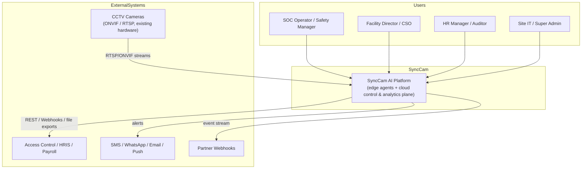

### 2.2 Container Overview (C4 Level 2)

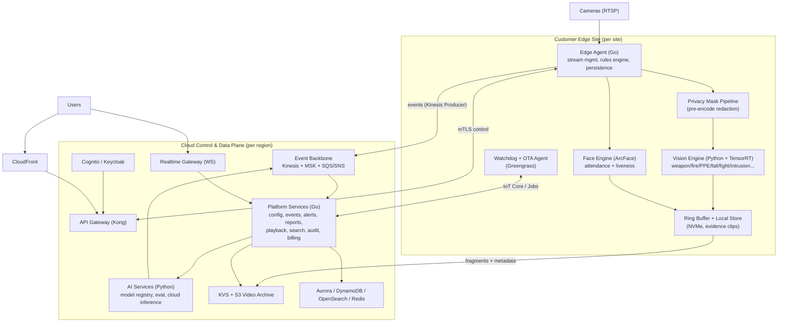

### 2.3 Architectural Themes at a Glance

- **Three planes:** (a) *Edge plane* — detection, masking, buffering, store-and-forward; (b) *Control plane* — configuration, identity, fleet management, rules; (c) *Data plane* — event stream, alerts, analytics, video archive, reports.
- **One backbone:** all intelligence flows as events over a Kinesis/Kafka backbone; services are loosely coupled consumers.
- **Two deployments:** fully-managed SaaS (edge + cloud) and local-only appliance mode (edge + embedded control plane) per PRD §10.
- **Region-locked data:** tenant data never leaves its pinned region by default (§15.7).

---

## 3. Microservices Architecture

Services are grouped into **control plane**, **data plane**, **AI plane**, and **platform infrastructure**. All services are stateless (state lives in the database/backbone), horizontally scalable, and speak gRPC internally / REST externally.

### 3.1 Service Catalog

| Service | Plane | Language | Responsibilities | PRD Ref |
|---|---|---|---|---|
| **identity-svc** | Control | Go | Users, tenants, roles, MFA, token issuance (via Cognito/Keycloak), SSO/SAML | FR-204 |
| **tenant-svc** | Control | Go | Tenant onboarding, site hierarchy, residency pinning, quotas, billing metadata | FR-206 |
| **config-svc** | Control | Go | Cameras, zones, rules, PPE matrix, thresholds, rule versioning; **source of truth pushed to edge** | FR-202, FR-203 |
| **device-svc** | Control | Go | Edge fleet registry, OTA (model + firmware), device health, store-and-forward status | FR-116, §6 |
| **audit-svc** | Control | Go | Immutable, hash-chained audit trail; privileged access reviews | §15.6, §16 |
| **event-svc** | Data | Go | Event normalization, validation, dedupe (idempotency), enrichment, Kinesis ingestion | §6 reliability |
| **alert-svc** | Data | Go | Severity classification, aggregation, mute/snooze, escalation policies, priority ordering | FR-118 |
| **notify-svc** | Data | Go | Multi-channel fan-out (push/SMS/WhatsApp/email/webhook) with per-channel rate limits & delivery receipts | FR-118 |
| **analytics-svc** | Data | Go | Occupancy, dwell, crowd density, heatmaps, time-series aggregates | FR-114/115, Phase 2 |
| **report-svc** | Data | Go | Incident dossiers (pre/post clips, timeline, confidence), PDF/CSV/JSON export, hash-chained evidence | FR-117 |
| **playback-svc** | Data | Go | Timeline, scrub, HLS session mgmt, WebRTC low-latency view, clip export | FR-201 |
| **search-svc** | Data | Go | Event/incident search; face & plate search (Phase 2 vector search) | Phase 2 |
| **integration-svc** | Data | Go | Webhooks, HRIS/payroll adapters, access-control adapters (HID/ZKTeco), insurer exports | FR-205, Phase 2 |
| **model-registry-svc** | AI | Python | Model versions, A/B, shadow mode, per-site calibration, rollback | §6 maintainability, §14 |
| **training-svc** | AI | Python | Dataset curation, SageMaker pipelines, retrain triggers from feedback | §14 drift mitigation |
| **eval-svc** | AI | Python | Benchmark suite per vertical, regression gates, drift monitoring | §9 accuracy metrics |
| **realtime-gw** | Infra | Go | WebSocket gateway for live ops view, alert push, dashboards | FR-207 |
| **api-gateway (Kong)** | Infra | — | Routing, JWT/RBAC scoping, rate limits, mTLS termination, webhook ingress | FR-205 |
| **billing-svc** | Infra | Go | Usage metering (per-camera licensing), quotas (Phase 2+) | G3 |

### 3.2 Service Topology

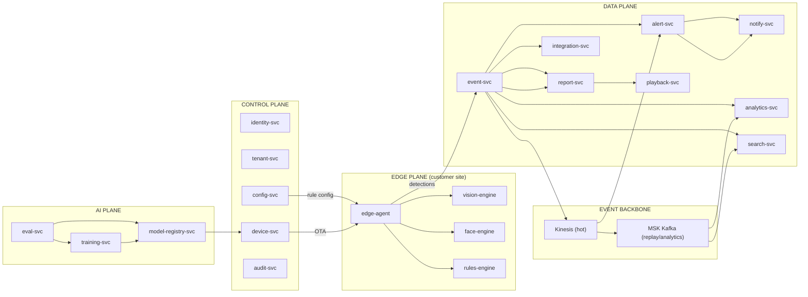

### 3.3 Service Interaction Rules

- **No direct service-to-service REST calls** — inter-service communication goes through gRPC within a namespace, or through events on the backbone for anything cross-cutting.
- **Config-svc is the single writer** of camera/zone/rule state; edges converge to it, never diverge.
- **Event-svc is the single ingress** for detection events from the edge (one choke point for dedupe/enrichment).
- **Idempotency keys** (`event_id`, `tenant_id`, `camera_id`, `occurred_at` fingerprint) make all consumers safe under redelivery.

---

## 4. Event-Driven Architecture

### 4.1 Event Taxonomy

| Event Type | Producer | Consumers | Semantics |
|---|---|---|---|
| `detection` (typed: weapon, fire, ppe, fall, fight, intrusion, zone, loitering, occupancy, crowd, vehicle, lpr) | edge-agent | event-svc → alerts/analytics/search | at-least-once, deduped |
| `attendance` | edge-agent | event-svc → integration (HRIS) | at-least-once |
| `camera-health` | edge-agent/watchdog | device-svc → alerts | at-least-once |
| `device-heartbeat` | edge-agent | device-svc | every 10–30s |
| `alert-created / alert-routed / alert-ack` | alert-svc | notify-svc, realtime-gw, audit-svc | idempotent |
| `incident-created / incident-exported` | report-svc | integration-svc, audit-svc | exactly-once intent |
| `config-changed` | config-svc | device-svc → edge | command-driven |
| `model-deployed / model-rolled-back` | model-registry-svc | device-svc, eval-svc | command-driven |
| `face-search-requested` | search-svc | audit-svc (compliance log) | audit |

### 4.2 Backbone Topology

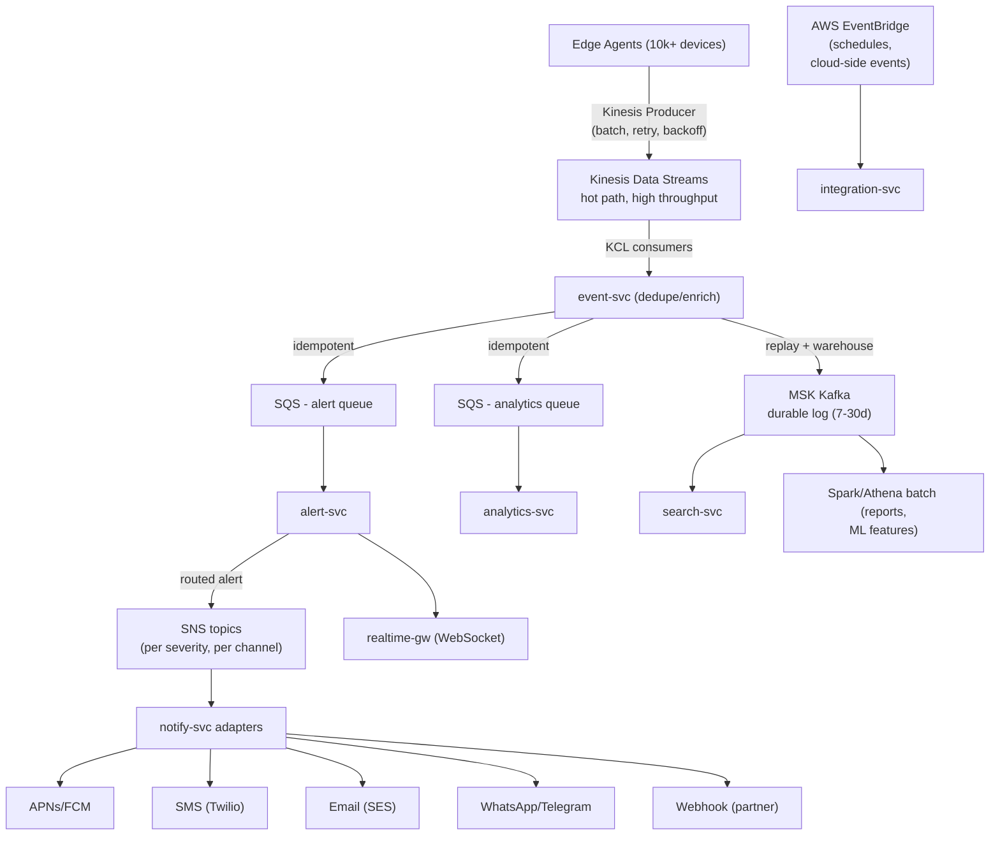

### 4.3 Delivery Guarantees

- **Ingest:** ≥1,000 events/sec sustained (PRD NFR) — Kinesis scales to tens of thousands via shard addition.
- **Reliability model:** at-least-once everywhere + idempotent consumers + 5-minute Redis dedupe window keyed on `sha256(tenant|camera|event_type|occurred_at|frame_seq)`. This satisfies "at-least-once + dedupe" from PRD §6.
- **No silent loss:** DLQs with alerting on depth, dead-letter replay tooling, and a daily reconciliation job comparing edge counters vs cloud counters (`device-heartbeat` includes `events_sent`, `events_acked`, `events_buffered`).
- **Ordering:** per-camera ordering preserved via Kinesis partition key `camera_id`; cross-camera ordering is not required.
- **Backpressure:** edge uses adaptive batch + exponential backoff; on sustained failure it persists to local store (store-and-forward, §7).

### 4.4 Alert Flood Control (PRD risk: alert fatigue)

Alert-svc implements: severity-based routing (FR-118), per-zone mute/snooze, **alert aggregation** (same camera+type within T seconds → state machine, not event storm), confidence thresholds per site, and ML false-positive suppression (eval-svc feedback loop).

---

## 5. AI Pipeline

### 5.1 Lifecycle

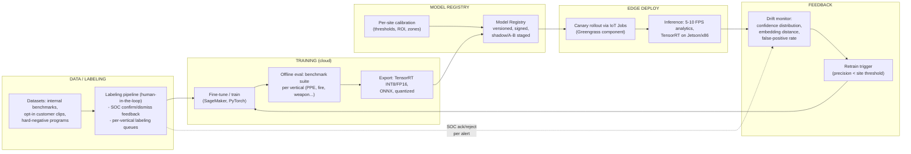

### 5.2 Inference Engines & Models

| Engine | Model Family | Acceleration | Notes (PRD) |
|---|---|---|---|
| Vision (weapon, fire/smoke, PPE, fall, fight, intrusion, loitering, crowd) | YOLO-class detectors + pose/velocity logic (fall: ≥1.5s posture change; fight: 2+ persons, velocity cluster) | TensorRT INT8, 5–10 FPS analytics | FR-101…114; false-positive suppression via hard negatives |
| Face (attendance, liveness, search) | ArcFace embeddings + anti-spoof liveness model | TensorRT FP16 | FR-102; biometric guardrails §15.3 |
| ReID (multi-camera person tracking) | OSNet/BoT embeddings; camera-graph handoff | TensorRT | FR-104, FR-119 (Phase 2) |
| LPR | Detection + OCR (regional formats IN/EU/US), night/rain augmentation | TensorRT | FR-105 (Phase 2) |
| Crowd density | Head-count CNN + calibration map | TensorRT | FR-114/115 (Phase 2) |

### 5.3 Runtime Design

- **Single inference runtime everywhere:** NVIDIA Triton Inference Server serves models identically on edge (Jetson/x86) and in cloud (GPU burst), so a model trained once deploys everywhere with the same inputs/outputs.
- **Scheduling:** frames are sampled at 5–10 FPS for analytics while the stream is passed through at full FPS for recording (PRD §14 mitigation for 4K cost).
- **Region-of-interest gating:** only decoded regions with motion/detector triggers enter expensive models (cascaded cheap detector → expensive classifier).
- **Temporal smoothing:** every event passes through a state machine (e.g., fire: 3+ consecutive frame confirms; fall: posture change ≥1.5s; loitering: dwell threshold) to meet precision targets in §9.
- **Per-site tuning:** thresholds (0.5–0.9 confidence), zone matrix, and ROI are tenant config pushed by config-svc (FR-101, §14).
- **Drift management:** shadow-mode evaluation of new model versions on live traffic; rollback via model registry (SageMaker + GitOps version pin).

### 5.4 Training Infrastructure (cloud)

- SageMaker Pipelines: preprocessing → training → evaluation → register; triggered by schedule, data additions, or drift alarms.
- GPU fleet: p4d/p5 instances for training; g5 for cloud inference burst.
- Dataset governance: opt-in-only customer data (§15.8), per-vertical benchmark programs (§14), versioned datasets in S3 with checksums.

---

## 6. Video Processing Pipeline

### 6.1 Pipeline Stages

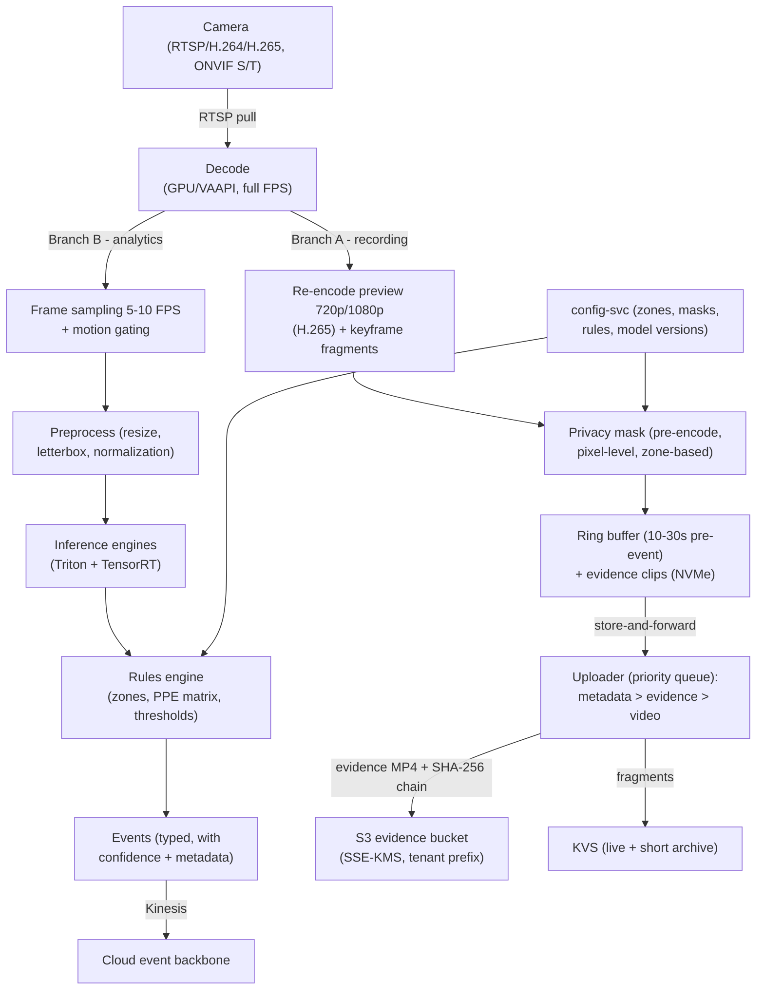

### 6.2 Key Design Decisions

| Decision | Rationale |
|---|---|
| **Decode once, branch twice** | Full-FPS decode feeds both the recording path and the analytics path from a single decode; GPU/VAAPI decode minimizes CPU per stream (8–32 streams/box per PRD). |
| **Analytics at 5–10 FPS** | Meets ≤3s detection latency (G1) while cutting 4K inference cost ~5–10× (PRD §14). |
| **Privacy masks pre-encode** | Lockers/restrooms are redacted at the pixel level *before* any encoding; masks are tamper-resistant because the masked pixels never exist downstream (§15.1). |
| **Ring buffer for pre-event evidence** | FR-112/117 require 10s pre-event context; NVMe ring preserves it until a detection promotes it to a clip. |
| **Dual video destinations** | KVS for live/low-latency viewing (WebRTC), S3 for durable evidence and tiered retention (30/90/365 days) — PRD §14 tiering. |
| **Upload priority queue** | Metadata first, then evidence, then archive video — guarantees event fidelity even on constrained links; store-and-forward resumes with resume/offset. |
| **Hash-chained evidence** | Each clip's SHA-256 links to the previous clip hash (chain of custody, FR-117, §16 insurance/forensic standard). |

### 6.3 Bandwidth Model (per camera)

| Stream | Rate (typical) | Purpose |
|---|---|---|
| Analytics (5–10 FPS detections) | ~50–150 KB/s metadata + thumbnails | Detection |
| Evidence clips (only on event) | bursty, ≤30s @ 2–4 Mbps | Incidents |
| Cloud archive (optional 720p) | ≤1 Mbps nominal (10.8 GB/camera/day); 1–2 Mbps burst envelope | Long retention; capacity and cost planning use the nominal value |
| Live view (on-demand, WebRTC/HLS) | 0 when idle | SOC viewing |

Site uplink planning uses this table; edges auto-degrade archive quality when link utilization exceeds 80%.

---

## 7. Edge Computing Architecture

### 7.1 Edge Node Software Stack

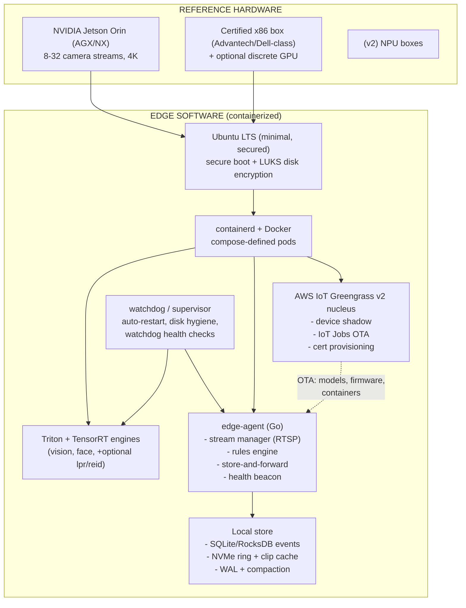

### 7.2 Responsibilities

- **Real-time detection** with local rule evaluation (zones, PPE matrix, thresholds) — zero cloud dependency for life-safety (G1, §14 network instability).
- **Store-and-forward:** events → local queue; evidence → NVMe cache; video → ring. On reconnect: resume uploads with backoff; cloud reconciliation verifies completeness (see §4.3).
- **OTA:** model artifacts, engine versions, firmware, and edge-agent binaries are delivered as Greengrass components via IoT Jobs with canary device groups and automatic rollback on health-beacon failure.
- **Edge high availability:** dual-power, RAID/NVMe mirroring for the store, watchdog auto-restart, degraded mode (drop archive video first, keep detection).
- **Zero-touch deployment:** pre-flashed SD/SSD images, first-boot enrollment via serial + QR pairing to tenant site, config convergence from config-svc (PRD G4 — 100-camera site in ≤5 days).

### 7.3 Edge ↔ Cloud Contract (mTLS)

| Channel | Protocol | Purpose |
|---|---|---|
| Events | HTTPS/Kinesis PUT (batch) | Detections, health, heartbeats |
| Video | KVS PutMedia (presigned, STS) | Fragments + evidence |
| Control | MQTT (IoT Core) + shadows | Config convergence, jobs, commands |
| Telemetry | OTLP/HTTPS | Metrics, logs (sampled) |
| Uploads | S3 (presigned) | Evidence clips, exports, debug bundles |

Certificates: device X.509 issued at enrollment, short-lived STS credentials for data-plane uploads, certificate rotation via IoT Jobs.

---

## 8. Cloud Architecture

### 8.1 Multi-Region Topology (Day 1)

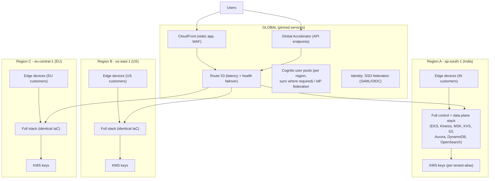

### 8.2 Region Architecture (one region, expanded)

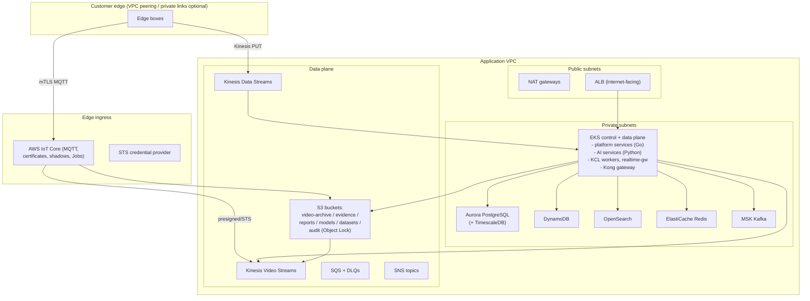

### 8.3 Region Strategy

- **Pinned tenants:** each tenant is bound to exactly one region at onboarding (residency guarantee §15.7); control-plane metadata (tenant row) carries `data_region`.
- **Same IaC everywhere:** Terraform modules parameterized by region (CIDRs, AZs, instance classes); no region-specific forks.
- **Federated identity:** enterprise SSO via SAML/OIDC against customer IdPs; user pools per region, user identity mirrored at the directory level.
- **Global services used sparingly:** Route53, CloudFront, Global Accelerator — only for routing; all data stays regional.
- **Future regions** (e.g., Saudi/UAE per roadmap §17.9) are added by instantiating the same module set.

---

## 9. Database Architecture

### 9.1 Database Portfolio (polyglot persistence)

| Store | Data | Why (PRD mapping) |
|---|---|---|
| **Aurora PostgreSQL + TimescaleDB** | Tenants, users, sites, cameras, zones, rules, incidents, reports metadata, audit (hot), occupancy/dwell time-series | Relational integrity for config & RBAC; Timescale hypertables for analytics (FR-115, Phase 2); Global Database for DR |
| **DynamoDB** | Alert fast-path, event log (30d hot), device shadows, dedupe window, rate-limit counters, sessions | Single-digit-ms at ≥1,000 events/sec (NFR); infinite scale with per-tenant partition keys |
| **OpenSearch** | Incident/event search, camera-health index, face-embedding vector search (k-NN, Phase 2), operational log search | Full-text + vector search (FR-117, Phase 2 face search) |
| **S3 (Intelligent-Tiering + Glacier)** | Video archive, evidence clips, snapshots, reports, model artifacts, datasets, audit archive | Tiered retention 30/90/365d, cost control (PRD §14) |
| **ElastiCache Redis** | Rule cache, presence, rate limits, alert aggregation windows, WebSocket pub/sub, dedupe | Sub-ms hot state; TTL-native |
| **SQLite/RocksDB (edge)** | Local event queue, config cache, ring-buffer index | Offline operation (store-and-forward) |

### 9.2 Relationships & Partitioning

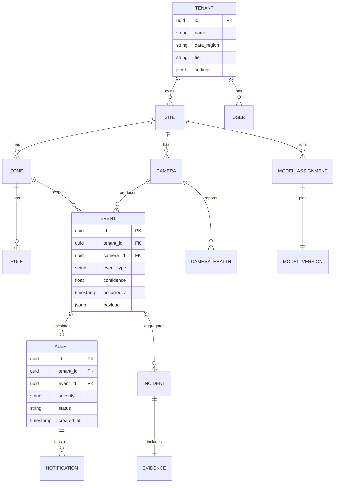

### 9.3 Data Partitioning & Multi-Tenant Isolation Rules

- **Aurora:** every table carries `tenant_id`; **row-level security** policy enforces `tenant_id = current_setting('app.tenant')`; Timescale hypertables partitioned by `(tenant_id, time)`; indexes suffix `(tenant_id, ...)` on every hot query.
- **DynamoDB:** primary key = `tenant_id + entity_id`; GSIs always begin with `tenant_id`; per-tenant capacity in **on-demand** mode with per-tenant burst protection at the API layer (quota middleware).
- **S3:** bucket-per-function + `s3://<bucket>/<tenant_id>/<site_id>/...` prefixes; lifecycle policies scoped per prefix; **SSE-KMS with per-tenant key aliases** (crypto isolation).
- **Kinesis/Kafka:** streams partitioned by `tenant_id`; larger tenants get dedicated shards/partitions (noisy-neighbor isolation).
- **OpenSearch:** tenant index-per-tenant (small tenants share an index with a `tenant_id` filter — aliased by size class).

### 9.4 Retention & Erasure (PRD §15.4)

Retention is a first-class tenant setting (7/30/90/365 days) enforced at **three layers**:

1. S3 lifecycle rules (prefix-scoped) → delete/transition to Glacier.
2. Timescale/DynamoDB TTLs → automatic row expiration.
3. **Erasure jobs** (tenant-svc) → full delete + right-to-erasure API that walks every store and produces a deletion manifest (audited). Biometric embeddings destroyed on tenant or employee erasure request.

---

## 10. API Gateway Architecture

### 10.1 Gateway Topology

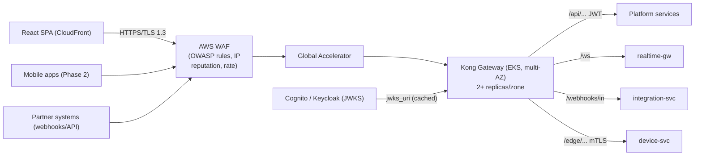

### 10.2 Gateway Responsibilities

| Concern | Implementation |
|---|---|
| **Authentication** | JWT validation (signature, issuer, audience, expiry) with cached JWKS; rejects tokens lacking `tenant_id` claim |
| **Authorization** | OPA (Rego) policy checks: scope required vs token scopes, tenant match, zone-level ABAC assertions passed as context headers |
| **Rate limiting** | Per-tenant + per-user sliding windows (Redis); 429 + `Retry-After`; tenant quotas from billing-svc |
| **Routing** | Path-based: `/api/*` (REST), `/ws/*` (WebSocket upgrade), `/webhooks/in/*` (HMAC-verified partner calls), `/edge/*` (mTLS-only, X.509 client certs) |
| **Edge identity** | mTLS termination for edge devices; validates client cert against device registry, injects `X-Device-Id` |
| **Observability** | Correlation-ID injection, access-log emission to Loki/CloudWatch, request sampling to Tempo |
| **Resilience** | Circuit breakers to services, request size limits, JSON schema validation, CORS policy |

### 10.3 API Contract

- REST over HTTPS with OpenAPI 3.1 spec; webhook-out with HMAC signatures and replay windows (FR-205).
- Versioned (`/v1/...`); additive changes only within a version; deprecation policy ≥6 months.
- Idempotency support on POST mutation endpoints (`Idempotency-Key` header).
- Event-stream consumers can subscribe via webhooks (delivered by integration-svc) or pull (REST pagination + cursor).

---

## 11. Authentication Flow

### 11.1 User Authentication (OIDC Authorization Code + PKCE)

```mermaid
sequenceDiagram
    participant U as User
    participant SPA as React SPA (PWA)
    participant CF as CloudFront/CDN
    participant IDP as Cognito Pool<br/>(or Keycloak local)
    participant K as Kong Gateway
    participant API as Platform Services

    U->>SPA: opens app
    SPA->>IDP: /authorize (code + PKCE, prompt=login)
    IDP-->>U: login form (MFA if required)
    U->>IDP: credentials + MFA (TOTP/WebAuthn)
    IDP-->>SPA: authorization code
    SPA->>IDP: /token (code_verifier, client_id)
    IDP-->>SPA: access_token (15 min) + refresh_token (30d, rotating)
    SPA->>K: GET /api/v1/sites (Bearer JWT)
    K->>K: validate JWT signature (JWKS cache),<br/>issuer, aud, exp, tenant_id claim
    K->>K: OPA policy: scope, tenant, zone access
    K-->>API: forward + X-Tenant-Id, X-User-Id, X-Scopes
    API-->>SPA: 200 (tenant-scoped data)
    Note over SPA,IDP: Refresh rotation on 401; re-auth on refresh replay
```

- **MFA enforced** for Super Admin, Auditor, and any role with export/delete privileges.
- **SSO:** enterprise IdPs via SAML 2.0/OIDC federation; SCIM provisioning for user lifecycle.
- **Local-only deployments:** the same flow runs against an embedded Keycloak instance with offline token validation (no cloud round-trip) — PRD §10.

### 11.2 Device (Edge) Authentication — mTLS + STS

```mermaid
sequenceDiagram
    participant E as Edge Agent
    participant IOT as IoT Core
    participant STS as STS/Device Credentials
    participant KVS as KVS / S3
    participant DV as device-svc

    E->>IOT: MQTT connect (X.509 client cert,<br/>CN = device-id, signed by tenant CA)
    IOT->>IOT: validate cert against device registry<br/>(active, not revoked, site matched)
    IOT-->>E: MQTT CONNACK + device shadow
    E->>STS: request credentials (cert-based, role = edge-data-uploader)
    STS-->>E: short-lived STS creds (15 min, scoped:<br/>kvs:PutMedia, s3:PutObject on own prefix)
    E->>KVS: PutMedia (fragment upload)
    E->>DV: heartbeat (authenticated channel)
    Note over E,DV: Cert rotation via IoT Jobs;<br/>revocation = disconnect + credential denial
```

### 11.3 Service-to-Service Authentication

- In-cluster: Kubernetes Service Accounts + IRSA (OIDC) — services assume narrow IAM roles; mTLS via service mesh where required.
- Out-of-cluster (Kinesis, S3, KVS, MSK): IAM roles with least-privilege policies; no long-lived keys.

---

## 12. Authorization

### 12.1 Model: RBAC + ABAC

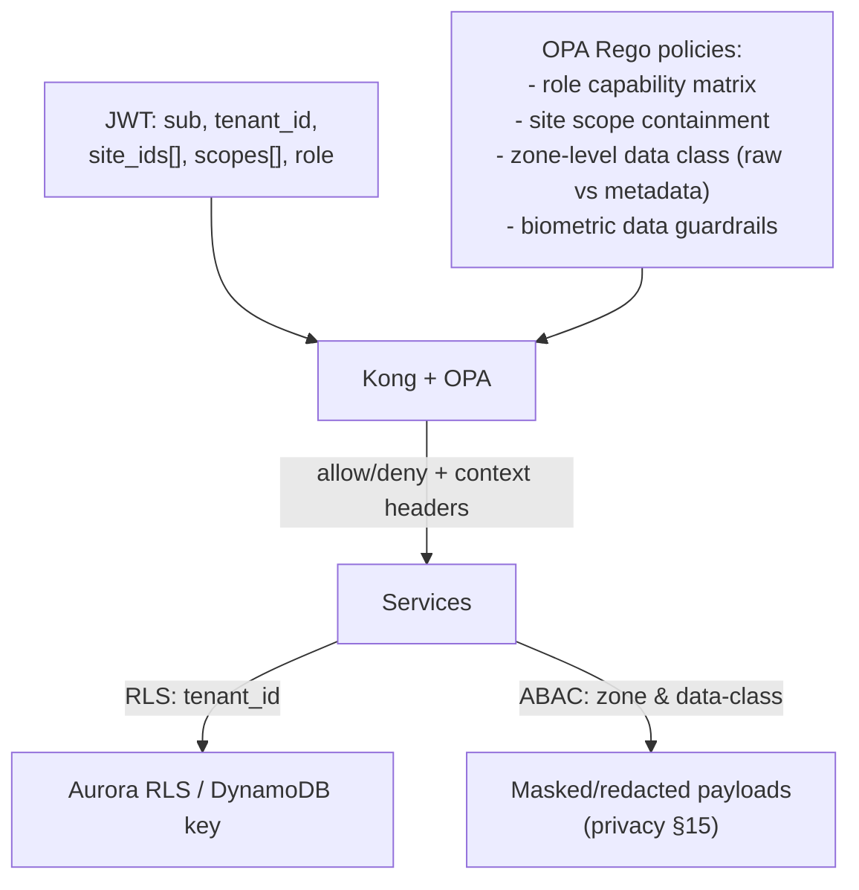

### 12.2 Role Matrix (FR-204)

| Capability | Super Admin | Site Admin | Operator (SOC) | Auditor | Viewer |
|---|---|---|---|---|---|
| Manage tenants/sites | ✓ | site-scoped | — | — | — |
| Configure zones/rules/cameras | ✓ | ✓ | view | view | view |
| Live view (raw video) | ✓ | ✓ | ✓ | — | — |
| Acknowledge/escalate alerts | ✓ | ✓ | ✓ | — | — |
| Export evidence/reports | ✓ | ✓ | ✓ | ✓ | — |
| Face search / biometric access | ✓ (audited) | site-opt-in | site-opt-in | — | — |
| View audit log | ✓ | — | — | ✓ | — |
| Delete data / erasure | ✓ (dual-approval) | — | — | — | — |
| View analytics/dashboards | ✓ | ✓ | ✓ | ✓ | ✓ |

### 12.3 ABAC Policies (examples)

- `site_scope ⊆ token.site_ids` — a user can never touch another site's data even with a valid tenant token.
- **Data class:** `raw video` vs `events+metadata` vs `biometric`. Privacy principle §15.2: default access is metadata; raw video requires explicit role + logged access.
- **Biometric guardrails (§15.3):** face-embedding endpoints require a separate `biometric:*` scope, always audited, tenant must have opted into biometric mode.
- Enforcement happens at the gateway (coarse) **and** in services (fine, for query filters and payload redaction) — never trust gateway alone.

---

## 13. Multi-Tenancy

### 13.1 Tenant Model

- **Tenant = company**; hierarchy: `tenant → site → camera/zone → rule`. Sites may be grouped for enterprise (CSO) dashboards (persona: Vikram).
- **Tenant classes:** SMB (pooled) and Enterprise (dedicated edge, dedicated capacity, private networks), per pricing plan (G3).
- **Isolation levels:**

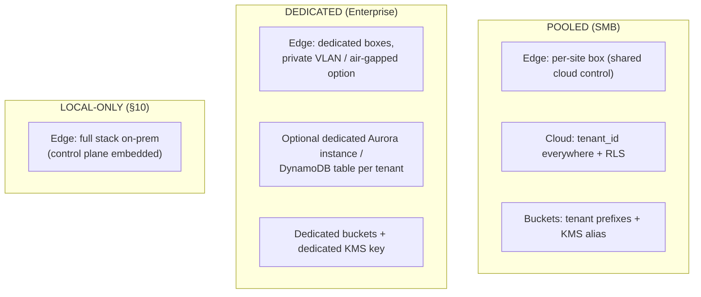

### 13.2 Tenant Governance

| Concern | Mechanism |
|---|---|
| Data isolation | `tenant_id` on every record, RLS, S3 prefixes, DynamoDB PK, Kafka partition keys (§9.3) |
| Crypto isolation | Per-tenant KMS key aliases; biometric data on separate key hierarchy per tenant |
| Quotas & limits | Per-tenant rate limits, camera count, retention days, storage caps (enforced at gateway + billing-svc metering) |
| Residency | `tenant.data_region` pinned at onboarding; cross-region copy APIs blocked by policy |
| Compliance per tenant | Retention profile, masking defaults, audit verbosity — all tenant settings |
| Erasure | Tenant-level or data-subject erasure API with manifest + audit (right-to-erasure) |
| Noisy neighbor | Dedicated Kinesis shards/MSK partitions for large tenants; per-tenant P95 latency dashboards |

### 13.3 Multi-Tenancy Test Gates

Every release runs isolation tests: cross-tenant read attempts must 404/403, RLS bypass attempts must fail, bucket-prefix traversal must fail, and tenant A's erasure must not affect tenant B.

---

## 14. Security Architecture

### 14.1 Defense in Depth

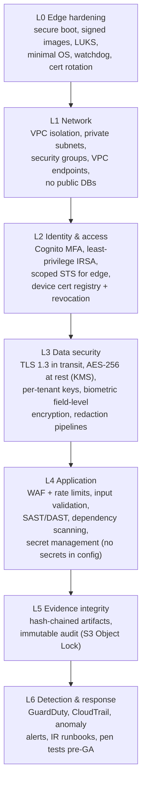

### 14.2 Specific Controls (PRD-mapped)

| Control | Implementation | PRD Ref |
|---|---|---|
| TLS 1.2+ everywhere; TLS 1.3 on user-facing paths | CloudFront/WAF/ALB termination, mTLS edge↔cloud | §6 security NFR |
| AES-256 at rest, hardware-backed keys | KMS (HSM-backed, multi-region replicas); edge uses TPM/secure element where available | §6 |
| No silent loss, tamper-evidence | Hash chains on evidence; Object Lock on audit bucket | FR-117, §16 |
| Biometric protection | Separate KMS key hierarchy + field-level encryption; no identity photos stored by default (§15.3 attendance-only mode) | §15.3 |
| Access logging & attribution | Every playback/export/identity lookup logged (audit-svc) | §15.6 |
| Threat detection | GuardDuty, WAF managed rules, CloudTrail to SIEM, edge-behavior anomaly (device-svc) | §6 |
| Supply chain | Signed container images (Cosign), signed model artifacts, SBOM generation, image/model provenance in registry | §6 |
| Penetration & red team | Pen test pre-GA; adversarial ML testing (liveness, input sanitization) | §6, §14 |
| Secrets | AWS Secrets Manager + external secrets operator; no secrets in Git, code, or edge images | — |

### 14.3 Compliance Envelope (PRD §16)

SOC 2 Type II / ISO 27001 evidence pipelines are produced from the same telemetry (audit log, access logs, config change history, backup/restore logs). GDPR/DPDP features (DPIA kit, consent tooling, erasure, residency, DPO contact) are configuration-driven per region. Biometric consent + BIPA-style notice packs are delivered per tenant at onboarding.

---

## 15. Monitoring

### 15.1 Telemetry Stack

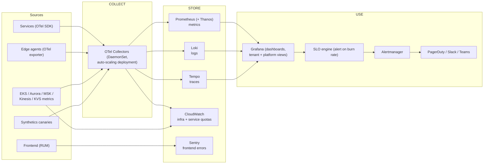

### 15.2 SLOs (from PRD §6, §9)

| SLO | Target | Measure |
|---|---|---|
| Platform availability | 99.9% monthly | Uptime of API + core services (multi-region pooled) |
| Detection latency (life-safety) | ≤3s p95 edge→alert | OTel span edge→alert-svc→notify |
| Event ingestion | ≥1,000 events/sec sustained | Kinesis throughput + consumer lag |
| Alert delivery | p95 ≤10s (push), ≤60s (email) | notify-svc delivery spans |
| Alert accuracy | false-alert rate ≤1/5 cameras/day | alert-svc + eval-svc feedback |
| Evidence availability | ≥99.9% of incidents have complete dossiers | report-svc reconciliation job |

### 15.3 Edge Health & Business Monitoring

- **Per-device:** heartbeat age, store-and-forward queue depth, GPU/CPU util, FPS per engine, model version, disk hygiene, watchdog events. Threshold alarms → device-svc tickets (FR-116 camera health incl. blur/occlusion/tamper/lens obstruction from vision engine).
- **Business dashboards (per persona):** SOC live ops (alerts/min, MTTA, MTTR), Safety (PPE compliance %, incidents by type/zone), Operations (occupancy, dwell, heatmaps), CSO (cross-site KPIs, ROI reports).
- **Capacity signals:** Kinesis consumer lag, MSK broker load, Aurora CPU/replicas lag, OpenSearch pressure, per-tenant P95 latency — feed the scalability strategy (§17).

---

## 16. Logging

### 16.1 Log Classification

| Class | Content | Store | Retention |
|---|---|---|---|
| **Application logs** | Structured JSON: trace_id, tenant_id, service, level, msg | Loki (hot) → S3 archive | 30d hot / 1y archive |
| **Access logs** | Gateway/ALB: user, tenant, route, status, latency | Loki / CloudWatch | 180d (compliance) |
| **Audit log (immutable)** | Admin actions, exports, playback, identity lookups, erasure, config changes | S3 Object Lock + OpenSearch (searchable copy) | ≥7y / per tenant policy |
| **Edge logs** | journald, rotated; sampled telemetry uplink; full logs on support bundle request | local + S3 debug bucket | 7d local / 90d cloud |
| **Model/ML logs** | Inference FPS, confidence histograms, drift metrics | Prometheus + S3 metrics archive | 1y |

### 16.2 Rules

- Every log line is **structured JSON** with `trace_id` propagated from gateway (correlation IDs) so a single incident is traceable across edge → gateway → services → storage.
- **PII-safe by default:** log redaction filters (names, faces, plate numbers, video paths) applied at the collector; raw video never logs.
- **Audit immutability:** write-once, WORM via S3 Object Lock; hash-chained; dual-administrator override protocol (break-glass, itself audited).
- **Retention is tenant-configurable** per §15.4; deletion jobs cover logs too.
- **Alerting on anomalies:** log spikes, auth failures, repeated 4xx/5xx, DLQ depth.

---

## 17. Scalability Strategy

### 17.1 Scaling Model (1 → 10,000+ cameras, PRD NFR)

| Layer | Scale Unit | Mechanism |
|---|---|---|
| Edge | camera-per-box (8–32 streams) | Add certified boxes per site; device-svc auto-registers, config converges; 10k cameras ≈ 300–1,200 boxes |
| Event ingest | Kinesis shards | Scale shards with sustained throughput; 1,000 ev/s baseline, ~10× headroom via auto-scaling on consumer lag |
| Processing | Kubernetes pods | Stateless services HPA/KEDA (CPU, queue depth, Kinesis lag); Karpenter burst nodes |
| AI (cloud) | GPU nodes | Burst inference for Phase 2 features (face search over archive); GPU node pool scale-to-zero |
| Databases | Read replicas / shards | Aurora replicas (read-heavy analytics), DynamoDB on-demand, OpenSearch node add, Timescale chunk tuning |
| Video | KVS streams + S3 | Per-camera KVS with retention; S3 Intelligent-Tiering; upload bandwidth shaping per site |
| Realtime | WebSocket nodes | Horizontal realtime-gw with Redis pub/sub backplane; sticky sessions not required |
| Notifications | SNS/Lambda fan-out | Push adapter as Lambda (burst-safe), SQS decoupling |

### 17.2 Large-Tenant Handling

- Tenants >2,000 cameras get: dedicated Kinesis shard group, dedicated MSK partitions, larger-rate quotas, optional dedicated DB capacity (silo tier, §13.1).
- Per-tenant burst control at gateway (Redis token bucket) prevents noisy-neighbor (PRD risk: alert floods).

### 17.3 Capacity & Perf Guards

- **Unit-cost model:** tracked $/camera/month per deployment tier (compute, storage, bandwidth, inference) — informs G3 70% gross margin target.
- **Load tests:** 1,000 ev/s ingest, 100k concurrent WS, 10k-camera synthetic fleet, 4K multi-stream boxes — run in CI (k6 + Locust + custom edge simulators).
- **Chaos engineering:** quarterly GameDays (node loss, region failure, Kinesis throttle, edge disconnect) validating §17/§19 runbooks.

---

## 18. Backup Strategy

### 18.1 Backup Matrix

| Data | Store | Backup Mechanism | RPO | RTO |
|---|---|---|---|---|
| Relational (Aurora) | Aurora PostgreSQL | Automated backups + PITR (35d); manual snapshots pre-migration; cross-region via Global DB secondary | ≤5 min | ≤15 min |
| Event log (DynamoDB) | DynamoDB | On-demand PITR (35d) | ≤5 min | ≤15 min |
| Search (OpenSearch) | OpenSearch | Daily snapshots → S3 (snapshot repo), 30d | ≤24 h | ≤1 h |
| Video archive | S3 | Versioning + lifecycle + cross-region replica (CRR) | real-time | <1 h |
| Evidence/reports | S3 (Object Lock) | Versioning + WORM + CRR; hash chains independent of backup | real-time | <1 h |
| Kafka (MSK) | MSK | Replicated across AZs; topic retention 7–30d; mirroring to S3 via connector (analytic replay) | ≤5 min (mirror) | <1 h |
| Redis | ElastiCache | AOF (append-only) + RDB snapshots to S3 | ≤5 min | ≤15 min |
| Configuration | Terraform state + Git | Git as source of truth; state in S3 with versioning + DynamoDB lock | n/a | n/a |
| Edge (local) | Device storage | Local WAL + cloud store-and-forward (the cloud *is* the backup); offline clip cache survives reboot | n/a | n/a |

### 18.2 Backup Operations

- Backup jobs are **scheduled, monitored, and restored-tested** (quarterly restore drills with recovery time measurement).
- Immutable backups for evidence data (Object Lock) — an incident dossier remains recoverable even if the tenant's live data is deleted within retention.
- Right-to-erasure exceptions are explicitly *not* backed up beyond legal hold flags.

---

## 19. Disaster Recovery

### 19.1 DR Strategy: Multi-AZ within region + Active-Passive cross-region

- **In-region (AZ loss):** automatic — EKS multi-AZ, Aurora Multi-AZ, MSK Multi-AZ, Kinesis/S3/KVS 3-AZ, Redis Cluster mode, OpenSearch Multi-AZ. No manual action.
- **Cross-region (region loss):** tenant fails over to its **paired DR region** (e.g., India: ap-south-1 ↔ ap-southeast-1; US: us-east-1 ↔ us-west-2; EU: eu-central-1 ↔ eu-west-2). Targets: **RTO ≤ 60 min, RPO ≤ 5 min** (consistent with 99.9% availability).

### 19.2 Regional Failover Flow

```mermaid
sequenceDiagram
    participant MON as Observability (region A)
    participant R53 as Route 53 (health checks)
    participant OPS as On-call (paging)
    participant DR as DR Region (standby stack)
    participant GLB as Aurora Global Database
    participant EDGE as Edge devices

    MON->>MON: Region A: multiple SLO burn alerts<br/>(API 5xx, Aurora failure, EKS loss)
    MON->>OPS: PagerDuty incident (critical)
    OPS->>OPS: Confirm via runbook (5 min decision)
    OPS->>DR: Failover command (Terraform/tfstate switch + flags)
    DR->>GLB: Promote regional secondary (Aurora,<br/>RPO <1s via Global Database)
    DR->>DR: Replay Kinesis/MSK offsets from S3 mirror<br/>+ DynamoDB PITR if needed
    OPS->>R53: Switch routing (health-check fails →<br/>DR endpoint; TTL 30s)
    R53-->>EDGE: Edge reconnects to DR region<br/>(mTLS + region endpoint from device shadow)
    EDGE->>DR: store-and-forward replay (data preserved)
    DR-->>OPS: Confirmed: dashboards green,<br/>DR drill report filed
```

### 19.3 DR Details

| Concern | Approach |
|---|---|
| Data plane | Aurora Global Database (secondary in DR region, RPO <1s); S3 CRR continuous; Kinesis fan-out mirrored (S3 + MSK replica); DynamoDB PITR restore |
| Edge continuity | Edge is **self-sufficient**: detection and alerts continue during a full cloud outage (local rules engine); alerts queue on edge and are replayed after reconnect; escalation via local relay (SMS gateway at site, optional) |
| Applications | Standby stack running at reduced capacity (warm standby: scaled-down EKS, scaled-down DB); scaled up on failover via IaC |
| Realtime | WebSocket clients reconnect to DR region endpoint; alert history served from DR DB |
| Failback | Reverse procedure after RCA; edge reconnects to primary; data reconciliation job merges (dedupe by event_id) |
| Governance | Quarterly DR drills (failover + failback timed and measured); annual full-region outage exercise; DR playbooks versioned in Git with screenshots of every command |

---

## 20. Deployment Topology

### 20.1 Full Deployment View

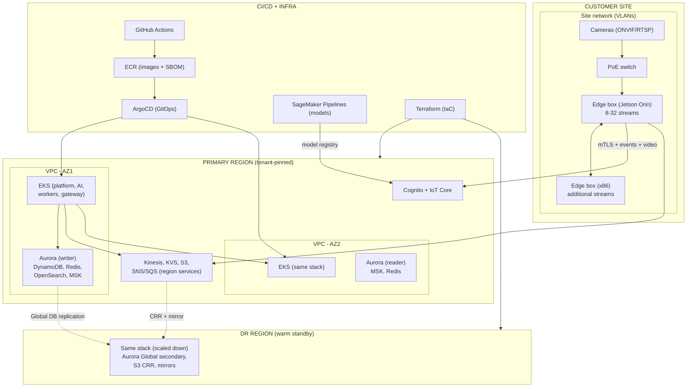

### 20.2 Environments & Promotion

| Environment | Purpose | Promotion gate |
|---|---|---|
| `dev` | Feature branches, synthetic edge simulators | PR + unit/integration tests |
| `staging` | Full stack + staging edge hardware | e2e, load smoke, security scan (Trivy/SAST/DAST) |
| `preview` (per-region) | Regional config validation | Terraform plan check, cross-region config diff |
| `prod` (3 regions) | Live | Canary 5% → 50% → 100% via ArgoCD; automated rollback |

Deployment model: **GitOps** — all changes (code, config, models) are declarative in Git; ArgoCD converges clusters; image/model provenance recorded in the deployment record (audited).

---

## 21. End-to-End Data Flow

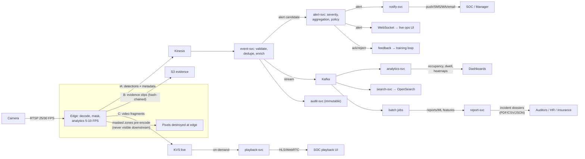

---

## 22. Technology Recommendations

### 22.1 Frontend

| Technology | Why |
|---|---|
| **React 18 + TypeScript + Vite** | Largest talent pool; Vite for fast builds; TS for a typed API contract with the OpenAPI spec |
| **Tailwind CSS + shadcn/ui** | Design-system velocity for dashboards across 12 verticals with per-vertical templates (FR-207) |
| **TanStack Query + Zustand** | Server-state caching/retry for event-heavy UIs; minimal client state |
| **PWA (Workbox)** | PRD §10 requires web-PWA in MVP (no native app); offline-friendly operator workflows (FR-118); installable for SOC |
| **HLS.js + KVS WebRTC SDK** | Playback scrub (HLS, latency-tolerant) + low-latency live view (WebRTC, ~300–500ms) — both backed by KVS (§6.3) |
| **ECharts** | Heatmaps, occupancy curves, density gauges (FR-115, Phase 2) without licensing friction |
| **MapLibre GL** | Site maps with camera placement, zones, tripwires (FR-203 builder UX) |

### 22.2 Backend

| Technology | Why |
|---|---|
| **Go** (platform services) | High concurrency per pod (Kinesis consumers, WebSocket gateways), small memory footprint, single-binary edge agent, static typing; ideal for the 1,000+ ev/s data path |
| **Python** (AI services) | The ML ecosystem (PyTorch, Triton, SageMaker SDK); AI-plane services only |
| **gRPC + Protobuf** (internal) | Typed, efficient service mesh calls; streaming support for video metadata |
| **REST + OpenAPI 3.1** (external) | FR-205 partner API suite; versioned, documented |
| **PostgreSQL via TimescaleDB** | Relational core + time-series in one engine (occupancy, dwell) — fewer moving parts |
| **NATS? No** — Kinesis/MSK chosen | Managed backbone removes self-hosting burden at 10k-camera scale (see 22.4) |

### 22.3 AI Services

| Technology | Why |
|---|---|
| **PyTorch** | Research-to-production standard; model family coverage (YOLO, ArcFace, ReID, LPR) |
| **NVIDIA Triton Inference Server** | One serving runtime on Jetson *and* cloud GPU; model versioning and dynamic batching; matches PRD §14 TensorRT requirement |
| **TensorRT (INT8/FP16)** | 2–5× latency/throughput gains on Jetson; required to hit 8–32 4K streams per box (§14) |
| **Ultralytics YOLO** | Detector backbone with hard-negative tuning programs; strong on small objects (weapons at 10–40m, FR-101) |
| **InsightFace/ArcFace + liveness model** | FR-102 attendance with anti-spoof; embeddings-only mode for privacy (§15.3) |
| **SageMaker Pipelines + Model Registry** | Training orchestration, versioning, shadow/AB, rollback, drift monitoring (§5.3) |
| **S3 + dataset versioning** | Labeled data governance with checksums and opt-in governance (§14.1, §5.4) |

### 22.4 Streaming

| Technology | Why |
|---|---|
| **RTSP/ONVIF Profile S/T** | Camera-side standard — zero hardware replacement (G4, §13 risk mitigation) |
| **Amazon Kinesis Video Streams** | Managed RTSP ingest, fragment archival, WebRTC signaling + HLS generation; directly solves §6 video scale without self-managed media servers |
| **HLS** | Playback/scrub and archive viewing — CDN-friendly (CloudFront) |
| **WebRTC (KVS signaling)** | ≤500ms live view for SOC operators (FR-201) — latency impossible with HLS alone |

### 22.5 Storage

| Technology | Why |
|---|---|
| **S3 (Intelligent-Tiering + Glacier)** | Durability (11×9s), lifecycle-driven retention 30/90/365d, evidence WORM (Object Lock) — meets §14 cost + §16 forensic needs |
| **Aurora PostgreSQL (+TimescaleDB)** | Managed RDS, Multi-AZ, Global Database for DR, RLS for multi-tenancy |
| **DynamoDB** | Hot event/alert path at ≥1,000 ev/s with predictable single-digit-ms; TTL for retention |
| **OpenSearch** | Full-text + vector (k-NN) search for incidents and Phase 2 face search |
| **Redis (ElastiCache)** | Sub-ms dedupe, rate-limit, aggregation, WS pub/sub |
| **NVMe on edge** | Pre-event ring buffer + store-and-forward cache (offline resilience, §6.2) |

### 22.6 Queues & Event Backbone

| Technology | Why |
|---|---|
| **Kinesis Data Streams** | High-throughput hot path (1,000+ ev/s), per-camera ordering, shard scaling — serverless, no broker to run |
| **MSK (Kafka)** | Durable replayable log for analytics/search/batch + multi-region mirroring; 7–30d retention for reprocessing |
| **SQS + DLQs** | Decoupled workers (alerts, notifications) with dead-letter replay — "no silent event loss" (§6) |
| **SNS + EventBridge** | Channel fan-out (severity topics) and cloud-side integrations/schedules (webhooks, HRIS syncs) |

### 22.7 Notification Service

| Technology | Why |
|---|---|
| **SNS → Lambda adapters** | Burst-safe push fan-out to APNs/FCM; per-channel adapters isolated (FR-118) |
| **Twilio** | SMS + WhatsApp in one API, global reach (India/EU/US) — deliverability matters for life-safety alerts |
| **Amazon SES** | Email with DKIM/DMARC, quota management, audit of sends |
| **Webhooks (integration-svc)** | HMAC-signed partner delivery with replay window + dead-letter (FR-205, Phase 2 Slack/Teams) |

### 22.8 Authentication

| Technology | Why |
|---|---|
| **Amazon Cognito** (cloud) | Managed OIDC + MFA + SAML federation + SCIM; multi-region pools; no IdP to operate |
| **Keycloak** (local-only mode) | PRD §10 requires offline deployment; embedded OIDC with same token contract as Cognito |
| **AWS IoT Core (X.509)** | Device identity, cert registry, shadows, Jobs (OTA) — the edge control channel (FR-202/FR-116) |
| **JWT (short-lived) + rotating refresh** | Stateless gateway validation; 15-min access tokens bound tenant/site scopes (§11, §12) |

### 22.9 Monitoring

| Technology | Why |
|---|---|
| **OpenTelemetry** | Vendor-neutral traces/metrics/logs from edge *and* cloud — one contract across planes |
| **Prometheus + Thanos + Grafana** | Industry-standard metrics; multi-region query; tenant + platform dashboards |
| **Loki** | Log correlation with traces (logQL); cheaper than full-text on hot logs |
| **Tempo** | Distributed traces across edge→gateway→services (detection latency SLO §15.2) |
| **Sentry** | Frontend/mobile error capture with user context |
| **Alertmanager + PagerDuty** | Severity-based paging; SLO burn-rate alerting |
| **CloudWatch** | AWS-infrastructure metrics and service quotas (complementary, not primary) |

### 22.10 Containerization

| Technology | Why |
|---|---|
| **Docker + containerd** | Standard build/runtime everywhere; identical images on edge (Jetson ARM64) and cloud (x86_64) via multi-arch builds |
| **Kubernetes (EKS) + Karpenter** | Self-healing, autoscaling platform; Karpenter for burst GPU nodes; avoids EC2 fleet management |
| **Helm + ArgoCD** | Declarative chart packaging + GitOps convergence with rollback (§20.2) |
| **Greengrass v2 (edge)** | OTA components, device shadows, Jobs — the edge-side "CD" story |
| **Cosign + Trivy** | Signed images + vulnerability gate in CI (supply chain, §14.2) |

### 22.11 CI/CD

| Technology | Why |
|---|---|
| **GitHub Actions** | Build, unit/integration/e2e tests, SAST/DAST, image build + sign, Terraform plan — single pipeline in the SCM |
| **ArgoCD** | GitOps deployment to 3 regions with canary progression and automated rollback |
| **Terraform (+ Terragrunt)** | Region-parameterized IaC (multi-region day 1, P6); state in S3 + DynamoDB lock |
| **SageMaker Pipelines** | Model CI/CD: train → eval gates → register → release via IoT Jobs |
| **k6/Locust + edge simulators** | Performance gates in CI (1,000 ev/s, 4K streams) |

### 22.12 Cloud Provider

| Technology | Why |
|---|---|
| **AWS (multi-region: ap-south-1, us-east-1, eu-central-1 + DR pairs)** | Unique fit for this workload: Kinesis Video Streams (managed RTSP/WebRTC), IoT Greengrass (edge OTA), SageMaker (MLOps), Aurora Global Database (sub-second RPO), S3 Object Lock (forensic evidence), WAF/GuardDuty (security), and the compliance footprint (SOC 2, ISO 27001, GDPR, DPDP alignment) — plus regional edge economics for India GTM |
| **Abstraction layer** | Edge hardware (Jetson/x86/NPU) and ONVIF camera standards prevent provider/device lock-in (P7, §13 risk) |

---

## 23. Appendix

### 23.1 Assumptions

1. Edge-first deployment with cloud control plane (PRD §10 recommended path); local-only mode supported via embedded control plane.
2. Multi-region day 1 (India/US/EU) with tenant-pinned residency; paired DR regions as listed in §19.
3. MVP web is PWA-only; native mobile in Phase 2 (PRD §11).
4. Camera protocol baseline: RTSP + ONVIF Profile S/T (PRD §6 interoperability).
5. Billing metering infrastructure (per-camera) is built in MVP to inform Phase-2 monetization.

### 23.2 Decisions Log

| # | Decision | Date | Rationale |
|---|---|---|---|
| AD-01 | Edge-first inference (Jetson + x86, abstraction layer) | 2026-07-30 | PRD §14; G1 latency; offline resilience |
| AD-02 | AWS multi-region day 1 | 2026-07-30 | GTM decision; KVS/Greengrass/SageMaker fit |
| AD-03 | Kinesis (hot) + MSK (replay) + SQS/SNS backbone | 2026-07-30 | Throughput + replay + decoupling (NFR) |
| AD-04 | Polyglot: Go (platform), Python (AI), TS/React (web) | 2026-07-30 | Throughput, ML ecosystem, talent |
| AD-05 | Aurora+Timescale, DynamoDB, OpenSearch, Redis, S3 | 2026-07-30 | Data-shape fit, RLS tenancy, cost tiers |
| AD-06 | Kong gateway with OPA authorization | 2026-07-30 | Vendor-neutral, mTLS, policy engine |
| AD-07 | Cognito cloud + Keycloak local-only | 2026-07-30 | PRD §10 local-only deployment |
| AD-08 | RPO ≤5 min, RTO ≤60 min; warm standby DR | 2026-07-30 | 99.9% availability target, cost balance |
| AD-09 | Privacy masks pre-encode at edge | 2026-07-30 | §15.1 — pixels never leave device |

### 23.3 PRD Feature → Component Mapping (MVP)

| PRD Feature | Component(s) |
|---|---|
| FR-101..114 detections | edge vision/face engines + event-svc + alert-svc |
| FR-116 camera health | vision engine health signals + device-svc |
| FR-117 incident reports | report-svc + S3 evidence + hash chain |
| FR-118 notifications | notify-svc + SNS + Twilio/SES/APNs/FCM |
| FR-201/202/203 | playback-svc, config-svc (ONVIF discovery, rule builder) |
| FR-204 RBAC | identity-svc + OPA policies |
| FR-205 API suite | Kong + integration-svc webhooks |
| FR-206 multi-tenancy | tenant-svc + RLS + per-tenant keys (§13) |
| FR-207 dashboards | analytics-svc + realtime-gw + React |
| §6 NFRs | Kinesis scale, DR §19, security §14 |
| §15 privacy | masking, biometric key hierarchy, erasure jobs |

### 23.4 Glossary

| Term | Meaning |
|---|---|
| Edge Agent | Go service on-premise managing streams, rules, persistence |
| Store-and-forward | Local buffering of events/clips during network loss with resume |
| Ring buffer | NVMe pre-event clip cache (10–30s) for evidence |
| KVS | Amazon Kinesis Video Streams |
| ReID | Person/vehicle re-identification across cameras |
| RLS | PostgreSQL Row-Level Security |
| PITR | Point-in-time recovery |
| WORM | Write-once-read-many (S3 Object Lock) |
