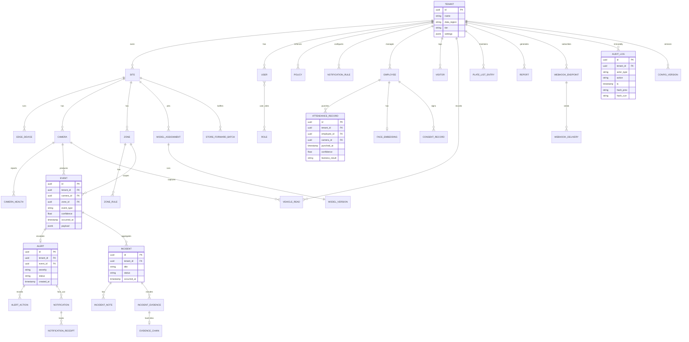

# SyncCam AI — Backend Architecture Specification v1.0

**Document:** Backend Architecture Specification v1.0 (Draft for Review)
**Date:** July 31, 2026
**Source:** `PRD-SyncCam-AI.md` (v1.0), `ARCHITECTURE.md` (v1.0), `AI-ARCHITECTURE.md` (v1.0), `UX-DESIGN-SyncCam-AI.md` (v1.0)
**Scope:** Database design (ER, tables, indexes, relationships), API surface (REST, GraphQL, WebSockets, webhooks), streaming (Kafka, RabbitMQ), caching (Redis), storage (S3), scaling, deployment (Docker/Kubernetes/Terraform), and observability (Prometheus/Grafana/OpenTelemetry).
**Posture:** Specification only — no implementation code. AWS-native per ARCHITECTURE.md AD-01…AD-09, with vendor-neutral alternatives noted. This document complements ARCHITECTURE.md; it does not restate its service catalog, security model, or DR plan.

---

## Table of Contents

1. [Design Posture & Store Portfolio](#1-design-posture--store-portfolio)
2. [Logical ER Diagram](#2-logical-er-diagram)
3. [Database Schemas, Indexes & Optimization](#3-database-schemas-indexes--optimization)
4. [REST API Specification](#4-rest-api-specification)
5. [GraphQL API](#5-graphql-api)
6. [WebSocket Protocol (Realtime Gateway)](#6-websocket-protocol-realtime-gateway)
7. [Webhook Events](#7-webhook-events)
8. [Event Backbone (Kafka) & Task Queues (RabbitMQ)](#8-event-backbone-kafka--task-queues-rabbitmq)
9. [Caching Strategy (Redis)](#9-caching-strategy-redis)
10. [Audit Log System](#10-audit-log-system)
11. [Object Storage](#11-object-storage)
12. [Scaling Strategy](#12-scaling-strategy)
13. [Deployment: Docker, Kubernetes, Terraform](#13-deployment-docker-kubernetes-terraform)
14. [Observability: OpenTelemetry, Prometheus, Grafana](#14-observability-opentelemetry-prometheus-grafana)
15. [Versioning & API Lifecycle Policy](#15-versioning--api-lifecycle-policy)
16. [Appendix: Decision Log & Cross-Reference Map](#16-appendix-decision-log--cross-reference-map)

---

## 1. Design Posture & Store Portfolio

### 1.1 Posture

The backend design inherits the nine principles of ARCHITECTURE.md (P1–P9) and adds three backend-specific rules:

| # | Rule | Meaning |
|---|---|---|
| B1 | **Postgres is the truth; everything else is a projection** | Aurora PostgreSQL (+TimescaleDB) is the single system of record for relational state. DynamoDB, Redis, ClickHouse, and OpenSearch are derived projections fed by the event backbone; they can be rebuilt from the source of truth. |
| B2 | **Every write enters through one of three doors** | (a) API gateway (user), (b) event-svc (edge detections), (c) integration-svc (partner webhooks). No service mutates a shared table behind another service's back. |
| B3 | **Retention is a schema concern, not a job** | TTL, partitions, lifecycle rules, and archiving are declared at table/bucket design time — deletion is continuous, not a nightly surprise. |

### 1.2 Store Portfolio (reconciled)

| Store | Role | Data | AWS-native | Vendor-neutral alt | PRD ref |
|---|---|---|---|---|---|
| **Aurora PostgreSQL + TimescaleDB** | System of record; RBAC/ABAC; hot analytics | Tenants, sites, users, roles, cameras, zones, rules, incidents, alerts history, audit (hot), occupancy/dwell hypertables | Aurora | RDS Postgres / any managed PG | FR-204/206, FR-115 |
| **DynamoDB** | Alert fast-path, hot event log (30d), device shadows, sessions | `alert_fast`, `event_log_hot`, `device_shadow`, `session` | DynamoDB | Cassandra / TiKV | NFR ≥1,000 ev/s |
| **ClickHouse** | Long-term analytics warehouse (90d–7y): AI Analytics, heatmaps, reports, cross-site benchmarks | Aggregated occupancy/dwell/crowd/PPE/vehicle series | ClickHouse (EC2/EKS) | — | FR-114/115, Phase 2 |
| **Redis (ElastiCache)** | Hot state: rule cache, dedupe window, rate limits, aggregation windows, WS pub/sub, presence, locks | Keyed state, TTL-native | ElastiCache | Redis OSS (any host) | FR-118 |
| **OpenSearch** | Full-text + vector (k-NN) search: events, plates, faces (Ph2), audit searchable copy | Inverted + HNSW indexes | OpenSearch | Elasticsearch 8.x (same API) | FR-117, Phase 2 |
| **S3** | Object archive: evidence, video, reports, snapshots, models, datasets, audit WORM | Objects, byte-streams | S3 (+KVS for live) | MinIO (local-only mode), Ceph | FR-117, §14 |
| **Kinesis Video Streams** | Live + short-archive video transport | Fragments | KVS | mediamtx/LiveKit (self-host) | FR-201 |
| **SQLite/RocksDB (edge)** | Offline event queue, config cache, ring-buffer index | Local rows/keys | — | — | §14 offline |

### 1.3 Data Tiering

```
TIER            STORE(S)                              RETENTION (default)
──────────────  ────────────────────────────────────  ────────────────────
HOT  (0–30d)    Postgres, DynamoDB, Redis, OpenSearch 30d (tenant-configurable 7–90d)
WARM (30–90d)   Timescale compressed + ClickHouse      90d
COLD (90d–7y)   ClickHouse + S3 (Glacier/IA)           per tenant policy
IMMUTABLE       S3 Object Lock (evidence, audit)      ≥7y / per tenant policy
```

Timescale hypertables are compressed after 7d (warm) and migrated to ClickHouse by a nightly tiering job; Postgres keeps only 90d of series before eviction.

---

## 2. Logical ER Diagram



---

## 3. Database Schemas, Indexes & Optimization

### 3.1 Schema Registry (master table)

All tables: `id UUIDv7` primary key, `tenant_id UUID` on every tenant-scoped table, `created_at/updated_at` timestamptz. UUIDv7 is time-ordered → B-tree friendly, avoids hot-page insert contention.

| Schema | Tables | Partitioning | TTL/Retention |
|---|---|---|---|
| `identity` | tenants, users, roles, user_roles, policies, access_requests, sessions | List by region (tenants only) | sessions 30d |
| `config` | sites, edge_devices, cameras, zones, zone_rules, ppe_matrix_entries, config_versions | none (small) | config_versions 7y |
| `people` | employees, face_embeddings, consent_records, attendance_records, attendance_adjustments, visitors | attendance_records: Range monthly | attendance_records 90d hot / archive |
| `traffic` | vehicle_reads, plate_list_entries | vehicle_reads: Range monthly | per tenant policy |
| `events` | events, event_detections, alerts, alert_actions | Range on `occurred_at` (pg_partman, monthly) | 90d hot → archive |
| `incidents` | incidents, incident_notes, incident_evidence, evidence_chain, reports, report_versions, report_schedules | none (evidence in S3) | 7y (evidence immutable) |
| `notify` | notifications, notification_receipts, notification_rules, webhook_endpoints, webhook_deliveries, integrations | notifications: Range monthly | notifications 30d, deliveries 90d |
| `audit` | audit_logs, audit_chains | Range monthly | 7y + S3 WORM archive |
| `ml` | model_versions, model_assignments | none | model_versions forever (provenance) |
| `edge` | store_forward_batches, device_telemetry | device_telemetry: Range monthly | 90d |

### 3.2 Core Table Schemas

#### 3.2.1 `identity.tenants`

| Column | Type | Notes |
|---|---|---|
| id | uuid PK | |
| name | varchar(120) | |
| slug | varchar(60) UNIQUE | URL-safe |
| data_region | varchar(16) | pinned at onboarding: `ap-south-1` / `us-east-1` / `eu-central-1` |
| tier | enum(smb, enterprise, local) | |
| retention_days | smallint | default 30; 7–365 |
| biometric_mode | enum(photos, embeddings_only) | PRD §15.3 |
| settings | jsonb | default mask policy, severity routing defaults, notification defaults |
| kms_key_arn | varchar(255) | per-tenant alias |
| created_at / updated_at | timestamptz | |

**Indexes:** PK; `slug UNIQUE`; GIN `settings`. **RLS:** enabled; policy `tenant_id = current_setting('app.tenant_id')::uuid`.

#### 3.2.2 `config.sites`, `config.edge_devices`, `config.cameras`

`sites` — id, tenant_id, name, address, timezone, region_pin, status(provisioning/active/offline/retired), settings jsonb. Index: `(tenant_id, status)`.

`edge_devices` — id, tenant_id, site_id FK, serial, hw_tier(s/m/l), model, firmware_version, greengrass_thing, cert_status(active/revoked/rotating), store_forward_depth int, last_heartbeat timestamptz, status. Indexes: `(site_id)`, `(tenant_id, last_heartbeat)` for fleet health.

`cameras` — id, tenant_id, site_id FK, edge_device_id FK, name, rtsp_url (encrypted), onvif_profile, ip, model, group_name, status(online/offline/tampered/masked/degraded/recording), analytics_enabled boolean, tags text[], config_template_id, ptz_capable boolean, privacy_mask_json jsonb (mask polygons — stored, pixels never leave edge). Indexes: `(tenant_id, site_id)`, GIN `tags`, partial `WHERE status='offline'` on `(tenant_id, updated_at)` for health feeds.

#### 3.2.3 `config.zones`, `config.zone_rules`

`zones` — id, tenant_id, site_id, camera_id (nullable: map zones), floor, name, kind(intrusion/loitering/abandoned/ppe/capacity/mask/tripwire), geometry jsonb (GeoJSON polygon/line), enabled, mask_approval (dual-approval state for mask kind), created_by, version. Indexes: `(tenant_id, site_id)`, GIN `geometry` (PostGIS where used).

`zone_rules` — id, tenant_id, zone_id FK, rule_type, thresholds jsonb (e.g., `{"dwell_seconds": 120, "confidence_min": 0.7}`), severity enum, schedule jsonb, escalation jsonb (`{"t1": 120, "t2": 600}`), ppe_matrix jsonb (6-item checklist: helmet/vest/mask/gloves/glasses/boots), routing jsonb, enabled, draft_version int, live_version int. Index: `(zone_id, enabled)`.

#### 3.2.4 `identity.users`, `identity.roles`, `identity.user_roles`, `identity.policies`

`users` — id, tenant_id, email, display_name, authn_sub (IdP subject), mfa_enabled bool, status(active/suspended), scopes text[] (e.g., `biometric:read`), last_login. Index: `(tenant_id, email)` UNIQUE.

`roles` — id, tenant_id, name, is_system bool, capability jsonb (capability→permission map), scope_mode(all/site_owned/selected), site_ids uuid[], preset_key. Index: `(tenant_id, name)` UNIQUE.

`user_roles` — (user_id, role_id) composite PK, assigned_by, assigned_at. Index: `(role_id)`.

`policies` (ABAC) — id, tenant_id, name, data_class(raw_video/metadata/biometric), effect(allow/deny), condition jsonb (role/site/zone/time/mfa_required AND-OR tree), priority int, enabled. Index: `(tenant_id, enabled)`. Evaluation is OPA (Rego); the policy table is the admin-facing persistence of rule sets synced to OPA bundles.

#### 3.2.5 `people.employees`, `people.face_embeddings`, `people.consent_records`

`employees` — id, tenant_id, employee_code, name, department, shift, site_id, status(active/suspended/erasure_requested), enrollment_status(pending/enrolled/suspended), consent_id, privacy_mode(photos/embeddings_only), watchlist bool, photo_url (nullable; null in embeddings_only mode). Index: `(tenant_id, employee_code)` UNIQUE, `(tenant_id, enrollment_status)`.

`face_embeddings` — id, tenant_id, employee_id FK UNIQUE, embedding vector(512) — **AES-256-GCM field-encrypted (application-level, per-tenant KMS key)**, model_version, quality_score, captured_at, checksum. Index: `(tenant_id, employee_id)`. Vector search happens in OpenSearch (k-NN), never by scanning this table; this table is the encrypted source of truth only.

`consent_records` — id, tenant_id, employee_id, consent_version, signed_at, template_hash, scope jsonb (what biometrics are used for), ip/source. Index: `(employee_id)`.

#### 3.2.6 `people.attendance_records`

| Column | Type | Notes |
|---|---|---|
| id | uuid PK | |
| tenant_id | uuid | partition key |
| employee_id | uuid FK | |
| camera_id | uuid FK | entry/exit camera |
| site_id | uuid FK | |
| punched_at | timestamptz | edge timestamp |
| direction | enum(entry, exit) | |
| confidence | float | face match |
| liveness_result | enum(verified, spoof_blocked, not_required) | |
| matched_method | enum(auto, manual, adjust) | |
| evidence_clip_key | varchar(255) | S3 key, nullable in embeddings_only mode |
| dedupe_key | char(64) | sha256 fingerprint; UNIQUE |
| created_at | timestamptz | cloud receive time |

**Indexes:** PK; `(tenant_id, punched_at DESC)` (hot roster query); `(tenant_id, employee_id, punched_at DESC)`; UNIQUE `dedupe_key`; partial `WHERE liveness_result='spoof_blocked'`.
**Partitioning:** pg_partman Range monthly on `punched_at`. Retention: 90d hot → nightly job moves to archive (S3 parquet) → drop partition.

`attendance_adjustments` — id, tenant_id, attendance_record_id nullable, employee_id, field_changed, from_value, to_value, reason (required), approved_by (required if delta >1h), created_by, created_at. Index: `(tenant_id, employee_id, created_at)`.

#### 3.2.7 `traffic.vehicle_reads`

id, tenant_id, site_id, camera_id, gate_id nullable, plate_text, plate_region(in/eu/us), plate_confidence, nbest jsonb, vehicle_class, vehicle_color, speed_kph nullable, direction, dwell_seconds, track_id, matched_list nullable(whitelist/blacklist), match_list_id nullable, snapshot_key, occurred_at, dedupe_key UNIQUE. **Indexes:** `(tenant_id, occurred_at DESC)`, `(tenant_id, plate_text, occurred_at DESC)` (journey queries), partial `WHERE matched_list='blacklist'` on `(tenant_id, occurred_at)`. Partitioning: Range monthly.

`plate_list_entries` — id, tenant_id, site_id nullable (scope), list_type(whitelist/blacklist), plate_text, reason (required for blacklist), expires_at nullable, scope, created_by, created_at. Index: `(tenant_id, list_type, plate_text)` UNIQUE — enforced with `ON CONFLICT DO UPDATE`.

#### 3.2.8 `events.events`, `events.event_detections`

`events` — the canonical event row produced by event-svc after validation/dedupe.

| Column | Type | Notes |
|---|---|---|
| id | uuid PK | |
| tenant_id | uuid | partition key |
| site_id | uuid FK | |
| camera_id | uuid FK | |
| zone_id | uuid nullable | |
| event_type | enum(weapon, fire, smoke, ppe, fall, fight, intrusion, zone, loitering, abandoned, occupancy, crowd, vehicle, lpr, camera_health, face_match) | |
| severity | enum(critical, high, medium, low, info) | graded by alert-svc |
| confidence | float | temporal-confirmed aggregate |
| occurred_at | timestamptz | edge time (clock-skew corrected) |
| received_at | timestamptz | cloud time |
| model_version | varchar(40) | provenance (U8) |
| payload | jsonb | typed extras (boxes, tracks, matrix, nbest…) |
| dedupe_key | char(64) | sha256(tenant\|camera\|type\|occurred_at\|frame_seq) |
| frame_seq | bigint | edge frame counter |

**Indexes:** PK; `(tenant_id, occurred_at DESC)` (feed queries); `(tenant_id, event_type, occurred_at DESC)` (filtered feeds); `(tenant_id, camera_id, occurred_at DESC)`; GIN `payload` (ad-hoc filtered views); UNIQUE `dedupe_key`; BRIN `occurred_at` on partitions for range scans.
**Partitioning:** Range monthly by `occurred_at`; 13 partitions held (90d) + nightly archive job. **Row estimate at scale:** ~2.6B rows/year at 1,000 ev/s → partition drops keep table small.

`event_detections` — id, tenant_id, event_id FK, track_id, class, bbox jsonb, confidence, frame_ts. Index: `(event_id)`; parent-child write batched. This table feeds eval-svc (SOC ack/reject → training), so it is **never pruned in raw form** — moved to S3 parquet archive after 90d.

#### 3.2.9 `events.alerts`, `events.alert_actions`

`alerts` — id, tenant_id, event_id FK UNIQUE (one alert per event; aggregation is a *state* on the alert, not new rows), alert_group_id nullable (aggregation group), severity, status(unacknowledged/acknowledged/dispatched/arrived/resolved/dismissed/snoozed), assignee_id nullable, dispatch_guard_id nullable, escalation_stage smallint, acked_at, resolved_at, resolved_by, dismiss_reason enum(false_positive/duplicate/handled) nullable, dismissed_by, zone_muted_until nullable, priority int (severity×age sort key), created_at, updated_at. **Indexes:** PK; `(tenant_id, status, priority DESC)` — the **queue query**; `(tenant_id, severity, status)`; partial `WHERE status='unacknowledged' AND severity='critical'` on `(tenant_id, created_at)` (badge query); `(alert_group_id)`.

`alert_actions` — id, tenant_id, alert_id FK, action(acknowledge/escalate/dismiss/assign/dispatch/snooze/mute/note/resolve), actor_type(user/edge/system/schedule), actor_id, payload jsonb, created_at. Index: `(alert_id, created_at)`. Append-only.

#### 3.2.10 `notify.notifications`, `notify.notification_receipts`

`notifications` — id, tenant_id, alert_id FK nullable, channel enum(push/sms/email/whatsapp/webhook), recipient_group, template_key, payload jsonb (redacted — no PII beyond recipient), status(queued/sent/failed/retried/delivered), aggregated_count int (FR-118 aggregation), created_at. Partition: Range monthly; retention 30d.

`notification_receipts` — id, tenant_id, notification_id FK, channel, provider_ref, status(queued/sent/delivered/failed/expired), attempts smallint, next_attempt_at, delivered_at, provider_latency_ms, error_code. Index: `(notification_id)`, `(tenant_id, status, created_at)` for delivery-health dashboards. Retention 90d.

`notification_rules` — id, tenant_id, site_id nullable, severity_min, channels jsonb, recipients jsonb (groups), schedule jsonb (quiet hours), escalation jsonb (wave 2 delay, wave 3), aggregation jsonb (`{"window_seconds": 300, "max_per_window": 1}`), per_channel_limits jsonb (e.g., `{"sms_per_min": 3}`), enabled. Index: `(tenant_id, severity_min, enabled)`.

#### 3.2.11 `incidents.*`

`incidents` — id, tenant_id, site_id, title, description, source enum(auto/soc/verify), status(open/resolved/dismissed), severity, occurred_at, resolved_at, resolved_by, confirmation_rate_feed jsonb (eval-svc), incident_number (per-tenant sequence). Index: `(tenant_id, occurred_at DESC)`, `(tenant_id, status)`, `(tenant_id, site_id, occurred_at DESC)`.

`incident_evidence` — id, tenant_id, incident_id FK, kind(clip/snapshot/detection_note/chain_manifest), storage_key (S3), sha256, sequence int (chain order), size_bytes, captured_at, created_by. Index: `(incident_id, sequence)` UNIQUE.

`evidence_chain` — id, tenant_id, chain_id (per incident), block_index int, prev_hash char(64), block_hash char(64) = sha256(prev_hash ‖ sha256(artifact) ‖ block_index ‖ ts), artifact_key, created_at. UNIQUE `(chain_id, block_index)`. This table is the hash chain; the last block is also written to S3 Object Lock.

`incident_notes` — id, tenant_id, incident_id FK, author_id, body, attachments jsonb, created_at. Index: `(incident_id)`.

#### 3.2.12 `audit.audit_logs`, `audit.audit_chains`

`audit_logs` — id, tenant_id, ts, actor_type(user/edge/system/integration), actor_id, action, resource_type, resource_id, before jsonb nullable, after jsonb nullable, ip inet nullable, user_agent, request_id, trace_id, hash_prev char(64), hash_curr char(64), region. **Indexes:** PK; `(tenant_id, ts DESC)`; `(tenant_id, actor_id, ts DESC)`; `(tenant_id, resource_type, resource_id, ts DESC)`; GIN on `(action, after)` for compliance queries. Partitioning: Range monthly. WORM copy in S3. Full design in §10.

`audit_chains` — id, tenant_id, chain_date date UNIQUE (one chain per tenant per day), first_hash, last_hash, block_count, sealed_at (written to S3 Object Lock).

#### 3.2.13 `notify.webhook_endpoints`, `notify.webhook_deliveries`

`webhook_endpoints` — id, tenant_id, url, secret_encrypted (AES-GCM), events text[] (subscriptions: `alert.created`, `incident.resolved`, …), filters jsonb (site/camera/severity_min), hmac_alg(hmac-sha256), active bool, rate_limit_per_min int default 60, last_rotation_at, created_by. Index: `(tenant_id, active)`.

`webhook_deliveries` — id, tenant_id, endpoint_id FK, event_id, event_type, payload_json (as sent), signature, status(queued/sent/retrying/delivered/failed/expired), attempts, next_attempt_at, response_status int, response_body_truncated, delivered_at. Index: `(endpoint_id, created_at DESC)`, `(tenant_id, status)`.

#### 3.2.14 `ml.model_versions`, `ml.model_assignments`

`model_versions` — id, name (e.g., `yolo8m-weapon-v3`), family(weapon/ppe/fall/…), version, registry_arn, artifact_sha256, license(apache-2.0/agpl/enterprise), benchmark jsonb (per-vertical precision/recall), shadow bool, status(staged/canary/prod/rolled_back/retired), released_at, signed_by. Index: `(family, version)`.

`model_assignments` — id, tenant_id, site_id, model_version_id FK, thresholds jsonb (per-site 0.5–0.9), deployed_at, deployed_by. UNIQUE `(site_id, family)`.

#### 3.2.15 `config.config_versions`

Every mutation of cameras/zones/rules writes a version row (diff vs previous): id, tenant_id, resource_type, resource_id, version int, diff jsonb, applied_by, applied_at, edge_acked_at nullable. UNIQUE `(resource_type, resource_id, version)`. This is the config-svc single-writer contract (ARCHITECTURE §3.3) made durable.

### 3.3 Partitioning, Compression & Retention (TimescaleDB)

| Hypertable | Time column | Chunk interval | Compression | Continuous aggregate |
|---|---|---|---|---|
| `series.occupancy` | `ts` | 1 day | after 7d (PGLZ, ~12×) | 1-min → 5-min occupancy per zone/camera; hourly per site |
| `series.dwell` | `ts` | 1 day | after 7d | 15-min per zone |
| `series.crowd_density` | `ts` | 1 day | after 7d | 5-min density level per zone |
| `series.ppe_compliance` | `ts` | 1 day | after 7d | daily per zone % (FR-106) |
| `series.vehicle_flow` | `ts` | 1 day | after 7d | hourly per gate |

Hypertable retention: 90d in Timescale; nightly tiering job writes daily aggregate rows into ClickHouse (`occupancy_daily`, `dwell_daily`, `ppe_daily`) for the cold tier. Continuous aggregates answer dashboard queries (5s p95) without touching raw chunks.

### 3.4 ClickHouse (cold analytics)

| Table | Engine | ORDER BY | PARTITION BY | Notes |
|---|---|---|---|---|
| `events_cold` | ReplacingMergeTree | `(tenant_id, occurred_at, event_type)` | `toYYYYMM(occurred_at)` | archive of events >90d; replaces on `event_id` |
| `occupancy_daily` | SummingMergeTree | `(tenant_id, site_id, zone_id, day)` | `toYYYYMM(day)` | from Timescale tiering job |
| `dwell_daily` | SummingMergeTree | `(tenant_id, site_id, zone_id, day, bucket_15m)` | `toYYYYMM(day)` | |
| `ppe_daily` | SummingMergeTree | `(tenant_id, site_id, zone_id, day)` | `toYYYYMM(day)` | |
| `alert_facts` | ReplacingMergeTree | `(tenant_id, alert_id, occurred_at)` | `toYYYYMM(occurred_at)` | cross-site alert analytics (Phase 3 benchmarks) |

**Feeding:** Kafka topics `analytics.occupancy`, `analytics.ppe`, `events` → ClickHouse via native Kafka engine consumers (3 replicas × 2 shards; shard key `sipHash64(tenant_id)`). Queries: AI Analytics (UX §5.12), heatmaps (UX §5.13), Reports (UX §5.14) for ranges >30d route here; <30d route to Timescale continuous aggregates. **Retention:** 7y default, tenant-configurable.

### 3.5 OpenSearch (search)

| Index | Mappings | k-NN | Shards |
|---|---|---|---|
| `events-{yyyy.MM}` | event_type, severity, camera_id, zone_id, occurred_at, confidence, payload | no | 3 (tenant_alias routing) |
| `incidents` | title, description, type, severity, status | no | 2 |
| `plates-{yyyy.MM}` | plate_text (edge-ngram), region, confidence | no | 2 |
| `faces-{yyyy.MM}` (Phase 2) | embedding vector(512) | HNSW, `vector:512` | 3 |
| `audit` | action, actor, resource, ts | no | 2 |

Tenant isolation: small tenants share an index with mandatory `tenant_id` filter term in every query (alias-based routing per size class, per ARCHITECTURE §9.3). Elasticsearch 8.x is a drop-in alternative (same REST API); OpenSearch chosen for AWS-managed ops.

### 3.6 Index Strategy — General Rules

1. Every hot query index **starts with `tenant_id`** (RLS + partition pruning in one).
2. Time columns use **BRIN** on partitioned/append-heavy tables (events, audit, vehicle_reads); B-tree elsewhere.
3. **Partial indexes** for status-heavy queries: `alerts(unacknowledged)`, `cameras(offline)`, `notifications(queued)`.
4. **Covering indexes** (INCLUDE) on feed queries (`events` feed, `alerts` queue) to keep index-only scans.
5. **GIN jsonb** only where payload filters are a real query path (`events.payload`, `tenants.settings`); never on write-heavy JSON.
6. `dedupe_key` UNIQUE everywhere a redelivery is possible (attendance, vehicle_reads, events) — dedupe is *enforced by schema*, Redis is only a fast pre-filter (ARCHITECTURE §4.3).
7. **Index bloat control:** `autovacuum` tuned per table class; HOT updates preferred (no updates to indexed columns); monthly `pg_repack` for events/audit partitions on an ops window.
8. UUIDv7 PKs avoid right-hand page contention under 1,000+ inserts/s.

### 3.7 Multi-Tenant Isolation (database layer)

- **RLS** on every tenant table: `CREATE POLICY` using `tenant_id = current_setting('app.tenant_id')`; the setting is set by the service layer from the verified JWT claim — never from client input.
- DynamoDB: PK `tenant_id#entity_id`, all GSIs begin with `tenant_id`; on-demand capacity with gateway quota middleware for burst protection.
- ClickHouse: shard by `sipHash64(tenant_id)`; queries always filter `tenant_id` (projection pruning).
- OpenSearch: tenant filter term in query DSL; field-level security for `biometric:*` fields.
- S3: prefix-per-tenant + per-tenant KMS key alias (§11).

---

## 4. REST API Specification

### 4.1 Conventions

| Concern | Contract |
|---|---|
| Base URL | `https://api.sentinelvision.ai/v1` (global); residency-pinned tenants may use `https://{region}.api.sentinelvision.ai/v1` (edge devices always use region endpoint) |
| Transport | HTTPS, TLS 1.3; JSON (UTF-8); `Accept: application/json` |
| Auth | `Authorization: Bearer <JWT>` (15-min access token, OIDC); edge: mTLS client certs (`/edge/*`); webhooks-in: HMAC |
| Versioning | URI segment `/v1`; additive-only; deprecation ≥6 months with `Sunset` header (§15) |
| Idempotency | `Idempotency-Key` header on all POST mutations; 24h replay window; same key + same body → same response (stored in Redis `idem:{tenant}:{key}`, replayed); replay of a *different* body → `409 IDEMPOTENCY_REPLAY` |
| Correlation | `X-Correlation-Id` (client-generated UUIDv4 accepted, else server assigns) — propagated to traces, logs, audit rows |
| Pagination | Cursor-based: `?cursor=<opaque>&limit=50` (default 50, max 200); response `meta.next`; list order is always deterministic (typically `created_at DESC, id DESC`) |
| Filtering | Query params for exact (site_id, status) and `gt_/lt_/gte_/lte_` prefixes for ranges (`gte_occurred_at`); `q=` for search endpoints |
| Sorting | `?sort=-occurred_at` (default per endpoint) |
| Errors | Unified envelope (below); retryable errors carry `Retry-After` |
| Rate limits | §4.3; `RateLimit-*` headers on every response |
| Time | RFC 3339 UTC everywhere; edge timestamps carry `epoch_ms` where sub-second matters |

**Response envelope (lists):**
```json
{
  "data": [ { "id": "alr_01J9QZ4J2W9WQH8A8VQ6XZ2M4N", "severity": "critical" } ],
  "meta": {
    "cursor": null,
    "next": "eyJzb3J0IjpbIjIwMjYtMDctMzFUMTA6MTE6NTlaIl0sImlkIjoiYWxyXzAx...",
    "count": 1
  }
}
```

**Response envelope (single):** `{ "data": { ... } }`. Mutations return 200/201 with the resource; async jobs return `202 { "data": { "job_id": "..." } }` with a `GET /jobs/{id}` status endpoint.

### 4.2 Error Codes

Envelope:
```json
{
  "error": {
    "code": "RATE_LIMITED",
    "message": "Per-tenant limit exceeded. Retry after 2026-07-31T10:15:00Z.",
    "details": { "limit": 600, "window": "1m", "scope": "tenant" },
    "status": 429,
    "request_id": "8f3c2a9e-1c4b-4d6f-9b0a-1e2f3d4c5b6a",
    "trace_id": "e7a1f0c2b3d4e5f6a7b8c9d0e1f2a3b4"
  }
}
```

| Code | HTTP | Retryable | Meaning |
|---|---|---|---|
| `AUTH_REQUIRED` | 401 | no | Missing/invalid `Authorization` header |
| `TOKEN_EXPIRED` | 401 | no | Access token expired; refresh or re-auth (client may attempt refresh once) |
| `TOKEN_REVOKED` | 401 | no | Token revoked (logout, role change, re-auth prompt per UX §5.17) |
| `MFA_REQUIRED` | 403 | no | Resource requires step-up MFA (export, delete, biometric) |
| `FORBIDDEN` | 403 | no | OPA denied: role/scope/data-class/site containment failed. **Never** reveals existence of other tenants' data |
| `NOT_FOUND` | 404 | no | Resource absent *or* outside caller's scope (indistinguishable by design) |
| `VALIDATION_FAILED` | 422 | no | Schema/constraint errors; `details.field_errors` array |
| `CONFLICT` | 409 | no | Version conflict, duplicate (e.g., duplicate enrollment), invalid state transition |
| `IDEMPOTENCY_REPLAY` | 409 | no | Same Idempotency-Key with a different body within the replay window |
| `RATE_LIMITED` | 429 | yes | §4.3; always with `Retry-After` |
| `QUOTA_EXCEEDED` | 403 | no | Tenant plan quota (cameras, exports, SMS, retention) — from billing-svc |
| `PAYLOAD_TOO_LARGE` | 413 | no | Body > 10 MB (REST) / 1 MB (webhook-in) |
| `UPSTREAM_TIMEOUT` | 504 | yes | Service deadline exceeded (gateway default 10s, long jobs are 202+job) |
| `SERVICE_UNAVAILABLE` | 503 | yes | Circuit open / region failover in progress; retry with backoff |
| `INTERNAL` | 500 | yes | Unexpected; `request_id` for support |
| `TENANT_MAINTENANCE` | 503 | yes | Scheduled maintenance window (announced 7d prior) |

Client contract: 429/5xx → retry with exponential backoff (base 1s, jitter, max 60s); 4xx → never auto-retry except `RATE_LIMITED` (after `Retry-After`).

### 4.3 Rate Limits

Tiers enforced in Redis (sliding window, token bucket for bursts) at Kong; quotas from billing-svc.

| Tier | Default (req/min) | Burst | Applied to |
|---|---|---|---|
| Anonymous | 10 | 20 | IP (pre-auth endpoints only) |
| SMB (authenticated) | 120 | 240 | per user + per tenant (min of both) |
| Enterprise | 600 | 1,200 | per user + per tenant |
| Edge (mTLS) | 3,000 | 6,000 | per device; event batches counted per record |
| Webhook-in (partner) | 60 per endpoint | 120 | HMAC-verified endpoints |

Stricter per-endpoint limits (override the tier): exports/`report-svc` render 5/min/user; `POST /notifications/test` 3/min; `POST /auth/device/certificate/rotate` 5/hour/device; `GET /streams/*/segment/*` 60/min/user; face search (Phase 2) 10/min/user **and** every query audited (biometric scope). SMS fan-out is capped at 3/min per zone source (flood control, ARCHITECTURE §4.4).

Headers: `RateLimit-Limit`, `RateLimit-Remaining`, `RateLimit-Reset` (epoch seconds), plus `Retry-After` on 429.

### 4.4 Authentication APIs

| Method | Path | Description |
|---|---|---|
| POST | `/auth/token` | OIDC authorization-code + PKCE exchange (SPA proxies to IdP; gateway validates `aud`) |
| POST | `/auth/refresh` | Rotating refresh token (30d, rotation detected → re-auth) |
| POST | `/auth/logout` | Revoke refresh token + sessions; WS kicked |
| POST | `/auth/mfa/enroll` | Enroll TOTP/WebAuthn (required for Super Admin, Auditor, export roles) |
| POST | `/auth/mfa/verify` | Step-up MFA challenge for sensitive operations (export, delete, biometric) |
| POST | `/auth/webauthn/register` / `/verify` | Passkey registration & assertion |
| GET | `/auth/me` | Current user: profile, tenant, roles, scopes, mfa state, active sessions |
| GET | `/auth/sessions` | List sessions (device, IP, created, last used); `POST /auth/sessions/{id}/revoke` |
| POST | `/auth/device/credentials` | Edge bootstrap: exchange serial+one-time-token for mTLS cert (enrollment QR flow, UX §7.5) |
| POST | `/auth/device/certificate/rotate` | Certificate rotation (IoT Jobs alternative) |
| GET | `/auth/jwks` | Public keys (cached by clients) |

**Example — `POST /auth/refresh`**
```json
// request
{ "refresh_token": "eyJ...", "client_id": "web-pwa" }
// response 200
{
  "data": {
    "access_token": "eyJhbGciOiJSUzI1NiIs...",
    "expires_in": 900,
    "refresh_token": "eyJ...", "refresh_expires_in": 2592000,
    "token_type": "Bearer"
  }
}
```
Access token claims: `sub, email, tenant_id, site_ids[], scopes[], roles[], data_class[], mfa_level, exp, iat, jti`.

**Example — `GET /auth/me`**
```json
{
  "data": {
    "id": "usr_01J9QZ...", "email": "rajan@safesite.in",
    "tenant_id": "tnt_01J8XK...", "data_region": "ap-south-1",
    "roles": ["operator"], "sites": ["site_01J8YP..."],
    "scopes": ["alerts:write", "raw_video:read", "biometric:read"],
    "mfa_enabled": true, "mfa_required": true
  }
}
```

### 4.5 Attendance APIs

| Method | Path | Description |
|---|---|---|
| POST | `/attendance/records` | **Edge ingest** (mTLS, internal) — batched punch records, idempotent via `dedupe_key` |
| GET | `/attendance/records` | Filter: employee_id, site_id, camera_id, direction, `gte_/lte_punched_at`, status, liveness_result; sort `-punched_at` |
| GET | `/attendance/records/{id}` | Single record + evidence link (role-scoped: photos only for HR+; embeddings_only → no photo) |
| GET | `/attendance/summary` | KPI totals per shift (present/absent/late/on-leave, per UX §5.6) |
| GET | `/attendance/exceptions` | Missing-punch, late, spoof_blocked, low_confidence queues |
| POST | `/attendance/adjustments` | Manual correction; `reason` required; `approver_id` required if delta >1h |
| POST | `/attendance/export` | 202 job → payroll CSV/JSON (HRIS-compatible); every export audited |
| GET | `/attendance/export/{job_id}` | Job status + signed download URL |
| GET | `/attendance/shifts` / POST `/attendance/shifts` | Shift definitions (day/night/custom) |
| POST | `/employees` | Create employee (privacy mode, consent flow, watchlist flag) |
| POST | `/employees/{id}/enrollment` | Start enrollment wizard session (returns quality-gating checklist per UX §7.3) |
| POST | `/employees/{id}/enrollment/frames` | Upload 3 enrollment frames (quality-gated: pose/lighting/occlusion) |
| POST | `/employees/{id}/enrollment/test` | Live test match (verifies before directory entry) |
| POST | `/employees/{id}/erasure-request` | Right-to-erasure; Super Admin dual-approval; generates deletion manifest (§11.3) |

**Example — `POST /attendance/records` (edge ingest)**
```json
{
  "batch": [
    {
      "dedupe_key": "8f3c...",
      "employee_id": "emp_01J8YP...", "camera_id": "cam_01J8ZQ...",
      "punched_at": "2026-07-31T02:29:07.123Z", "direction": "entry",
      "confidence": 0.986, "liveness_result": "verified",
      "embedding_only": true
    }
  ]
}
// 200
{ "data": { "accepted": 1, "duplicates": 0, "rejected": 0 } }
```

**Example — `GET /attendance/exceptions`**
```json
{
  "data": [
    {
      "id": "atd_01J9R2...", "employee_id": "emp_01J8YP...", "employee_name": "Ravi S.",
      "type": "spoof_blocked", "camera_id": "cam_01J8ZQ...",
      "punched_at": "2026-07-31T02:29:07Z", "confidence": 0.94,
      "evidence_url": null, "action": "review"
    }
  ],
  "meta": { "cursor": null, "count": 1 }
}
```

### 4.6 Vehicle APIs

| Method | Path | Description |
|---|---|---|
| POST | `/vehicles/reads` | Edge ingest (LPR reads, N-best candidates) |
| GET | `/vehicles/reads` | Filter: plate (partial), region, gate, class, color, matched_list, range; sort `-occurred_at` |
| GET | `/vehicles/plates/search` | `?q=MH12` partial/wildcard → plate candidates (mono, validated per region regex) |
| GET | `/vehicles/{plate}/journey` | Multi-camera handoff timeline (ReID + LPR anchors) with thumbnails |
| GET | `/vehicles/dwell/summary` | Dwell histogram + over-threshold list (FR-104) |
| GET | `/vehicles/whitelist` · POST `/vehicles/whitelist` · DELETE `/vehicles/whitelist/{id}` | Whitelist CRUD (change audited) |
| GET | `/vehicles/blacklist` · POST `/vehicles/blacklist` · DELETE `/vehicles/blacklist/{id}` | Blacklist CRUD (**reason required**; change audited; immediate re-eval of open reads) |
| POST | `/vehicles/gates/{id}/open` | Manual gate open (logged; gate override per UX §5.9) |
| GET | `/vehicles/gates` | Gate status + last auto-action + integration health |
| POST | `/vehicles/export` | 202 job → vehicle log CSV/JSON |

**Example — `GET /vehicles/{plate}/journey`**
```json
{
  "data": {
    "plate": "MH12AB1234", "region": "in", "reads": [
      { "camera_id": "cam_01J8ZQ...", "gate": "gate_01", "direction": "entry",
        "occurred_at": "2026-07-31T02:14:03Z", "confidence": 0.98,
        "track_id": "trk_8f31", "dwell_seconds": null },
      { "camera_id": "cam_01J8ZS...", "gate": "gate_02", "direction": "exit",
        "occurred_at": "2026-07-31T06:41:22Z", "confidence": 0.93,
        "track_id": "trk_8f31", "dwell_seconds": 16039 }
    ],
    "matched_list": null
  }
}
```

### 4.7 Alert APIs

| Method | Path | Description |
|---|---|---|
| GET | `/alerts` | **The queue**: sort severity→age (`priority`), filters: status, severity, type, site, camera, zone, age, confidence_min; cursor pagination |
| GET | `/alerts/stats` | Queue-rate sparkline + severity donut (UX §5.4 header) |
| GET | `/alerts/{id}` | Full detail: evidence, confidence+model, metadata, similar events (24h, same camera+type), dispatch status |
| POST | `/alerts/{id}/acknowledge` | Lock into operator queue (2-click path step 1) |
| POST | `/alerts/{id}/assign` | `{ "user_id": "...", "reason": null }` |
| POST | `/alerts/{id}/dispatch` | `{ "guard_id": "...", "priority": "high" }` → guard app push; auto-select nearest on-shift if `guard_id` omitted |
| POST | `/alerts/{id}/escalate` | Raise severity + trigger phone tree (critical waves); `{ "severity": "critical" }` |
| POST | `/alerts/{id}/dismiss` | **Reason required** (false_positive/duplicate/handled) → eval-svc feedback |
| POST | `/alerts/{id}/snooze` | `{ "minutes": 15 }` (15/60) |
| POST | `/alerts/{id}/notes` | Note thread (alert-level) |
| POST | `/alerts/acknowledge-all` | Supervisor-confirmed for critical (`{ "severity_min": "high" }`) |
| POST | `/zones/{id}/mute` | `{ "duration_minutes": 30 }` → zone mute (muted sources shown in Notification Center) |

**Example — `GET /alerts`**
```json
{
  "data": [
    {
      "id": "alr_01J9QZ4J...", "severity": "critical", "status": "unacknowledged",
      "type": "fall", "camera_id": "cam_01J8ZS...", "camera_name": "Ward 3 - East",
      "zone_id": "zon_01J8ZR...", "confidence": 0.95, "model_version": "pose-m-v2",
      "occurred_at": "2026-07-31T02:29:07Z", "age_seconds": 12,
      "evidence": { "clip_url": "/v1/streams/cam_01J8ZS.../clips/clp_01J9QZ...", "pre_seconds": 10 },
      "similar_count": 0
    }
  ],
  "meta": { "cursor": null, "next": "eyJ...", "count": 1 }
}
```

**Example — `POST /alerts/{id}/acknowledge`**
```json
// request: {}  (actor derived from token)
// response 200
{ "data": { "id": "alr_01J9QZ4J...", "status": "acknowledged", "acked_at": "2026-07-31T02:29:19Z" } }
```

### 4.8 Incident APIs

| Method | Path | Description |
|---|---|---|
| GET | `/incidents` | Filter: range, type, severity, status, zone, camera, confidence_min, disposition_source; sort `-occurred_at` |
| GET | `/incidents/{id}` | Summary + related evidence count |
| POST | `/incidents/{id}/resolve` | `{ "disposition": "...", "notes": "..." }` (Operator+) |
| POST | `/incidents/{id}/notes` | Attach note (audited) |
| POST | `/incidents/{id}/evidence` | Attach external evidence (photo, voice note from guard app — geotagged, hashed) |
| GET | `/incidents/{id}/dossier` | Full dossier payload: timeline, detections+confidence+model, camera/zone metadata, hash chain state, vault path (UX §7.2) |
| POST | `/incidents/{id}/dossier/export` | 202 → PDF/CSV/JSON; tamper-evident hash chip after generation |
| POST | `/incidents/{id}/dossier/verify-hash` | Recompute chain server-side; `{ "valid": true, "blocks": 4 }` |
| POST | `/incidents/export` | Batch export (period/zone filters); Auditor-only download |
| DELETE | `/incidents/{id}` | Super Admin only, dual-approval, reason required, audit-logged; blocked for >30-day records without second approver |

**Example — `GET /incidents/{id}/dossier` (abridged)**
```json
{
  "data": {
    "id": "inc_01J9QZ...", "incident_number": "INC-2026-0314",
    "title": "Fall detected - Ward 3 East", "severity": "critical",
    "occurred_at": "2026-07-31T02:29:07Z", "status": "open",
    "camera": { "id": "cam_01J8ZS...", "name": "Ward 3 - East", "site_id": "site_01J8YP..." },
    "timeline": [
      { "t": "-00:10", "event": "detection.start", "confidence": 0.91, "model_version": "pose-m-v2" },
      { "t": "00:00", "event": "fall.confirmed", "confidence": 0.95, "model_version": "pose-m-v2" },
      { "t": "00:03", "event": "alert.escalated", "severity": "critical" }
    ],
    "evidence": {
      "chain_id": "chn_01J9QZ...", "blocks": 4, "valid": true,
      "vault_path": "s3://sv-evidence-ap-south-1/evt_01J9QZ.../",
      "chain": ["sha256:4f3c...", "sha256:9a1e...", "sha256:2b7d...", "sha256:c0de..."]
    },
    "export": { "job_id": "job_01J9R1...", "hash_chip": "SHA-256 verified" }
  }
}
```

### 4.9 Camera APIs

| Method | Path | Description |
|---|---|---|
| GET | `/cameras` | Filter: status, group, site, has_active_event, event_type, tag, camera_type; cursor |
| POST | `/cameras` | Create (or batch `POST /cameras/batch`); `{ "name", "site_id", "rtsp_url", "onvif_profile", "group", "tags", "analytics_modules": ["ppe","weapon"] }` |
| GET | `/cameras/{id}` | Detail incl. health summary, config version, active rules |
| PATCH | `/cameras/{id}` | Update (name, group, tags, modules) — **every change → config_versions row + edge push** |
| DELETE | `/cameras/{id}` | Soft-delete; evidence preserved; audit-logged |
| GET | `/cameras/{id}/health` | Camera-health card: status, uptime %, last_known_good, tamper events, ticket state (FR-116) |
| GET | `/cameras/{id}/snapshot` | Latest frame (role-scoped; logged access; masked zones never render) |
| GET | `/cameras/{id}/clips` | Clip list (evidence clips + manual clips) |
| POST | `/cameras/discover` | ONVIF discovery scan (site-scoped, returns candidates) |
| POST | `/cameras/{id}/config` | Apply config template (FR-202) |
| POST | `/cameras/{id}/ticket` | Mark camera offline → auto-creates IT ticket (FR-116); `{ "reason": "..." }` |
| POST | `/cameras/{id}/ptz` | `{ "op": "preset|pan|tilt|zoom", "value": "...", "preset": "gate" }` — PTZ usage audited, "PTZ operated by" surfaced |

**Example — `POST /cameras`**
```json
// request
{
  "name": "Front Gate - Cam 12", "site_id": "site_01J8YP...",
  "rtsp_url": "rtsp://10.20.0.12/stream1", "onvif_profile": "S",
  "group_name": "Perimeter", "tags": ["gate", "lpr"],
  "analytics_modules": ["intrusion", "vehicle", "lpr", "ppe"]
}
// response 201
{
  "data": {
    "id": "cam_01J9R5...", "name": "Front Gate - Cam 12", "status": "provisioning",
    "config_version": 1, "edge_push": "queued",
    "stream_url": "/v1/streams/cam_01J9R5.../live/session"
  }
}
```

### 4.10 Streaming APIs

| Method | Path | Description |
|---|---|---|
| POST | `/streams/{cameraId}/live/session` | WebRTC signaling session (KVS channel); returns ICE/offer endpoint + short-lived ticket; **every live session logged** (audit-svc) |
| GET | `/streams/{cameraId}/playback/manifest.m3u8` | HLS manifest for recorded window (query `?from=&to=`) |
| GET | `/streams/{cameraId}/segment/{ts}` | HLS segment fetch (signed, TTL 15 min) |
| GET | `/streams/{cameraId}/timeline` | Timeline ticks for scrubber: events (severity-colored), pre/post context bands (±30s), per-camera health; query range |
| POST | `/streams/{cameraId}/clips` | Create clip (start/end, hash-stamped); 202 job → `GET /streams/{cameraId}/clips/{clipId}` |
| GET | `/streams/{cameraId}/clips/{clipId}` | Clip metadata + signed download; export = Auditor+ (audited) |
| GET | `/streams/{cameraId}/detections` | Detection overlay data for the playback window (boxes/tracks/confidence — powers UX §5.5 inspector) |
| POST | `/streams/export` | Bulk clip export (period/camera set) → S3 export bundle + manifest + hash |

**Example — `POST /streams/{cameraId}/live/session`**
```json
// request
{ "mode": "webrtc", "quality": "1080p" }
// response 201
{
  "data": {
    "session_id": "ws_01J9R7...", "ttl_seconds": 60,
    "signaling": { "channel_arn": "arn:aws:kinesisvideo:ap-south-1:...:channel/...", "ticket": "kvsticket:..." },
    "opts": { "ice_servers": ["stun:stun.sentinelvision.ai:3478"] },
    "logged": true
  }
}
```

### 4.11 Notification APIs

| Method | Path | Description |
|---|---|---|
| GET | `/notifications` | Inbox: filter channel, severity, date, status, read_state; cursor |
| GET | `/notifications/{id}` | Detail + per-channel receipts (delivered/failed/retried/queued + latency) |
| POST | `/notifications/{id}/resend` | Requeue failed channels (Operator+) |
| POST | `/notifications/mark-all-read` | |
| GET | `/notification-rules` / POST / PATCH / DELETE | Routing rules (severity → channels → recipients → schedule → escalation → aggregation) |
| POST | `/notification-rules/{id}/test` | Fire a test alert through the rule's channels; returns live receipts |
| POST | `/notifications/test` | `{ "severity": "high", "channels": ["sms","push"] }` — rate-limited 3/min |
| GET | `/notifications/delivery-health` | p95/p50 latency, success rate 7d, volume by channel (UX §5.18) |

**Example — `GET /notifications/{id}`**
```json
{
  "data": {
    "id": "ntf_01J9QZ...", "alert_id": "alr_01J9QZ4J...",
    "title": "Critical — Fall · Ward 3 · 12s ago",
    "severity": "critical", "aggregated_count": 1,
    "channels": [
      { "channel": "push", "status": "delivered", "latency_ms": 340, "attempts": 1 },
      { "channel": "sms", "status": "delivered", "latency_ms": 890, "attempts": 1 },
      { "channel": "whatsapp", "status": "retrying", "latency_ms": null, "attempts": 2, "next_attempt_at": "2026-07-31T02:30:02Z" }
    ]
  }
}
```

### 4.12 Integration APIs

| Method | Path | Description |
|---|---|---|
| GET | `/integrations` / POST / PATCH / DELETE | Adapter registry: hris, access_control, whatsapp, slack, teams, insurance |
| POST | `/integrations/{id}/test` | Adapter connectivity test (scoped credentials, no data movement) |
| POST | `/integrations/{id}/sync` | Trigger manual sync (e.g., HRIS roster pull → employees upsert); 202 job |
| GET | `/integrations/{id}/syncs` | Sync history (rows upserted, failures, DLQ state) |
| GET | `/webhooks` / POST / PATCH / DELETE | Outbound webhook endpoints (URL, secret, subscriptions, filters, active) |
| POST | `/webhooks/{id}/secret/rotate` | Rotate HMAC secret (versioned; old secret accepted 24h) |
| GET | `/webhooks/{id}/deliveries` | Delivery log: status, attempts, response, latency |
| POST | `/webhooks/{id}/test` | Send canned payload; returns delivery receipt |
| POST | `/webhooks/in/{provider}` | Partner ingress (see §7.3) — public path, HMAC/credential verified |

**Example — `POST /integrations/{id}/sync`**
```json
// request: { "direction": "pull", "scope": "roster", "since": "2026-07-30T00:00:00Z" }
// response 202
{
  "data": { "job_id": "job_01J9R9...", "status": "queued", "poll": "/v1/jobs/job_01J9R9..." }
}
```

### 4.13 Audit APIs

| Method | Path | Description |
|---|---|---|
| GET | `/audit-logs` | Filter: actor, action, resource_type, resource_id, range; sort `-ts`; Auditor+ |
| GET | `/audit-logs/export` | 202 job → JSONL/parquet (Auditor; every export itself audited) |
| GET | `/audit-logs/verify` | `?chain_date=2026-07-31&tenant_id=...` → recompute day chain: `{ "valid": true, "blocks": 128412, "first": "...", "last": "..." }` |
| POST | `/audit-logs/{id}/review` | Privileged-access review disposition (quarterly reviews, PRD §15.6) |
| GET | `/audit-logs/stats` | Access events by day (compliance pulse, UX §5.17) |

### 4.14 Config / Zones / Edge APIs

| Method | Path | Description |
|---|---|---|
| GET | `/zones` / POST `/zones` / PATCH / DELETE | Zone CRUD (geometry GeoJSON; mask zones: Super Admin + dual-approval) |
| GET | `/zones/{id}/rules` / POST / PATCH / DELETE | Rule CRUD (thresholds, severity, routing, schedule, ppe_matrix) |
| POST | `/rules/{id}/simulate` | Synthetic-track injection → pass/fail verdict (test mode, UX §5.11) |
| POST | `/zones/{id}/push` | Save draft → versioned config → edge convergence (draft vs live state) |
| GET | `/config/versions` / `/config/versions/{id}` | Config history + diff (3-way merge view for conflicts, UX §5.15) |
| GET | `/edge/devices` | Fleet: model version, uptime, store-forward depth, OTA status |
| GET | `/edge/devices/{id}/shadow` | Device shadow (desired vs reported) |
| POST | `/edge/devices/{id}/jobs` | Trigger OTA (model/firmware) with canary % |
| GET | `/edge/devices/{id}/store-forward` | Queue depth, oldest buffered event, reconciliation state |
| POST | `/edge/devices/{id}/pair` | QR pairing enrollment (first-boot) |
| GET | `/sites` / POST `/sites` | Site CRUD (region pin at creation) |
| GET | `/sites/{id}/stats` | KPI pack for hero strip (UX §5.1) |
| GET | `/tenants` / PATCH `/tenants/{id}` | Super Admin only: tier, retention, residency, quotas |
| POST | `/tenants` | Onboarding wizard backend (creates region stack allocation) |

### 4.15 Search & Reports APIs

| Method | Path | Description |
|---|---|---|
| GET | `/search/events` | Full-text over events (q, filters, range); OpenSearch-backed |
| GET | `/search/plates` | Plate search with partial/wildcard (mono validation per region) |
| GET | `/search/faces` | **Phase 2, biometric scope, every query audited**, rate-limited 10/min |
| GET | `/search/employees` | Employee directory search |
| POST | `/reports/generate` | `{ "template": "incident-dossier", "period": { "from", "to" }, "scope": { "site_ids": [...] }, "format": "pdf", "schedule": null }` → 202 |
| GET | `/reports` / `/reports/{id}` | Report list / status (analyzing → compiling → hashing → ready) |
| GET | `/reports/{id}/download` | Signed URL (TTL); Auditor+/Operator-own-scope |
| POST | `/reports/{id}/verify-hash` | Recompute chain (public trust — no auth required for hash check) |
| GET | `/reports/schedules` / POST / PATCH / DELETE | Scheduled reports (daily/weekly/monthly, delivery: email/webhook) |

**Example — `POST /reports/generate`**
```json
// request
{
  "template": "ppe-compliance",
  "period": { "from": "2026-07-01T00:00:00Z", "to": "2026-07-31T00:00:00Z" },
  "scope": { "site_ids": ["site_01J8YP..."], "zone_ids": null },
  "format": "pdf", "schedule": null
}
// response 202
{
  "data": { "report_id": "rpt_01J9RB...", "job_id": "job_01J9RB...", "status": "analyzing" }
}
```

### 4.16 Jobs Pattern

Long-running work (exports, renders, syncs, dossiers) is always `202 + GET /jobs/{id}`:
```json
{
  "data": { "job_id": "job_01J9RB...", "status": "running", "progress": 0.4,
            "stage": "compiling", "result_url": null,
            "created_at": "2026-07-31T02:30:00Z", "expires_at": "2026-08-01T02:30:00Z" }
}
```
Jobs carry the caller's scope; result URLs are presigned with TTL and audited on access.

---

## 5. GraphQL API

### 5.1 Rationale & Boundaries

GraphQL exists for **one job**: read-heavy dashboard and AI-Analytics composition (UX §5.1, §5.12) where clients need nested, role-shaped queries. It is **not** used for: mutations (REST keeps idempotency, 202 jobs, and versioned contracts), edge ingest, webhooks, or streaming.

| Aspect | REST (`/v1`) | GraphQL (`/graphql/v1`) |
|---|---|---|
| Use | Everything (system of record) | Dashboard/analytics composition |
| Mutations | Yes (Idempotency-Key, jobs) | No (read-only; mutations rejected) |
| Caching | ETag/304 + Redis | Redis per-query (60s), persisted queries |
| Auth | Bearer JWT | Same JWT; `@auth`/`@siteScope`/`@dataClass` directives |
| Rate limit | Tier table (§4.3) | Tier table + complexity budget |

### 5.2 Topology

Apollo Federation with four subgraphs (all behind Kong, all read-only), served by a single BFF entry (`graphql-bff`):

- **analytics subgraph** — timeseries, heatmaps, KPIs (Timescale continuous aggregates + ClickHouse cold)
- **alerts-incidents subgraph** — queue summaries, dossier shapes (Postgres + OpenSearch)
- **identity subgraph** — me, roles, sites, scopes (Postgres)
- **config subgraph** — cameras/zones/rule summaries (Postgres + Redis cache)

### 5.3 Cost Controls

| Control | Limit |
|---|---|
| Query depth | ≤ 10 |
| Complexity budget | ≤ 1,000 (per-node weights: list fields ×20, object 1, scalar 0.1) |
| Result set | ≤ 1,000 nodes per list field (cursor for more) |
| Persisted queries | Production allowlist; dynamic queries only in dev |
| Data loaders | Dataloader batching on all FK fields (no N+1) |
| Cache | Redis `gql:{tenant}:{sha256(query)}` TTL 60s (invalidated on alert/incident state events via WS pub/sub) |
| Introspection | Off in prod |

### 5.4 Schema Sketch (read-only)

```graphql
type Query {
  dashboard(scope: ScopeInput!, range: RangeInput!): Dashboard
  alertFeed(filter: AlertFilter, cursor: String, limit: Int): AlertConnection
  incident(id: ID!): Incident
  analytics(query: AnalyticsQuery!): AnalyticsResult
  me: User
}

type Dashboard {
  kpis: [KPI!]!          # active incidents, alerts today, uptime, ppeCompliance
  incidentTrend: Series!
  alertHeat: [HeatCell!]!
  liveIncidents: [Alert!]!
  cameraHealth: HealthSummary!
}

input ScopeInput { siteIds: [ID!], zoneIds: [ID!] }
input RangeInput { from: DateTime!, to: DateTime! }

directive @auth(require: [String!]) on FIELD_DEFINITION
directive @siteScope on FIELD_DEFINITION
directive @dataClass(class: DATA_CLASS!) on FIELD_DEFINITION   # RAW_VIDEO | METADATA | BIOMETRIC
```

**Example query:**
```graphql
query DwellByZone($site: ID!, $from: DateTime!, $to: DateTime!) {
  analytics(query: { metric: DWELL, dimensions: [ZONE, HOUR], scope: { siteIds: [$site] }, range: { from: $from, to: $to } }) {
    series { dims { zone, hour } value unit }
    anomalies { description confidence }
  }
}
```
Resolution: ≤30d → Timescale continuous aggregates; >30d → ClickHouse. Every query is logged to audit (query hash + actor).

---

## 6. WebSocket Protocol (Realtime Gateway)

### 6.1 Endpoints & Topics

| Endpoint | Topics (subscribe) | Purpose |
|---|---|---|
| `/ws/v1/ops` | `alerts.*`, `incidents.*`, `dashboards.{id}` | SOC live ops (UX §5.4) |
| `/ws/v1/alerts` | `alerts.created`, `alerts.state`, `alerts.grouped` | Alert Center queue sync |
| `/ws/v1/telemetry` | `device.{id}.health`, `camera.{id}.health` | Edge fleet health rail |
| `/ws/v1/attendance` | `attendance.punch`, `attendance.exception` | Live punch feed (UX §5.6) |
| `/ws/v1/positions` | `guards.{site}.position` | Guard positions (Ops/Manager only) |

Auth: one-time **ticket** (`POST /auth/ws-ticket` → 30s TTL, single-use) exchanged for the socket in the upgrade handshake — tokens never appear in URLs/logs.

### 6.2 Envelope

```json
{
  "v": 1,
  "type": "event",
  "topic": "alerts.created",
  "seq": 482113,
  "ts": "2026-07-31T02:29:07.123Z",
  "payload": { "alert": { "id": "alr_01J9QZ4J...", "severity": "critical", "type": "fall", "camera": "Ward 3 - East" } }
}
```

Client → server: `{"type":"subscribe","topic":"alerts.*","seq":0}` / `unsubscribe` / `ping`. Server → client: `pong`, `snapshot` (on subscribe — full current state for the topic), `gap` (missed sequence detected → client re-fetches via REST).

### 6.3 Protocol Rules

| Rule | Value |
|---|---|
| Heartbeat | Server pings every 30s; client pongs; idle 90s → close |
| Sequence | Per-connection monotonic; `snapshot` carries `base_seq`; reconnect resumes with `{"type":"resume","last_seq":482113}` — server replays from Redis Streams buffer (5 min) or instructs REST catch-up |
| Rate cap | 20 msgs/s in, 100 msgs/s out per connection; slow consumer (buffer > 8,192) → evicted with `code 4008` |
| Payload size | ≤ 64 KB per message |
| Backpressure | WS gateway never blocks on Redis publish — drops with `gap` for lagging connections |
| State | Stateless nodes; Redis pub/sub backplane (no sticky sessions); topics namespaced `ws:{tenant}:{topic}` |

### 6.4 Event Payloads (examples)

```json
// alert.state (streams every transition: acked → dispatched → arrived → resolved)
{ "v": 1, "type": "event", "topic": "alerts.state", "seq": 482114,
  "ts": "2026-07-31T02:29:19Z",
  "payload": { "alert_id": "alr_01J9QZ4J...", "status": "dispatched",
               "guard": { "id": "usr_01J9Q...", "name": "Ravi S.", "eta_seconds": 240 } } }

// attendance.punch
{ "v": 1, "type": "event", "topic": "attendance.punch", "seq": 9032,
  "ts": "2026-07-31T02:29:07Z",
  "payload": { "employee": "Ravi S.", "direction": "entry", "confidence": 0.986,
               "liveness": "verified", "camera": "Entry Gate 1" } }

// device.health
{ "v": 1, "type": "event", "topic": "telemetry.device.edg_01J8WX.health", "seq": 77,
  "ts": "2026-07-31T02:29:00Z",
  "payload": { "device_id": "edg_01J8WX...", "uptime_pct_30d": 99.94,
               "store_forward_depth": 0, "gpu_util": 0.62, "fps_avg": 7.4 } }
```

### 6.5 Scaling

Stateless pods; target 5,000 conn/pod; 100k concurrent → ~20 pods across AZs. Redis pub/sub is the fan-out bus; high-volume topics (telemetry) are filtered at the *producer* (device-svc publishes only subscribed sites). Guard positions throttle to 5s refresh (UX battery honesty). No haptics/sound on web; native apps get push, not WS (battery).

---

## 7. Webhook Events

### 7.1 Outbound Event Catalog

| Event | Payload highlights | Consumers |
|---|---|---|
| `alert.created` | alert_id, severity, type, camera, zone, confidence, occurred_at, evidence_url | SOC tools, partner PSIM |
| `alert.state_changed` | alert_id, from, to, actor | ERP, access control |
| `incident.created` / `incident.resolved` | incident_id, number, type, severity, dossier_url | Insurance, safety platforms |
| `attendance.recorded` | employee_code, punched_at, direction, confidence | HRIS/payroll |
| `attendance.exception` | type (spoof_blocked/missing/late/low_confidence) | HR workflows |
| `vehicle.read` | plate, region, class, color, gate, matched_list | Parking/gate systems |
| `vehicle.blacklist_match` | plate, reason, gate, snapshot_url | Security systems |
| `device.health_changed` | device_id, camera_id, from, to | NMS/ITSM (ticket hooks) |
| `model.deployed` / `model.rolled_back` | family, version, site | MLOps partners |
| `report.completed` | report_id, format, hash, download_url | Audit pipelines |

### 7.2 Delivery Contract

- **Signature:** `X-SentinelVision-Signature: t=1753963747,v1=4f3c2a...` where `v1 = HMAC-SHA256(secret, "{t}.{raw_body}")`; t within 300s of receiver clock (replay window); secret rotation keeps prior secret 24h.
- **Retry:** exponential 1m→2m→4m→8m→16m→32m→1h, max 10 attempts, then **dead-letter** (visible in `GET /webhooks/{id}/deliveries`, status `expired`); DLQ alerting mirrors §8.3.
- **Idempotency:** every delivery carries `X-SentinelVision-Event-Id` (event_id) — receivers dedupe; redeliveries keep the same event_id.
- **Rate limits:** per-endpoint 60/min default (configurable), 5,000/day; overflow → `retrying` state, never silent drop.
- **Ordering:** per (endpoint, camera_id) FIFO for a given event source; cross-source ordering not guaranteed (documented).
- **Filtering:** subscription expression `event_type + severity_min + site_ids + camera_ids` evaluated at publish time.

**Example delivery (as received by partner):**
```
POST /hooks/sentinelvision HTTP/1.1
Host: partner.example.com
Content-Type: application/json
X-SentinelVision-Event-Id: evt_01J9QZ4J2W9WQH8A8VQ6XZ2M4N
X-SentinelVision-Event-Type: alert.created
X-SentinelVision-Tenant: tnt_01J8XK...
X-SentinelVision-Signature: t=1753963747,v1=4f3c2a9e1b7d8c4e2f0a6b3c5d1e9f8a7b6c5d4e3f2a1b0c9d8e7f6a5b4c3d2e1f
X-SentinelVision-Delivery-Id: dly_01J9QZ...

{ "event_id": "evt_01J9QZ4J...", "event_type": "alert.created", "occurred_at": "2026-07-31T02:29:07Z",
  "alert_id": "alr_01J9QZ...", "severity": "critical", "type": "fall",
  "camera": { "id": "cam_01J8ZS...", "name": "Ward 3 - East" }, "site_id": "site_01J8YP...",
  "zone_id": "zon_01J8ZR...", "confidence": 0.95, "evidence_url": null, "dossier_url": null }
```

### 7.3 Inbound Webhooks (partner ingress)

`POST /webhooks/in/{provider}` — verified by HMAC (shared secret per integration) or OAuth2 client-credentials; schema-validated; **every partner call attributed** (provider, endpoint, event → audit). Body ≤1 MB. Used for: HRIS roster sync callbacks, access-control events (badge grant/revoke → zone authorization), insurance evidence requests, gate controller callbacks. Responses: `200 { "accepted": true, "event_id": "..." }` (delivery = async processing), `409` on duplicate `event_id`, `422` on schema failure (DLQ'd with alerting).

---

## 8. Event Backbone (Kafka) & Task Queues (RabbitMQ)

### 8.1 Why Both (decision table)

| Concern | Kafka (MSK) | RabbitMQ |
|---|---|---|
| Semantics | Event log — replay, multi-consumer, retention | Job/task — one consumer, ack/reject, priority |
| Ordering | Per-partition (per camera) | Per-queue (FIFO) or priority |
| Replay | Yes (7–30d) | No (consumed) |
| Routing | Topic → consumer groups | Exchanges → queues (direct/topic/headers) |
| Delayed retry | Manual (own timer topics) | **TTL + dead-letter native** |
| Backpressure | Consumer lag (visible) | Prefetch |
| Best fit here | detection events, analytics streams, audit feed | notify-svc fan-out, HRIS sync, report render, ONVIF discovery |

SQS/SNS from ARCHITECTURE.md §4.2 remain for the Kinesis→alert fast path and channel fan-out; RabbitMQ replaces SQS for *task* queues where per-message routing/priority/retry semantics matter. Edge ingest stays Kinesis (high-throughput, per-camera ordering).

### 8.2 Kafka Topic Taxonomy (MSK)

| Topic | Key | Partitions (per region) | Retention | Compaction | Consumers |
|---|---|---|---|---|---|
| `detection.{type}` (typed: weapon, fire, ppe, fall, fight, intrusion, loitering, occupancy, crowd, vehicle, lpr, face) | `tenant:camera` | 16 (scale +4 on lag) | 30d | no | event-svc |
| `attendance` | `tenant:employee` | 8 | 30d | no | event-svc, integration-svc |
| `camera.health` | `tenant:camera` | 4 | 7d | no | device-svc, alert-svc |
| `device.heartbeat` | `tenant:device` | 4 | 1d | no | device-svc |
| `alerts` | `tenant:alert` | 8 | 30d | no | notify-svc, realtime-gw, analytics |
| `incidents` | `tenant:incident` | 4 | 30d | no | report-svc, integration-svc |
| `analytics.{occupancy,dwell,crowd,ppe,vehicle_flow}` | `tenant:site` | 8 | 7d (post-copy) | no | ClickHouse ingest |
| `config.changed` | `tenant:resource` | 4 | 30d | **yes** (log compacted) | device-svc (→ edge), Redis invalidator |
| `audit.feed` | `tenant` | 4 | 7d (post-copy) | no | audit archiver (S3/parquet) |
| `model.lifecycle` | `family` | 2 | 30d | **yes** | device-svc, eval-svc |
| `dead-letter.{source}` | any | 2 | 90d | no | DLQ reconciler |

Rules: producers idempotent (`enable.idempotence`); consumers commit offsets only after durable side-effect (DB write, S3 copy); schema registry (Avro) enforces `event_version`; partition count only increases (key stability); large tenants get dedicated partitions (noisy-neighbor isolation, ARCHITECTURE §13.2).

### 8.3 Kafka Delivery & Failure Semantics

- At-least-once + Redis dedupe pre-filter + **schema-enforced UNIQUE `dedupe_key`** (final arbiter).
- Consumer lag ≥ threshold (e.g., 10k records) → KEDA scales consumers; lag persistent → paging.
- DLQ topics + reconciler: replay by partition offset, alert on depth (mirrors ARCHITECTURE §4.3 "no silent loss").
- Daily reconciliation: edge heartbeat counters vs cloud counts; mismatch → gap-fill job re-pulls missing keys from edge store-and-forward.

### 8.4 RabbitMQ Task Queues

| Queue | Exchange (type) | Routing | Prefetch | Priority | Delayed retry (TTL/DLX) | Per-queue rate limit | Notes |
|---|---|---|---|---|---|---|---|
| `tasks.notify.push` | `notify` (topic) | `channel.push` | 20 | sev-based | 30s→2m→10m | burst-aware (APNs/FCM) | APNs/FCM adapter consumers |
| `tasks.notify.sms` | `notify` | `channel.sms` | 5 | sev-based | 1m→5m→30m | **3 msg/min per zone-source** | Twilio adapter; quota guard |
| `tasks.notify.email` | `notify` | `channel.email` | 50 | normal | 10m | SES quota-aware | digest builder consumes aggregated alerts |
| `tasks.notify.whatsapp` | `notify` | `channel.whatsapp` | 10 | sev-based | 1m→10m | provider limit | |
| `tasks.notify.webhook` | `notify` | `channel.webhook` | 30 | normal | §7.2 schedule | 60/min/endpoint | per-endpoint limiter |
| `tasks.integration.hris.sync` | `jobs` (topic) | `hris.sync` | 1 | normal | 15m→1h→4h | — | single-flight per tenant |
| `tasks.integration.access_control` | `jobs` | `ac.sync` | 5 | normal | 5m | — | zone permission push |
| `tasks.report.render` | `jobs` | `report.render` | 4 | normal | — | — | PDF/CSV render workers |
| `tasks.camera.discover` | `jobs` | `camera.discover` | 2 | normal | — | — | ONVIF scans (site-scoped) |
| `tasks.audit.archive` | `jobs` | `audit.archive` | 1 | normal | — | — | nightly chain sealing |
| `dead-letter.tasks` | — | — | — | — | — | — | DLX for all task queues; alerting + replay tool |

Task semantics: consumer ack after side-effect; `reject + requeue=false` after `max_attempts` (header `x-death`); poison messages to DLX with payload preserved; TTL-based delayed retry via a `retry-{n}` queue with per-step TTL and dead-letter to the live queue. Priorities: critical alerts jump the queue (priority 9), operational default 1. All queues: `x-queue-type=quorum` (mirrored semantics, no split-brain), TLS, per-tenant isolation via queue-per-tenant for noisy tenants (large customers).

### 8.5 Ordering & Exactly-Once Intent

- Detection ordering per camera: Kinesis partition `camera_id` (hot) → Kafka partition `tenant:camera` (replay) → consumers process partition-ordered. Cross-camera order not required (ARCHITECTURE §4.3).
- "Exactly-once intent" is achieved as at-least-once + idempotent consumers + dedupe — never via transactional brokers across the whole pipeline.

---

## 9. Caching Strategy (Redis)

### 9.1 Keyspace Map

| Keyspace | Pattern | TTL | Writer → invalidator |
|---|---|---|---|
| Rule/config cache | `cfg:{tenant}:{type}:{id}` | 60s | config-svc → `config.changed` → invalidator |
| Dedupe pre-filter | `dd:{tenant}:{fingerprint}` | 300s | event-svc (schema UNIQUE is the backstop) |
| Rate limits | `rl:{tenant}:{user|ip}:{route}` | window | Kong |
| Alert aggregation | `agg:{tenant}:{camera}:{type}:{window}` | 300s | alert-svc (state machine) |
| Idempotency | `idem:{tenant}:{key}` | 24h | api-gateway |
| WS pub/sub | `ws:{tenant}:{topic}` | — | realtime-gw |
| WS resume buffer | `wsbuf:{conn_id}` | 300s | realtime-gw |
| Presence | `pres:{tenant}:{site}:{user}` | 60s heartbeat | realtime-gw |
| Sessions/blacklist | `sess:{tenant}:{jti}` | until expiry | identity-svc |
| Locks (erasure, tiering, sync) | `lock:{job}:{tenant}` | 300s lease | job runner (Redlock) |
| GraphQL query cache | `gql:{tenant}:{hash}` | 60s | graphql-bff |

### 9.2 Patterns

- **Cache-aside with TTL** for read-heavy config; **write-through** never used (Postgres is truth — B1).
- **Invalidation by event**, not TTL-only: `config.changed` fans out to a Redis invalidator; config converges edge-first anyway (ARCHITECTURE §3.3).
- **Redis Cluster mode** (3 nodes, multi-AZ); keys use `{tenant}` hash tags for multi-key ops; AOF fsync=everysec + RDB snapshots (RPO ≤5 min per ARCHITECTURE §18).
- **Never cache persistently or in shared cache:** plaintext biometric embeddings, raw video, audit rows, or per-request evidence URLs. A face engine may hold the minimum tenant-scoped embedding index transiently in process memory for matching; it must not enter Redis, logs, crash dumps, browser state, or disk, and buffers are wiped on tenant unload/restart.
- **Dedupe sizing:** 1,000 ev/s × 300s × ~64 B ≈ **19 MB** per region — negligible; aggregation windows bounded per (camera, type).

---

## 10. Audit Log System

### 10.1 What Is Captured (append-only)

| Category | Actions |
|---|---|
| Auth | login, refresh, mfa step-up, session revoke, cert issue/rotate |
| Config | camera/zone/rule create/update/delete (with before/after diff), template apply, push |
| Response | ack, escalate, dispatch, dismiss (with reason), snooze, mute, assign |
| Evidence | playback sessions (start/end/camera/user), snapshots, exports, dossier generation, hash verifies |
| Privacy | identity lookup, face search, biometric access, erasure requests + manifests |
| Admin | role/permission/policy changes, tenant settings, retention changes, grant revocations (with reason), dual-approval actions |
| Edge | OTA deploys, rollbacks, store-and-forward recovery, reconciliation gaps |
| Partner | webhook deliveries (out), webhook ingress (in), integration syncs |

### 10.2 Hash Chain & Sealing

1. Each row computes `hash_curr = sha256(prev_hash ‖ sha256(canonical_row_json) ‖ ts)`. Canonicalization: sorted keys, RFC 3339 timestamps, `jsonb` normalized — **reproducible offline**.
2. Per (tenant, calendar day): `audit_chains` row records `first_hash`/`last_hash`/`block_count`; sealed nightly by `tasks.audit.archive` → appended to S3 Object Lock object `audit-worm/{tenant}/{region}/{date}.chain` (WORM, ≥7y).
3. Rows older than 90d are exported to S3 parquet (Object Lock) and the Postgres partition dropped — the chain files are the immutable record; Postgres is the searchable hot copy.
4. Verification: `GET /audit-logs/verify` recomputes a range client-side from exported artifacts, or server-side from hot rows; mismatch → incident.
5. OpenSearch `audit` index is a **searchable copy only** — a compromised search index cannot forge the chain (hashes verified against WORM).

### 10.3 Integrity Guards

- DB roles: audit tables grant `INSERT`/`SELECT` only (no UPDATE/DELETE) to service roles; `REVOKE` from superuser accounts used by operators; break-glass uses dual-administrator protocol (itself audited).
- Backups of audit data are WORM-protected (ARCHITECTURE §18.2); right-to-erasure excludes legal-hold audit records.
- Every audit write includes `request_id`/`trace_id` → a single operator action is traceable edge→gateway→service (ARCHITECTURE §16.2).

---

## 11. Object Storage

### 11.1 Bucket Layout

| Bucket | Content | Encryption | Lifecycle | Object Lock |
|---|---|---|---|---|
| `sv-evidence-{region}` | Evidence clips (MP4 + .sha256 + chain manifests), snapshots | SSE-KMS per-tenant alias | IA after 30d, Glacier after 365d | **Enabled** (evidence, 7y default) |
| `sv-video-archive-{region}` | Optional cloud archive (720p H.265) | SSE-KMS | IA 7d → Glacier 30d | no |
| `sv-reports-{region}` | Generated reports (PDF/CSV/JSON) + hash sidecars | SSE-KMS | 90d (tenant-config) | no (hash verifiable via chain) |
| `sv-snapshots-{region}` | Alert/incident snapshots | SSE-KMS | 30d | no |
| `sv-models-{region}` | Signed model artifacts (TensorRT engines) | SSE-KMS | forever (provenance) | no |
| `sv-datasets-{region}` | Labeled datasets (opt-in only), checksums | SSE-KMS | tenant-config | no |
| `sv-audit-{region}` | WORM audit + evidence chain archives | SSE-KMS | 7y+ | **Enabled** (compliance) |
| `sv-debug-{region}` | Edge support bundles | SSE-KMS | 90d | no |

Path convention: `s3://sv-evidence-ap-south-1/{tenant_id}/{site_id}/{camera_id}/{yyyy-mm-dd}/{event_id}/{clip_seq}.mp4` + `{clip_seq}.sha256` + `manifest.json` (chain links). Tenant prefixes make lifecycle and KMS-scoped policies clean; bucket-per-function per ARCHITECTURE §9.3.

### 11.2 Access Flows

| Flow | Mechanism |
|---|---|
| Edge upload (events→evidence) | STS short-lived role `edge-data-uploader` scoped to own tenant/site prefix (ARCHITECTURE §11.2) |
| Evidence clip write | Server-side: playback-svc copies ring-buffer clip → S3, computes sha256, appends chain block |
| Download (reports, clips, exports) | Presigned URL TTL 15 min; access audited; URL never cached publicly |
| Audit sealing | audit-svc writes WORM objects via `ObjectLock` API (`COMPLIANCE` mode, 7y) |
| Local-only mode | MinIO (S3-compatible) with the same prefix/lifecycle semantics on-prem (PRD §10) |

### 11.3 Retention & Erasure

- Lifecycle rules are prefix-scoped per tenant retention setting (7/30/90/365d) — retention is *data-plane enforced*, not just app logic.
- **Right-to-erasure (PRD §15.4):** erasure job walks every store (S3 prefixes, Postgres, DynamoDB, OpenSearch, ClickHouse, Redis, edge via OTA command) and produces a **deletion manifest** (`erasure_manifest_{tenant}_{subject}.json`, hashed, archived to audit-worm). Legal-hold records exempted and listed in the manifest. Biometric embeddings destroyed first (separate KMS key hierarchy).
- Erasure of evidence in Object Lock: cannot be deleted while locked → manifest records `locked_until` + a compliance note (documented legal exception).

---

## 12. Scaling Strategy

### 12.1 Capacity Model (10,000 cameras baseline)

| Dimension | Assumption | Math | Result |
|---|---|---|---|
| Detection events | ~0.1 ev/camera/s average, 10× peaks | 10k × 0.1 = 1,000/s sustained | PRD NFR met; Kinesis 4 shards nominal, scale to 20 shards (10× headroom) |
| Kafka partitions | 16 for `detection.*` | 1,000/s ÷ 16 ≈ 63 rec/s/partition | fine (< 500 rec/s warning) |
| Postgres events | 1,000/s ≈ 86M rows/day | 90d ≈ 7.8B rows; monthly partitions ≈ 2.6B each | partition drops keep table lean; BRIN scans |
| Postgres writes | alert + event + audit ≈ 1,200 writes/s peak | writer instance r7g.4xl + 2 read replicas (analytics offload) | fine with partition + UUIDv7 |
| DynamoDB | alert fast-path 1,000 w/s, event hot 30d | on-demand | fine; per-tenant quota middleware |
| Redis | dedupe 19 MB, rate limits, WS fan-out | cluster 3+ nodes | fine |
| ClickHouse | events_cold 86M rows/day + aggregates | 3 shards × 2 replicas (r6g.4xl each) | 7y ≈ 220B rows; PARTITION monthly; merges tuned nightly |
| S3 archive (optional) | 720p H.265 ≈ 1 Mbps ≈ 10.8 GB/cam/day | 10k cams = ~108 TB/day | **archive is opt-in per site** (default off; edge holds 30d locally) — cost guard documented to customers |
| WebSockets | 100k concurrent | 5k conn/pod × 20 pods | Redis backplane; per-topic filtering |
| Notifications | 10k alerts/day fan-out × 4 channels | ≤40k msgs/day; SMS capped 3/min/zone | RabbitMQ quorum queues |

### 12.2 Autoscaling Model

| Layer | Metric | Trigger | Mechanism |
|---|---|---|---|
| Stateless services | CPU 70% | HPA | min 3 / max 40 per service |
| Event consumers | Kafka consumer lag > 10k | KEDA ScaledObject | scale consumer group pods |
| notify workers | Queue depth > 500 | KEDA on RabbitMQ | scale channel workers |
| AI verify pool (cloud) | Queue depth (verify.tasks) | KEDA | GPU node pool 0→4 (scale-to-zero) |
| Kinesis | Lag + ingress | scripted shard add | +25% shards per step |
| Read replicas | Replica lag / CPU | Aurora auto-scaling | 1–4 replicas |
| OpenSearch | CPU / heap | node group | EKS-managed nodes |
| ClickHouse | Query queue | pre-scaled (baseline) | static 3×2 + burst pool |

### 12.3 Large-Tenant Isolation

Tenants >2,000 cameras (ARCHITECTURE §17.2): dedicated Kafka partitions, dedicated Kinesis shard group, per-tenant queue (RabbitMQ), optional silo Aurora/DynamoDB, per-tenant P95 dashboards. Gateway quota middleware enforces per-tenant token buckets so one tenant's alert storm never starves another (PRD alert-fatigue risk, ARCHITECTURE §4.4).

### 12.4 Database Scaling Decisions

- **Vertical first, shard later:** single writer Aurora until ~20k cameras or 5k writes/s; then tenant-silo shards (routing map in `tenants.db_shard` column + connection pooler).
- **Read paths** go to replicas (dashboards, exports, reports, GraphQL) — writer only for mutations + hot queues.
- **Partitioning is the primary retention mechanism** — dropping a partition is O(1) vs DELETE churn.
- **Timescale** continuous aggregates absorb dashboard read load; ClickHouse absorbs cold analytics.
- **Postgres** vacuum/repack schedules; `huge_pages`, tuned `shared_buffers` (25% RAM), connection pooling via PgBouncer at 100/instance.

### 12.5 Degradation Order (per ARCHITECTURE §6.3)

Under sustained pressure: drop archive video → reduce snapshot frequency → defer non-critical report renders (queue priority) → rate-limit dashboard refresh → **never** drop detection ingestion or alert delivery (life-safety).

---

## 13. Deployment: Docker, Kubernetes, Terraform

### 13.1 Docker

| Concern | Contract |
|---|---|
| Multi-arch | `arm64` (Jetson) + `amd64` (cloud) per service; manifest lists; edge images GPU-enabled (`cuda` runtime), cloud distroless where no GPU |
| Base images | `gcr.io/distroless` (Go services), `python:3.12-slim` (AI plane, Triton client), `nvcr.io` (Triton server) |
| Healthchecks | `HEALTHCHECK` / HTTP probe on `:8080/healthz` (liveness) + `/readyz` (readiness: DB, broker connectivity) |
| Signing/scan | Cosign signature at build; Trivy gate in CI (fail on critical/high); SBOM (syft) attached to registry metadata |
| Config | Never baked into images; env from K8s secrets/SecretsManager (external-secrets) |
| Resource hints | Declared per service (requests/limits) — examples: event-svc 500m/1Gi, realtime-gw 1/2Gi, report-render 2/4Gi, Triton 8/16Gi+GPU |

### 13.2 Kubernetes (EKS)

| Concern | Contract |
|---|---|
| Clusters | One per region (multi-AZ, 3 AZs); DR region warm standby (scaled-down) |
| Namespaces | `control-plane`, `data-plane`, `ai-plane`, `infra`, `ingress` |
| Node pools | general (Karpenter, spot for batch), gpu (on-demand, Karpenter burst), arm64 (edge CI runners only) |
| Autoscaling | HPA + KEDA (see §12.2); Karpenter for burst GPU |
| Network | Calico CNI; NetworkPolicies default-deny between namespaces (data-plane ↔ ai-plane only on gRPC); no public LoadBalancer — Kong/ALB only |
| Mesh | mTLS between services (Linkerd, identity-scoped) — optional phase 2; network policies cover phase 1 |
| Schedulability | `podAntiAffinity` per AZ; PDBs on all stateful consumers; `topologySpreadConstraints` |
| Storage | EBS gp3 + NVMe instance store for AI temp; EFS only for model staging |
| GitOps | ArgoCD appsets per environment; canary 5%→50%→100%; auto-rollback on health-beacon failure (ARCHITECTURE §20.2) |
| Secrets | external-secrets → SecretsManager; no secrets in Git (secrets-scan gate in CI) |

### 13.3 Terraform

| Module tree | Purpose |
|---|---|
| `modules/vpc` | CIDRs, AZs, NAT, endpoints (parameterized per region) |
| `modules/eks` | Cluster, node groups, Karpenter, IRSA roles, OIDC |
| `modules/database` | Aurora (PG+Timescale), DynamoDB, ElastiCache, MSK, OpenSearch, ClickHouse |
| `modules/streaming` | Kinesis, KVS, SQS/SNS, EventBridge, RabbitMQ |
| `modules/storage` | S3 buckets (per §11.1), lifecycle, KMS keys, Object Lock |
| `modules/edge` | IoT Core, Greengrass roles, device cert CA |
| `modules/security` | WAF, GuardDuty, CloudTrail, IAM policies, SecretsManager |
| `modules/observability` | Prometheus/Thanos, Loki, Tempo, Grafana, Alertmanager |
| `envs/{dev,staging,preview,prod-{region}}` | Workspace composition, remote state per env |

- State: `s3://sv-tfstate-{region}` + DynamoDB lock; **no state in Git**.
- Terragrunt for DRY env inheritance; `terraform plan` gate in CI on every PR; drift detection nightly + `plan` diff alerting; destructive operations behind `-target` review + approval.
- Preview-per-region: plan/apply into ephemeral stacks to validate regional parameterization (P6 — same IaC everywhere, ARCHITECTURE §8.3).
- Model deployments are *not* Terraform — they flow through the model registry → IoT Jobs (ARCHITECTURE §5.1) to keep ML deploys independent of infra deploys.

---

## 14. Observability: OpenTelemetry, Prometheus, Grafana

### 14.1 Telemetry Pipeline

```
edge-agent (OTel SDK, OTLP/HTTPS, sampled)   ─┐
platform services (OTel SDK: gRPC/HTTP/DB,    │
  Kafka producer-consumer spans, RabbitMQ)    ├→ OTel Collector (DaemonSet + deployment,
K8s/Aurora/MSK/Redis/ClickHouse exporters     │    tail-sampling 10% errors 100%, 60s batching,
CloudFront/ALB/Kong access logs               ┘    PII redaction filter)
                                               │
          ┌────────────────────────────────────┴──────────────────────────────┐
          ▼                                                                   ▼
   Prometheus (metrics, 15d)                     Loki (logs, 30d hot) → S3 archive
   └─ Thanos (1y+, multi-region query)           Tempo (traces, 15d hot, S3 backend)
          │                                                                   │
          ▼                                                                   ▼
   Grafana (platform + tenant dashboards) ── Alertmanager (burn-rate, RED) ── PagerDuty/Slack
```

CloudWatch remains for AWS-infra quotas (complementary, not primary — ARCHITECTURE §22.9). Sentry for frontend errors (RUM).

### 14.2 Key Metrics (RED per service)

| Metric | Examples |
|---|---|
| Rate | `http_requests_total{route,status}`, `events_ingested_total{type}`, `alerts_created_total{severity}`, `ws_messages_total{topic}` |
| Errors | `consumer_lag{group}`, `dlq_depth{queue}`, `notify_failure_total{channel}`, `edge_store_forward_depth{device}` |
| Duration | `http_request_duration_seconds{p50,p95,p99}`, `detect_to_alert_seconds` (edge→alert-svc→notify span), `db_query_duration`, `redis_latency`, `clickhouse_query_seconds` |

Instrumentation: OTel SDKs (Go/Python), auto-instrumentation for gRPC/HTTP/DB, manual spans on the **detection latency path** (edge inference → event-svc → alert-svc → notify-svc) — this is SLO #2 (ARCHITECTURE §15.2) and must be traceable end to end.

### 14.3 SLOs & Burn-Rate Alerting

| SLO | Target | Window | Alert (burn rate) |
|---|---|---|---|
| API availability | 99.9% | 30d | error budget burn ≥ 2%/1h → page; ≥ 1%/1d → ticket |
| Detection→alert latency | ≤3s p95 | 30d | p95 > 3s for 15min → page |
| Event ingestion | ≥1,000 ev/s sustained, lag <10k | 30d | lag breach → page |
| Alert delivery (push) | p95 ≤10s | 30d | page |
| Evidence dossier completeness | ≥99.9% | 30d | ticket |
| Notify delivery success | ≥99.5% | 30d | ticket |

Alertmanager routing: critical → PagerDuty + Slack `#incidents`; warning → Slack `#slo`; info → Grafana annotations. Multi-region dashboards via Thanos; per-tenant P95 dashboards for enterprise tenants (noisy-neighbor guard, ARCHITECTURE §13.2).

### 14.4 Logs

- Structured JSON everywhere with `trace_id`, `tenant_id`, `service`, `level` (ARCHITECTURE §16.2); Kong access logs → Loki (180d per compliance).
- **PII redaction at the collector** (names, plates, face paths, video URLs) before storage; biometric paths never logged.
- Log anomalies (auth-failure spikes, 4xx/5xx bursts, DLQ depth, edge reconnect storms) → Alertmanager via LogQL alert rules.

### 14.5 Edge Telemetry

Edge exports OTLP over HTTPS (sampled): per-engine FPS, GPU/CPU util, model version, inference latency, store-and-forward depth, watchdog events. Down-sampled 1:10 on constrained links; full fidelity on support-bundle request (ARCHITECTURE §16.1). Edge data joins cloud traces via `trace_id` (edge span parent → cloud spans).

---

## 15. Versioning & API Lifecycle Policy

| Artifact | Versioning | Compatibility |
|---|---|---|
| REST | URI `/v1` | Additive-only within version; breaking → new major, dual-version for ≥6 months, `Sunset` + `Deprecation` headers, migration guide + changelog |
| GraphQL | schema (introspection-gated) | Deprecate fields ≥2 releases with `@deprecated`; breaking changes in major |
| Webhook payloads | `event_version` in envelope + `X-SentinelVision-Event-Type` | New fields additive; breaking → new event name (`alert.created.v2`) |
| Kafka events | Avro schema registry (compatible evolution rules) | Backward-compatible defaults for new fields |
| gRPC internal | Protobuf packages | Wire-compatible evolution; internal, so majors are cheap |
| Config versions | `config_versions.version` | Diffs are forward-replayable |
| Model versions | Registry (semantic) | Shadow → canary → prod; rollback always |
| SDKs (Phase 3) | SemVer + generator | OpenAPI-first |

Deprecation mechanics: every deprecated endpoint returns `Deprecation: true` header + doc pointer; removal requires ≥6 months notice and published migration path; API changelog is part of release notes; compliance-critical endpoints (audit, evidence, erasure) are **never** removed without legal review.

---

## 16. Appendix: Decision Log & Cross-Reference Map

### 16.1 Decision Log Additions (extends ARCHITECTURE.md §23.2)

| # | Decision | Rationale |
|---|---|---|
| AD-10 | ClickHouse as cold analytics warehouse (90d–7y), Kafka-fed; Timescale remains hot (0–90d) | Year-scale ad-hoc aggregations (heatmaps, cross-site benchmarks, Phase 3) are cost-prohibitive in Timescale; columnar engine with Summing/Replacing merge trees matches aggregate workloads; tiering job is one nightly stream |
| AD-11 | RabbitMQ (quorum queues) for task/notification queues; Kafka remains the event backbone | Job semantics (ack/priority/TTL-delayed-retry/DLX) are native in RabbitMQ and awkward in Kafka; avoids re-implementing retry schedulers; SQS remains where already wired |
| AD-12 | GraphQL (Apollo Federation) read-only BFF for dashboard/analytics composition | Cuts dashboard payload/N+1 cost at the BFF while keeping mutations, idempotency, and versioning on REST |
| AD-13 | Audit log: Postgres append-only + daily hash chain + S3 Object Lock WORM + OpenSearch searchable copy | Tamper-evidence (FR-117/§16) with practical query performance; chain verifiable offline |
| AD-14 | Retention enforced in the schema (partitions/TTL/lifecycle), not by jobs | B3; deletion is continuous and provable; erasure manifest is an audit artifact |
| AD-15 | ClickHouse shard key `sipHash64(tenant_id)`; OpenSearch aliases per tenant-size class | Noisy-neighbor isolation + query-time tenant filtering (ARCHITECTURE §9.3) |
| AD-16 | WebSocket resume via Redis Streams buffer (5 min) + REST catch-up | Reconnect resilience without Kafka replay cost per connection |
| AD-17 | MinIO for local-only deployments (S3-compatible), same prefix/lifecycle semantics | PRD §10 local mode without a second object-storage contract |

### 16.2 Cross-Reference Map (service → stores & streams)

| Service | Postgres | DynamoDB | Redis | Kafka | RabbitMQ | ClickHouse | OpenSearch | S3 |
|---|---|---|---|---|---|---|---|---|
| identity-svc | users/roles/policies | sessions | sess/blacklist | — | — | — | — | — |
| tenant-svc | tenants/sites | — | quotas | — | — | — | — | erasure manifests |
| config-svc | zones/rules/cameras/config_versions | — | cfg:* | config.changed | — | — | — | — |
| device-svc | edge_devices/camera_health | device_shadow | pres | device.heartbeat, camera.health | — | — | health index | debug bundles |
| event-svc | events (dedupe UNIQUE) | event_log_hot | dd:* | detection.*, attendance | — | events_cold (via Kafka) | events index | — |
| alert-svc | alerts/alert_actions | alert_fast | agg:* | alerts | — | alert_facts | — | — |
| notify-svc | notifications/receipts/rules | — | rate buckets | — | notify.* queues | — | — | — |
| analytics-svc | series hypertables | — | — | analytics.* | — | daily aggregates | — | — |
| report-svc | reports/incidents/evidence/chain | — | job state | incidents | report.render | cold queries | — | reports/evidence |
| playback-svc | — | — | — | — | — | — | — | video-archive/evidence |
| search-svc | — | — | gql cache | — | — | — | events/plates/faces/audit | — |
| integration-svc | webhook_endpoints/deliveries | — | — | — | hris/ac/webhook queues | — | — | exports |
| audit-svc | audit_logs/audit_chains | — | — | audit.feed | audit.archive | — | audit index | audit-worm |
| model-registry-svc | model_versions/assignments | — | — | model.lifecycle | — | — | — | model artifacts |
| realtime-gw | — | — | ws:* backplane | alerts | — | — | — | — |
| billing-svc | usage meters | rate counters | quota tokens | — | — | alert_facts (metering) | — | — |

### 16.3 Glossary Additions (extends ARCHITECTURE.md §23.4)

| Term | Meaning |
|---|---|
| BFF | Backend-for-frontend (GraphQL composition layer) |
| Continuous aggregate | TimescaleDB materialized view refreshed on chunks |
| DLX / dead-letter | RabbitMQ queue receiving rejected/expired messages |
| Epoch/quorum queue | RabbitMQ replicated queue type (mirrored semantics) |
| HNSW | Hierarchical navigable small world — approximate k-NN index |
| Replacing/SummingMergeTree | ClickHouse engines for dedupe/aggregation |
| Store-and-forward | Local buffering of events/clips during network loss with resume |
| WORM | Write-once-read-many (S3 Object Lock) |

---

*Document ends. Companion docs: `PRD-SyncCam-AI.md`, `ARCHITECTURE.md`, `AI-ARCHITECTURE.md`, `UX-DESIGN-SyncCam-AI.md`.*
