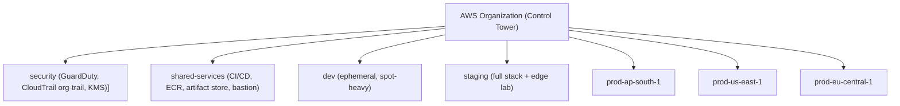
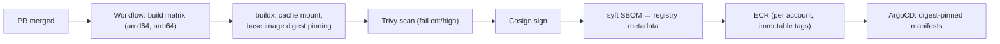
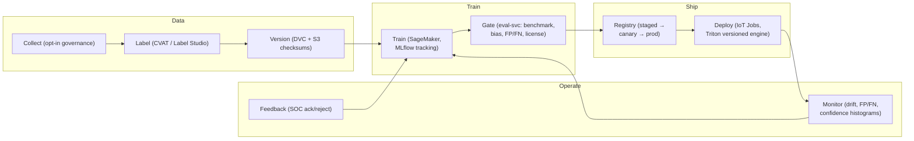
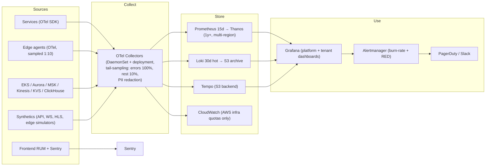

# SyncCam AI — DevOps, Cloud Infrastructure & MLOps Strategy v1.0

**Document:** DevOps, Cloud Infrastructure, Deployment & MLOps Strategy v1.0 (Draft for Review)
**Date:** August 1, 2026
**Source:** `PRD-SyncCam-AI.md` (v1.0), `ARCHITECTURE.md` (v1.0), `AI-ARCHITECTURE.md` (v1.0), `BACKEND-ARCHITECTURE-SyncCam-AI.md` (v1.0), `SECURITY-PRIVACY-COMPLIANCE-AI-GOVERNANCE.md` (v1.0), `UX-DESIGN-SyncCam-AI.md` (v1.0)
**Posture:** This document is the DevOps, cloud infrastructure, deployment, and MLOps strategy companion to the architecture set. It **extends** (and does not restate) ARCHITECTURE.md §7–8, §17–20 (Edge/Cloud/Scaling/DR); BACKEND-ARCHITECTURE.md §12–14 (Scaling/Deployment/Observability); AI-ARCHITECTURE.md §5–8 (Tools/Training/Data); and SECURITY-PRIVACY-COMPLIANCE-AI-GOVERNANCE.md §6–8 (SecOps/Testing/Roadmap) with the operational strategy layer: **how the platform is built, shipped, operated, scaled, and paid for.** Where a mechanism is already specified, this document references it and adds the strategy: provider selection, build/deploy pipeline, fleet operations, unit economics, runbooks, and gates.

---

## Table of Contents

1. [Strategy & Posture](#1-strategy--posture)
2. [Cloud Architecture](#2-cloud-architecture)
3. [Edge AI Architecture](#3-edge-ai-architecture)
4. [Container Architecture](#4-container-architecture)
5. [CI/CD Pipeline](#5-cicd-pipeline)
6. [MLOps Pipeline](#6-mlops-pipeline)
7. [Monitoring & Observability](#7-monitoring--observability)
8. [Scalability Planning (100 → 100,000 Cameras)](#8-scalability-planning-100--100000-cameras)
9. [Backup & Disaster Recovery](#9-backup--disaster-recovery)
10. [Cost Optimization](#10-cost-optimization)
11. [Production Readiness Checklist](#11-production-readiness-checklist)
12. [Decision Log & Cross-Reference Map](#12-decision-log--cross-reference-map)

---

## 1. Strategy & Posture

### 1.1 Strategic Postures

The operating strategy is governed by seven postures, each traceable to the source documents:

| # | Posture | Statement | Source |
|---|---|---|---|
| O1 | **Edge-first compute** | Real-time inference and life-safety decisions run on customer hardware; the cloud is the control, verification, analytics, and archive plane — never the life-safety dependency | ARCHITECTURE P1, S5; PRD G1, §14 |
| O2 | **AWS-native multi-region cloud** | All managed cloud services run in AWS regions (ap-south-1, us-east-1, eu-central-1 + DR pairs), tenant-pinned, region-parameterized IaC | ARCHITECTURE AD-02, P6 |
| O3 | **GitOps everywhere** | Code, configuration, infrastructure, and models are declarative artifacts in Git; convergence is continuous (ArgoCD for apps, Terraform for infra, IoT Jobs for edge, registry for models) | ARCHITECTURE §20.2, §22.11 |
| O4 | **SRE-led operations** | Availability, latency, and data integrity are expressed as SLOs with burn-rate alerting; every release is gated on error budget | ARCHITECTURE §15.2; BACKEND §14.3 |
| O5 | **Unit-economics-designed cost** | Every architectural decision is priced per camera-month against the G3 70% gross-margin target; cost is a design input, not a retrofit | PRD G3; ARCHITECTURE §17.3 |
| O6 | **Zero Trust & security-as-evidence** | Security controls ship in the same pipeline as features; compliance evidence is generated automatically from production telemetry | SECURITY §1.1, §5.10 |
| O7 | **Fleet-scale edge operations** | Edge devices are treated as a server fleet: golden images, canary OTA, health-beacon rollback, and zero-touch enrollment — never field-service-driven | ARCHITECTURE §7.2; PRD G4 |

### 1.2 Operating Model (who operates what)

| Function | Team | Owns | Operates |
|---|---|---|---|
| **Platform engineering** | Backend + DevOps | CI/CD, IaC, EKS, observability stack | All cloud environments |
| **SRE (on-call)** | Rotating (3 regions, follow-the-sun) | SLOs, incident response, capacity, GameDays | Production services |
| **MLOps** | ML engineers + AI-plane devs | Training pipelines, model registry, eval gates, drift | Model lifecycle only |
| **Edge ops** | Edge/firmware team | Golden images, OTA waves, fleet health, hardware certification | Edge fleet |
| **SecOps** | Dedicated (24×7 vendor SOC from Phase 3) | Detection, IR, vuln management, pen tests | Security plane |
| **DBA / data ops** | Platform engineering | Migrations, partitions, retention jobs, restore drills | Data stores |

**Cadence commitments:** deploy to prod multiple times per day (app plane); model releases weekly at most; infra changes via Terraform with plan gates; quarterly GameDays; quarterly restore drills; quarterly privileged-access reviews (SECURITY §6.4).

### 1.3 New Decision Entries

This document introduces the `OD-xx` decision series (full log in §12.1): OD-01 GitHub Actions + ArgoCD + Terraform; OD-02 MLflow/SageMaker hybrid registry; OD-03 DVC; OD-04 trunk-based development; OD-05 multi-arch distroless images; OD-06 Karpenter + scale-to-zero GPU; OD-07 Thanos + SLO burn-rate alerting; OD-08 S3 lifecycle cost spine; OD-09 multi-account AWS Organization; OD-10 golden edge image pipeline; OD-11 models decoupled from app deploys; OD-12 cost invariants; OD-13 synthetic edge fleet in CI; OD-14 automated degradation ladder; OD-15 dual-region edge endpoints; OD-16 FinOps practice.

---

## 2. Cloud Architecture

### 2.1 Provider Comparison (the 5-way analysis)

| Dimension | AWS | Azure | GCP | Hybrid (on-prem control plane) | Edge-only |
|---|---|---|---|---|---|
| **Managed RTSP/video ingest** | **Kinesis Video Streams** (WebRTC signaling + HLS built-in) — unique fit | Azure Video Analyzer (retired/declining), Media Services (no RTSP-managed ingest) | No managed RTSP service (GKE + media self-host) | Self-hosted mediamtx/LiveKit (BACKEND §1.2 alt) | N/A (no cloud) |
| **Edge fleet management + OTA** | **IoT Core + Greengrass v2** (shadows, Jobs, component registry) — unique fit | IoT Hub + IoT Edge (strong, equivalent capability) | IoT Core (device registry, no first-class edge-agent OTA) | K3s/balena (self-operated) | Full control plane on-prem |
| **GPU/ML platform** | **SageMaker** (Pipelines, Model Registry), p4d/p5/g5 fleet, Triton-ready | Azure ML (strong), NC/NV-series GPUs | Vertex AI, TPUs (edge for custom ASICs), A100/H100 | On-prem GPUs (expensive, no elasticity) | N/A |
| **Event backbone (1k–10k ev/s)** | Kinesis + MSK + SQS/SNS (managed, shard-scaling) | Event Hubs + Kafka + Service Bus (comparable) | Pub/Sub + Kafka (comparable) | Kafka self-managed | N/A |
| **Multi-region DB with sub-second RPO** | **Aurora Global Database** (RPO <1s), DynamoDB global tables | Cosmos DB multi-region (comparable) | Cloud Spanner (strong, different data model) | Self-managed replication | N/A |
| **Forensic evidence WORM** | **S3 Object Lock** (COMPLIANCE mode) — direct fit for FR-117 | Blob immutability (comparable) | GCS Object holds (comparable) | MinIO object lock (BACKEND AD-17) | Local hash chains only |
| **India presence (GTM)** | **ap-south-1 (Mumbai)** mature, DPDP-aligned docs | Central India (strong, competitive) | Mumbai region (younger portfolio) | N/A | N/A |
| **Compliance footprint** | SOC 2/ISO 27001/GDPR/DPDP, FedRAMP-grade controls | Equivalent | Equivalent | Customer-owned | Customer-owned |
| **Cost predictability @ scale** | On-demand + Savings Plans + spot; unit-cost discipline required | Comparable; licensing complexity on SQL Server paths | Sustained-use discounts; egress ~same | Capex-heavy | Lowest cloud cost, highest field cost |
| **Lock-in risk** | High (mitigated: P7 hardware abstraction, ONVIF, edge-neutral Triton) | High | High | Low | Low (functional ceiling) |

### 2.2 Verdict

**Primary: AWS, multi-region from day 1 (confirms AD-02).** AWS wins on the four workload-specific dimensions where the platform is concentrated: KVS (managed RTSP + WebRTC + HLS), IoT Core/Greengrass (edge OTA), SageMaker (MLOps), and Aurora Global Database + S3 Object Lock (DR + forensic evidence). Azure is the only credible alternative (IoT Edge and Azure ML are genuinely competitive); GCP is a poor fit without a managed video plane. **Hybrid** is not a cloud strategy — it is the *local-only product mode* (ARCHITECTURE §10, BACKEND AD-17) and must remain a supported deployment artifact, not the default. **Edge-only** is the fallback mode of the product, not the platform strategy.

**Portability hedge (P7):** the lock-in exposure is contained by three abstraction layers already mandated — (1) edge hardware abstraction (Jetson/x86/NPU), (2) ONVIF/RTSP camera standards, (3) Triton as the single inference runtime on both planes. The control-plane services (Go) and event contracts are provider-agnostic by design (BACKEND §8.5); a GCP/Azure re-platform study is a Phase 3 exercise, not an MVP risk.

### 2.3 Compute

| Tier | Technology | Rationale | Scale point |
|---|---|---|---|
| App services | **EKS + Karpenter** (3 AZs/region) | Container-native, HPA/KEDA autoscaling, multi-arch readiness (BACKEND §13.2) | 1 cluster/region; separate per-account for prod vs dev |
| Node classes | general: m7g/r7g (ARM) + c7g; GPU burst: g5 (T4/L4) on-demand; batch: spot | ARM saves ~20% on steady-state CPU; GPU burst scale-to-zero (OD-06) | Karpenter provisioners per class |
| AI training | SageMaker on p4d/p5 (A100/H100) + g5.24xlarge (A10G) | Fine-tune scale, distributed training, ephemeral (AI-ARCHITECTURE §6) | On-demand; spot for sweep jobs |
| Edge CI | arm64 runners (EKS node pool or GitHub-hosted ARM runners) | Build/verify multi-arch images (OD-05) | Shared, pooled |
| Serverless | Lambda/SQS adapters for notification fan-out (ARCHITECTURE §22.7) | Burst-safe push fan-out; no idle capacity | Per region |

### 2.4 Storage

| Service | Role (from BACKEND §1.2) | Strategy |
|---|---|---|
| S3 (8 buckets per §11.1) | Evidence, video archive, reports, snapshots, models, datasets, audit WORM, debug | Intelligent-Tiering + prefix-scoped lifecycle (OD-08); SSE-KMS per tenant; CRR to DR region; Object Lock on evidence + audit |
| KVS | Live + short-archive video transport | Retention set per site (default 30d); fragments → S3 for long retention; KVS retention cost is the binding constraint → keep short, export early |
| EBS gp3 | EKS persistent volumes | Stateful consumers (MSK brokers, OpenSearch, ClickHouse, Redis use managed services' own volumes) |
| EFS | Model staging only | Triton model cache shared between GPU pods (not EFS for hot paths) |
| Edge NVMe | Ring buffer + store-and-forward | Device-level; the cloud is the backup (ARCHITECTURE §18.1) |

### 2.5 Networking

| Layer | Design |
|---|---|
| VPC | 3-AZ, private subnets only; NAT gateways per AZ; no public DBs (ARCHITECTURE §14.1 L1) |
| VPC endpoints | Gateway + interface endpoints for S3, DynamoDB, Kinesis, MSK, KVS, Secrets Manager, ECR — no data-plane traffic through NAT |
| Cross-region | S3 CRR, Aurora Global Database, MSK mirroring (S3 connector); no live app traffic cross-region (residency P6) |
| Edge ingress | IoT Core MQTT (control), HTTPS Kinesis PUT + KVS PutMedia (data), mTLS certs (ARCHITECTURE §7.3) |
| Global routing | Route 53 (latency + health failover), Global Accelerator (API TCP/UDP, static anycast IPs), CloudFront (static + HLS) |
| Site-to-site | Transit Gateway + Direct Connect for enterprise tenants (dedicated tier, §13.1); Site-to-Site VPN as fallback |
| WAF | OWASP managed rules, IP reputation, rate-based rules at CloudFront + ALB (ARCHITECTURE §10.1) |

### 2.6 Databases (managed-service strategy)

| Store | Instance posture | Scaling & ops |
|---|---|---|
| Aurora PostgreSQL + TimescaleDB | Writer + 2 readers baseline; Global DB secondary in DR; r7g.4xl at 10k-camera tier (BACKEND §12.1) | Auto-scaling readers; PgBouncer 100 conns/instance; vertical-first, tenant-silo sharding >20k cameras/5k writes/s (BACKEND §12.4) |
| DynamoDB | On-demand, PK `tenant_id#entity_id` | TTL for retention; per-tenant quota middleware; PITR 35d |
| OpenSearch | 3-9 data nodes per size class; tenant aliases | Daily snapshots → S3; k-NN (HNSW) for Phase 2 face search |
| ClickHouse | 3 shards × 2 replicas (r6g.4xl) at 10k; Kafka engine ingest | Static baseline + burst; monthly partition drop = retention (BACKEND §3.4) |
| ElastiCache Redis | Cluster mode, 3+ nodes, multi-AZ | AOF everysec + RDB snapshots; keyspace `{tenant}` hash tags |
| MSK | 3 brokers at 10k → 9 at 100k | Partition-only scaling (16→128); topic retention 7–30d; S3 mirror for replay |
| Kinesis | 4 shards nominal → 20 (10× headroom at 1k ev/s) | Scripted +25% shard steps on lag; partition key `camera_id` |

### 2.7 GPU Infrastructure

| Pool | Instance | Use | Autoscaling | Cost posture |
|---|---|---|---|---|
| Cloud verify burst | g5.xlarge (T4) / g5.2xlarge (L4) | RT-DETR/GroundingDINO verify cascade, batch LPR/face re-embedding | KEDA on verify queue depth: **0 → 4 nodes, scale-to-zero** (BACKEND §12.2) | On-demand; the single largest discretionary cost — strictly queue-gated |
| Training | p4d.24xlarge (A100), p5 (H100) | Fine-tunes, synthetic generation, eval runs | SageMaker-managed; ephemeral per pipeline | Spot for non-critical sweeps; on-demand for critical path |
| Edge | Jetson Orin (15–60W), RTX 4000 Ada (150–250W) | All real-time inference (AI-ARCHITECTURE §6) | N/A (fleet sizing per camera count) | Capital or rental per site; amortized per camera-month (§10.2) |

### 2.8 CDN

- **CloudFront:** SPA/PWA (React), HLS segments for playback (ARCHITECTURE §22.4), report downloads, static assets. Cache: SPA max-age short + immutable hashed assets; HLS segments 1h TTL with signed URLs (15 min, audited).
- **Global Accelerator:** API/WS traffic — static IPs across regions, health-based routing, DDoS absorption.
- **KVS WebRTC:** signaling + TURN via KVS (no CDN needed for live; HLS via CloudFront).

### 2.9 Load Balancing

| Layer | Balancer | Purpose |
|---|---|---|
| Edge of cloud | CloudFront + WAF | TLS termination, DDoS, static delivery |
| API | Global Accelerator → **Kong** (EKS, 2+/AZ) | App gateway: JWT, OPA, rate limits, mTLS `/edge/*`, WS upgrade (ARCHITECTURE §10) |
| L7 HTTP/WS | ALB (internet-facing) | Kong → services; WS sticky-free (Redis backplane) |
| Internal gRPC | Headless services + client-side LB | No NLB needed for phase 1; Linkerd phase 2 for mTLS |
| Streams | KVS native | No self-managed media load balancer |

### 2.10 Disaster Recovery (cloud view)

Per ARCHITECTURE §19 (RTO ≤60 min, RPO ≤5 min; warm standby in paired regions; region pairs: ap-south-1 ↔ ap-southeast-1, us-east-1 ↔ us-west-2, eu-central-1 ↔ eu-west-2). The operational additions in §9: failover runbook, KMS key replication, edge endpoint failover (OD-15), and security monitoring provisioning in DR from minute zero (SECURITY §6.7).

### 2.11 AWS Organization & Account Strategy (OD-09)



| Account | Contents | Guardrails |
|---|---|---|
| security | Org-level CloudTrail (S3 Object Lock), GuardDuty, AWS Config, KMS key admin, SSO | Read-only for most engineers; break-glass dual-control |
| shared-services | GitHub-hosted runners (or EKS arm64 runners), ECR (prod images only), Terraform state S3 + DynamoDB lock, Artifactory/SBOM store | No workloads |
| dev / staging | Full Terraform module stack, reduced capacity | Budget alarms; staging has real edge hardware lab |
| prod-{region} | Full stack per region (EKS, Kinesis, MSK, KVS, Aurora, S3…) | SCPs: deny bucket public access, deny leaving region, deny `iam:*` outside pipelines; MFA on all console |

SCPs (service control policies) enforce: region pinning per account, S3 public-access denial, `kms:ScheduleKeyDeletion` deny except break-glass, EC2 instance-type restrictions (GPU accounts only), and data-plane egress limits.

---

## 3. Edge AI Architecture

### 3.1 Split of Responsibility (what runs where, and why)

| Capability | Edge | Cloud | Why (source) |
|---|---|---|---|
| Decode + record (full FPS) | ✓ | ✗ | Bandwidth economics; decode-once-branch-twice (ARCHITECTURE §6.2) |
| Detection inference (5–10 FPS, INT8) | ✓ | ✗ (verify only) | ≤3s life-safety latency (G1); S5: no cloud dependency |
| Temporal confirmation (state machines) | ✓ | ✗ | Local FSM; precision targets (AI-ARCHITECTURE §4) |
| Rules engine (zones, PPE matrix, thresholds) | ✓ | config only | Offline-safe life-safety; config-svc single-writer (B2) |
| Privacy masking (pre-encode) | ✓ | ✗ | S2: pixels never leave device |
| Ring buffer + evidence clip promotion | ✓ | ✗ | 10–30s pre-event context (FR-112/117) |
| Face attendance (enrolled gallery) | ✓ (on-box encrypted DB) | re-embedding only | Offline attendance loop (G1/§14, AI-ARCHITECTURE §3.7) |
| Cheap→expensive verify cascade | detector on edge | **RT-DETR / GroundingDINO on T4/L4** | D3: suppress FPs with heavyweight cloud models |
| Camera health (blur/tamper/FPS) | ✓ | aggregation + tickets | FR-116, device-svc |
| Analytics / search / reports | ✗ | ✓ | Heavy compute, cross-site (FR-114/115/117) |
| Training / retraining | ✗ | ✓ (SageMaker) | GPU fleet, data governance (AI-ARCHITECTURE §7) |
| Model registry + eval gates | ✗ | ✓ | Governance (ARCHITECTURE §5.1) |
| Alert fan-out (SMS/push/email) | local relay fallback | ✓ (notify-svc) | Channels; edge SMS relay only in local-only mode (§19.3) |
| Long-term archive | 30d local NVMe | opt-in S3/KVS | Cost guard (PRD §14, ARCHITECTURE §6.3) |

**Rule:** anything that must respond in ≤3s or must survive a full cloud outage runs on edge. Anything that needs fleet-wide context, heavy GPUs, or long retention runs in cloud. Nothing runs twice.

### 3.2 Edge Gateway Software Stack

Per ARCHITECTURE §7.1 (containerd + Docker-compose pods, Greengrass v2 nucleus, edge-agent (Go), Triton + TensorRT engines, local store, watchdog). Operational additions:

| Concern | Strategy |
|---|---|
| Container runtime | containerd; compose-defined pods (K8s is not deployed on edge in v1 — 300–1,200 boxes × K8s control plane is not operationally justifiable; a single-agent supervisor is) |
| Process model | `edge-agent` (streams, rules, persistence) + `vision-engine` (Triton client) + `face-engine` + `watchdog` (restart, disk hygiene, health beacon) |
| Device identity | X.509 issued at enrollment (serial + OTP + QR, BACKEND §4.4); TPM-bound keys; LUKS full-disk encryption; secure boot (ARCHITECTURE §7.1) |
| Local store | SQLite/RocksDB events + WAL; NVMe ring buffer; config cache; store-and-forward queues |
| Networking | Egress-only allowlist (SyncCam endpoints + NTP); no inbound; cameras on isolated VLAN (SECURITY §2.2) |
| Time | NTP + `epoch_ms` on all events (clock-skew correction at event-svc) |

### 3.3 Hardware Tiers & Deployment

| Tier | Hardware | Streams | Deployed when | Image |
|---|---|---|---|---|
| Edge S | Jetson Orin NX 16GB | 8–16 @ 5–10 FPS | MVP reference; SMB sites | arm64 golden image |
| Edge M | Jetson AGX Orin 64GB | 16–32 @ 4K | Enterprise sites | arm64 golden image |
| Edge L | x86 (i7-13th/Xeon E-2400) + RTX 4000 Ada / RTX 4070 Ti | 16–32 | Existing-hardware preference, 4K sites | amd64 golden image (+OpenVINO fallback) |

**Golden image pipeline (OD-10):** Ubuntu LTS minimal + secure boot + LUKS + kernel hardening → build per tier (arm64/amd64) → signed image (Cosign) → staged rollout (canary site → 10% → 100% of fleet) → rollback = previous signed image via Greengrass component. Images are versioned, SBOM'd, and trivy-scanned in the same CI as cloud images (SECURITY §6.3 edge gates).

**Zero-touch deployment (G4):** pre-flashed SD/SSD, first-boot serial+QR pairing, config convergence from config-svc; 100-camera site ≤5 days (ARCHITECTURE §7.2).

### 3.4 Camera-Side Inference (assessment)

| Option | Verdict | Why |
|---|---|---|
| **Edge box aggregation (recommended)** | **USE — default** | One box per 8–32 cameras amortizes GPU; central config/rules; Triton batching; lifecycle management via one OTA channel (AI-ARCHITECTURE §6) |
| Camera-side basic analytics (ONVIF motion/VCA) | USE — as pre-gate only | Camera motion events can gate edge inference ROI (save compute) without trusting camera accuracy; never the decision-maker |
| Camera-side AI inference (edge cameras) | AVOID in v1 | Vendor lock-in, per-camera model fleet explosion, no unified engine versioning; revisit only for isolated remote cams (Phase 3) |

### 3.5 Offline Operation Model

| Failure | Behavior | Guarantee |
|---|---|---|
| Cloud reachable, degraded | Upload priority: metadata > evidence > video; archive quality auto-degrades at >80% link utilization (ARCHITECTURE §6.3) | Event fidelity preserved |
| Full cloud outage | Detection, rules, temporal confirmation, attendance, local SMS relay (local-only mode) all continue (ARCHITECTURE §19.3) | Life-safety S5; alerts queue on edge |
| Disk near-full | Watchdog hygiene: drop archive video first, then old thumbnails; never drop pending events | Degradation ladder (OD-14) |
| Reconnect | Resume uploads with offset; daily reconciliation job (edge counters vs cloud, §4.3) | No silent loss; gap-fill re-pull |

### 3.6 Cloud Synchronization Channels

| Channel | Protocol | Contents | Direction | Notes |
|---|---|---|---|---|
| Events | HTTPS/Kinesis PUT (batch, adaptive backoff) | detections, attendance, camera-health | edge → cloud | per-camera ordering via partition key |
| Video | KVS PutMedia (STS, presigned) | fragments, evidence | edge → cloud | fragment resume/offset |
| Control | MQTT (IoT Core) + shadows | config convergence, commands, OTA | cloud → edge | desired vs reported state |
| Telemetry | OTLP/HTTPS (sampled 1:10) | FPS, GPU util, model version, store-and-forward depth | edge → cloud | full fidelity on bundle request |
| Uploads | S3 presigned | evidence clips, exports, debug bundles | edge → cloud | priority queue |

### 3.7 Fleet Management & OTA (edge as a fleet)

| Concern | Design |
|---|---|
| Registry | device-svc: serial, hw_tier, firmware, cert status, store-and-forward depth, last heartbeat (BACKEND §3.2.2) |
| OTA components | (1) models (TRT engines), (2) engine/agent binaries, (3) golden OS image, (4) config bundles — all as Greengrass components |
| Canary waves | canary device group (1 site) → 10% → 50% → 100%; auto-rollback on health-beacon failure (ARCHITECTURE §7.2) |
| Rollback | previous signed component retained; IoT Jobs rollback command; fleet-wide rollback is the default on P1 incident |
| Health model | heartbeat 10–30s; threshold alarms → device-svc tickets; fleet dashboards (uptime, OTA success %, store-and-forward depth) |
| Certificate rotation | IoT Jobs-driven, revocation honored at handshake (ARCHITECTURE §11.2) |
| Fleet sizing math | 10k cameras ≈ 300–1,200 boxes; 100k cameras ≈ 4,000–12,000 boxes → fleet ops must be fully automated (OD-10); no manual provisioning path |

---

## 4. Container Architecture

### 4.1 Docker Strategy

| Concern | Contract (extends BACKEND §13.1) |
|---|---|
| Multi-arch | Every image built for `arm64` + `amd64` via buildx matrix; manifest lists; edge images GPU-enabled (`cuda` runtime), cloud images distroless where possible |
| Base images | `gcr.io/distroless` (Go services); `python:3.12-slim` (AI plane); `nvcr.io` Triton server; JetPack base for edge engines |
| Size & attack surface | Distroless non-root; no shells in prod images; `COPY --chown`; read-only root filesystem where stateful stores are external |
| Health | `HEALTHCHECK` + `/healthz` (liveness) + `/readyz` (readiness incl. DB/broker connectivity) |
| Supply chain | Cosign signature at build; Trivy gate (fail critical/high); SBOM (syft) attached to ECR metadata; digest pinning in GitOps manifests (OD-05, SECURITY T14) |
| Config | Never baked into images; env from K8s secrets/SecretsManager via external-secrets; config maps for non-secrets |
| Resources | Declared per service (requests/limits) — see §4.3 table; GPU requests only on GPU pools |
| Edge images | Same registry; signed; multi-arch; consumed by Greengrass components (not K8s) |

### 4.2 Kubernetes (EKS) Architecture

| Concern | Contract (extends BACKEND §13.2) |
|---|---|
| Clusters | One per region per environment; 3-AZ; prod + DR warm standby (scaled down); staging includes edge hardware lab |
| Namespaces | `control-plane`, `data-plane`, `ai-plane`, `infra`, `ingress`; NetworkPolicies default-deny between namespaces (data-plane ↔ ai-plane gRPC only) |
| Node pools | general (Karpenter, ARM m7g/r7g preferred), gpu-burst (on-demand g5, scale-to-zero), batch (spot), arm64-runner (CI) |
| Autoscaling | HPA (CPU/RPS) + KEDA (Kafka lag, RabbitMQ depth, Kinesis lag, verify queue) + **Karpenter** as the only node autoscaler (OD-06) |
| Scheduling | podAntiAffinity per AZ; topologySpreadConstraints; PDBs on all stateful consumers; **priority classes** implement the degradation ladder (OD-14): `life-safety` > `real-time` > `standard` > `batch` > `preemptible` |
| Storage | EBS gp3; NVMe instance store for AI temp; EFS only for model staging |
| GitOps | ArgoCD appsets per environment; canary 5% → 50% → 100% with analysis; auto-rollback on health-beacon failure (ARCHITECTURE §20.2) |
| Security | IRSA everywhere; no long-lived keys; Linkerd mTLS Phase 2 (BACKEND §13.2); Seccomp/AppArmor profiles on distroless pods |
| Tenancy in cluster | Namespaces per plane, **not** per tenant — tenant isolation lives in the data layer (RLS, PK prefixes, KMS aliases) plus per-tenant quota middleware; silo-tier tenants get dedicated clusters/DBs (ARCHITECTURE §13.1) |

### 4.3 Service → Deployment Map (baseline at 10k-camera tier; extends BACKEND §16.2)

| Service | Plane | Image | Replicas (baseline) | Requests/Limits | Scaling trigger | State |
|---|---|---|---|---|---|---|
| api-gateway (Kong) | infra | amd64 | 6–12 | 500m/1Gi | HPA CPU/RPS | stateless |
| identity-svc | control | amd64 | 3–6 | 250m/512Mi | HPA | stateless |
| tenant-svc | control | amd64 | 3 | 250m/512Mi | HPA | stateless |
| config-svc | control | amd64 | 3–6 | 250m/512Mi | HPA | stateless |
| device-svc | control | amd64 | 3–6 | 250m/512Mi | HPA + heartbeat rate | stateless |
| audit-svc | control | amd64 | 3–6 | 500m/1Gi | HPA + Kafka lag (KEDA) | stateless |
| event-svc | data | amd64 | 6–20 | 500m/1Gi (BACKEND §13.1) | **Kinesis lag KEDA** | stateless (dedupe in Redis) |
| alert-svc | data | amd64 | 4–12 | 500m/1Gi | Kafka lag KEDA | stateless |
| notify-svc | data | amd64 | 4–16 | 500m/1Gi | **RabbitMQ depth KEDA** | stateless |
| analytics-svc | data | amd64 | 3–8 | 500m/1Gi | Kafka lag | stateless |
| report-svc | data | amd64 | 2–8 | 2/4Gi (render) | queue depth | stateless |
| playback-svc | data | amd64 | 4–12 | 500m/1Gi | RPS + KVS load | stateless |
| search-svc | data | amd64 | 3–8 | 500m/1Gi | RPS | stateless |
| integration-svc | data | amd64 | 2–6 | 250m/512Mi | queue depth | stateless |
| realtime-gw | data | amd64 | 5k conn/pod → ~20 at 100k | 1/2Gi (BACKEND §13.1) | WS conn count HPA | stateless (Redis backplane) |
| model-registry-svc | ai | amd64 | 2–4 | 500m/1Gi | — | stateless |
| eval-svc (verify) | ai | amd64 | 2–6 | 500m/1Gi | queue depth | stateless |
| cloud-verify (Triton) | ai | amd64 + GPU | 0 → 4 (scale-to-zero) | 8/16Gi + 1 GPU (g5) | **verify queue KEDA** | stateless |
| training-svc | ai | amd64 | 0–2 (on demand) | 1/2Gi | pipeline-triggered | stateless |
| billing-svc | infra | amd64 | 2–4 | 250m/512Mi | scheduled | stateless |
| graphql-bff | infra | amd64 | 3–8 | 500m/1Gi | HPA RPS | stateless |
| Edge engines | edge | arm64/amd64 | 1 box = 1 pod set | TRT: 8/16Gi+GPU (Jetson) | watchdog | stateful local |

### 4.4 Service Discovery

- **In-cluster:** headless Services + DNS (`<svc>.<ns>.svc`); gRPC client-side load balancing (round-robin); no server-side LB for internal traffic in phase 1.
- **Cross-plane:** edge ↔ cloud uses mTLS + regional endpoints only (no in-cluster discovery on edge).
- **Phase 2:** Linkerd adds per-request mTLS + identity-scoped authz between namespaces (BACKEND §13.2) without application changes.
- **Zombie/health:** readiness gates on DB/broker connectivity (per §4.1); K8s probes drive discovery correctness.

### 4.5 Configuration Management

| Layer | Mechanism | Source of truth |
|---|---|---|
| Infra | Terraform modules + Terragrunt (`modules/…`, `envs/{dev,staging,preview,prod-{region}}`) | Terraform state in S3 + DynamoDB lock (never Git) |
| K8s manifests | Helm charts + Kustomize overlays; ArgoCD appsets render per-env | Git repo `infra/` |
| App config | ConfigMaps for non-secrets; env-derived | Git (declarative) |
| **Domain config** (cameras/zones/rules/thresholds) | **config-svc is the single writer**; `config_versions` rows (diffs, versioned, edge-acked) | Postgres (config-svc), pushed to edge |
| Model config | Registry pin per site (`model_assignments`, thresholds) | model-registry-svc |
| Runtime flags | Feature flags (dark launch) with kill-switch; not config maps | Flag service |

Rules: config changes to cameras/zones/rules are **domain deploys, not infra deploys** — they go through config-svc versioning + edge convergence (B2), never through ArgoCD. Infra changes (cluster, network, secrets) go through Terraform plan gates + ArgoCD.

### 4.6 Secrets Management

| Secret class | Store | Rotation | Notes |
|---|---|---|---|
| Cloud service credentials | AWS Secrets Manager + external-secrets → K8s | RDS auto-rotation; per-policy | No secrets in Git, images, or logs (S7) |
| RTSP/ONVIF camera credentials | Secrets Manager (cloud) + TPM-bound keystore (edge) | 90d automated where cameras support | Redaction filter keeps them out of logs (SECURITY §2.2) |
| Webhook HMAC secrets | Secrets Manager, versioned | 180d, 24h overlap | BACKEND §7.2 |
| Device certs | IoT Core registry + tenant CA | IoT Jobs rotation | Revocation instant (S8) |
| Tenant KMS aliases | KMS (per-tenant, biometric separate hierarchy) | Annual key rotation | S3; field-level biometric encryption (SECURITY §1.9.1) |
| Break-glass | Sealed envelope, dual authorization | On use | Audited (SECURITY §1.7.2 T0) |

---

## 5. CI/CD Pipeline

### 5.1 Git Workflow & Branch Strategy (OD-04)

- **Trunk-based development**: short-lived feature branches (<2 days), merged to `main` via PR; no long-lived release branches in normal operation.
- **Branches:** `main` (deployable), `feature/{id}-{slug}` (PR-only), `hotfix/{id}` (from `main`, urgent), `release/{major}.{minor}` (only for compliance-pinned artifacts, e.g., evidence pipeline versions).
- **Conventional commits** (feat/fix/chore/ci/docs + scope) → semantic-release derives versions + changelog; tags `v{app}.{major}.{minor}.{patch}`.
- **Branch protection on `main`:** required PR review (2 approvers for ai-plane and data-plane changes), status checks all green, linear history, no direct pushes (except break-glass, audited).
- **Merge strategy:** squash merge; PR title = commit message (enforces changelog discipline).

### 5.2 Pull Request Gates (every PR, all services)

| Gate | Tool | Fail policy |
|---|---|---|
| Lint/format | golangci-lint / ESLint+Prettier / ruff | fail |
| Unit tests | go test / vitest / pytest | fail (coverage ≥80% on changed packages) |
| Integration tests | Testcontainers (Aurora-compatible PG, Redis, Kafka, S3 local) | fail |
| Contract tests | OpenAPI diff (spectral) + Pact consumer tests | fail on breaking change without major version |
| SAST | Semgrep-class | fail critical/high |
| Secret scan | gitleaks | fail (any) |
| Dependency scan | Dependabot + Grype (SBOM diff) | fail critical |
| Docker build | buildx multi-arch smoke build | fail |
| Image scan | Trivy (in build) | fail critical/high |
| IaC plan | `terraform plan` + checkov/tfsec | fail + required approval on destroy |
| Isolation tests | Cross-tenant read suite (ARCHITECTURE §13.3) | fail (data-plane services) |
| Observability contract | OpenTelemetry semantic-convention check | fail |

### 5.3 Automated Testing Pyramid

| Layer | What | Tooling | When |
|---|---|---|---|
| Unit | Logic per service | go test/vitest/pytest | every PR |
| Integration | Service + real stores | Testcontainers | every PR |
| Contract | API/Webhook/WS contracts | Pact + OpenAPI diff | every PR |
| E2E | Full stack + browser flows (Alert Center triage, Zone Builder, Enrollment) | Playwright + axe-core (a11y gate, UX §10) | staging per release |
| Performance | 1,000 ev/s ingest, 100k concurrent WS, 10k-camera synthetic fleet, 4K multi-stream boxes | k6 + Locust + **synthetic edge simulators** (OD-13) | staging per release + nightly |
| Chaos | Node loss, region failure, Kinesis throttle, edge disconnect | custom GameDay toolkit | quarterly |
| Model eval | Per-vertical benchmarks, bias, FP/FN | eval-svc suite | per model release (§6.6) |

### 5.4 Security Scanning (extends SECURITY §6.3, §7.9)

- **PR level:** SAST, secret scan, dep scan, Trivy, terraform plan — all wired into §5.2 gates.
- **Staging:** DAST (OWASP ZAP/Burp automation) per release; GraphQL depth/complexity checks; privacy tests (masking pixel-level, erasure completeness — SECURITY §7.8).
- **Release level:** Cosign verify, SBOM attached, threat-model delta review, isolation suite green, security sign-off gate.
- **Cadence:** external pen test annual + pre-GA; adversarial ML red-team per model release (SECURITY §6.4).

### 5.5 Docker Builds



Rules: images are **immutable and digest-referenced** in GitOps; promotion between environments re-uses the same digest (no rebuild); nightly `main` builds keep the pipeline warm; edge engine images flow to Greengrass components, not ECR-deployed pods.

### 5.6 Deployment Pipeline (environments & promotion)

| Environment | Purpose | Promotion gate | Capacity |
|---|---|---|---|
| `dev` (per-PR ephemeral) | Feature validation + synthetic edge simulators | PR checks | minimal, auto-teardown |
| `staging` | Full stack + staging edge hardware lab | e2e, load smoke, DAST, security scans, isolation suite | full-ish, no real tenants |
| `preview` (per-region) | Regional config validation | Terraform plan check, cross-region config diff | ephemeral |
| `prod-{region}` ×3 | Live | **Canary 5% → 50% → 100%** via ArgoCD; automated rollback | production |

**Canary mechanics:** ArgoCD progressive sync with analysis: error-rate ratio <1%, p95 latency shift <10%, SLO burn check, health-beacon ok. **Auto-rollback triggers:** >1% 5xx over 10 min, p95 breach 15 min, Kinesis consumer lag breach, missing readiness, security signal (SECURITY §7.9 canary gate). Rollback = revert manifest to prior digest (instant, no rebuild).

**Deployment frequency:** app plane: multiple deploys/day; data migrations: expand→mirror→contract (expand-contract) with backout window; infra: weekly window + emergency path; models: weekly max (separate pipeline, §5.9).

### 5.7 Rollback Strategy

| Artifact | Rollback mechanism | RTO |
|---|---|---|
| App images | ArgoCD revert to previous digest (canary analysis failure triggers automatically) | minutes |
| DB schema | Expand-contract migrations; never destructive-in-place; Aurora PITR as last resort (35d window) | minutes (migration), ≤15 min (PITR) |
| Domain config | `config_versions` revert + edge re-push (versioned diffs are forward/backward replayable) | minutes |
| Models | Registry pin revert + IoT Jobs rollback (previous signed artifact) | minutes; auto on health-beacon failure |
| Feature flags | Kill-switch off | seconds |
| Edge firmware/images | Greengrass component rollback to previous signed image | wave-based (≤1 day fleet-wide) |
| Infra (Terraform) | Plan-based revert; state history in S3; never `destroy` in prod | per-change |

### 5.8 Tools Comparison & Recommendation

| Tool | Verdict | Why (for this platform) |
|---|---|---|
| **GitHub Actions** | **USE — primary CI** (OD-01) | Single SCM + pipeline plane; hosted runners (arm64 available); native matrix/security integrations; repo = source of truth (ARCHITECTURE §22.11) |
| GitLab CI | Acceptable alternative | Strong when self-managed GitLab already exists; equivalent stages; heavier ops for the same result |
| Jenkins | AVOID | Plugin sprawl, maintenance burden, no native container-native DX; only legacy migrations |
| **ArgoCD** | **USE — GitOps CD** (OD-01) | Multi-cluster convergence, appsets for 3 regions, canary + analysis, auto-rollback; matches GitOps posture (O3) |
| Flux CD | Acceptable alternative | Kustomize-native, lighter; weaker progressive-delivery story than Argo Rollouts |
| **Terraform (+Terragrunt)** | **USE — IaC** (OD-01) | Region-parameterized modules, state locking, drift detection, preview-per-region (BACKEND §13.3); Pulumi/CDK viable later if type safety desired |
| SageMaker Pipelines | **USE — model orchestration** (§6) | Training CI/CD must NOT share the app CI/CD (OD-11) |
| IoT Jobs/Greengrass | **USE — edge CD** | The edge is a fleet, not a cluster; Jobs are the only CD primitive that reaches devices |

**The one pipeline rule:** one delivery plane per artifact class — GitHub Actions builds code; Terraform manages infra; SageMaker+registry manages models; IoT Jobs manages edge; ArgoCD converges clusters. Mixing these planes causes rollback conflicts and audit ambiguity.

### 5.9 Model Release Pipeline (decoupled from app deploys, OD-11)

```mermaid
flowchart LR
    DATA["Dataset vN (DVC, checksummed)"] --> TR["SageMaker training<br/>(MLflow-tracked)"]
    TR --> EV["eval-svc gates:<br/>benchmark, bias, FP/FN, license"]
    EV -->|"pass"| REG["Registry: staged<br/>(signed artifact + model card)"]
    REG --> SHADOW["shadow mode on live traffic<br/>(eval-svc comparison)"]
    SHADOW --> CANARY["canary device group (5%)"]
    CANARY -->|"health + FP rate ok"| PROD["prod pin per site (IoT Jobs)"]
    PROD --> MON["drift monitor"]
    MON -->|"regression"| RB["auto-rollback to prior pin"]
```



### 5.10 Release Management

- Versioning: app semver + image digest; model semver + artifact SHA; config version integers; dataset versions (DVC).
- Changelog auto-generated from conventional commits; API changelog published (BACKEND §15).
- Freeze windows: none by default (SRE posture); maintenance windows for data migrations announced 7d prior (`TENANT_MAINTENANCE`, BACKEND §4.2).
- Feature flags: dark launches for UX surfaces; kill-switch per module family.

---

## 6. MLOps Pipeline

### 6.1 Lifecycle Overview



### 6.2 Data Collection

| Concern | Strategy (extends AI-ARCHITECTURE §7) |
|---|---|
| Governance | Opt-in-only customer data (SECURITY §5.8, PRD §15.8); datasets region-locked; no customer footage leaves its pinned region |
| Sources | Per-vertical benchmark sets; opt-in customer clips; hard-negative programs (weapons/tools, PPE head-vs-helmet, fire/welding, fight/hugs, smoke/steam) — the #1 precision lever |
| Storage | S3 `sv-datasets-{region}`; checksums; region-pinned; IAM least-privilege for labeling workers |
| Synthetic | TILDA-style plate generation; COCO-composited weapons; per-vertical synthetic programs (AI-ARCHITECTURE §3.3, §3.10) |

### 6.3 Data Labeling

| Tool | Use | Why (AI-ARCHITECTURE §5 verdicts) |
|---|---|---|
| **CVAT (self-hosted)** | Video annotation: tracks, interpolation, segment tracking, multi-annotator | The workhorse for all 23 modules' video data |
| **Label Studio** | Classification/regression + review UX; ML-assisted | Fast classification QA |
| Roboflow (self-hosted) | Dataset ops only (public datasets); **never** hosted Roboflow for customer footage (AGPL + data residency) | Versioning/augmentation |
| **Label pipeline** | Per-vertical labeling queues; SOC ack/reject (dismissal reasons) automatically enqueue training samples | HITL feedback is a first-class data source (ARCHITECTURE §5.1) |

Labeling is capacity-managed like compute: queue depth per vertical is monitored; annotation SLA per dataset (e.g., 2 wk for hard-negative round); quality gates (agreement sampling ≥90%).

### 6.4 Dataset Versioning (OD-03 — DVC)

- **DVC** over Git: `dvc.yaml` pipeline definitions; data lives in S3 remotes (per region, per tenant-consent class); `.dvc` pointers in Git.
- Each dataset version = DVC commit + S3 checksum manifest; lineage recorded in the model card: `dataset_version → training run → model artifact → eval report`.
- Benchmarks per vertical are datasets themselves (versioned the same way) — an eval gate reads the exact benchmark version that a model claims.
- Immutability: dataset versions are write-once; corrections create new versions (audit trail).
- Retrain hygiene: hard-negative programs accumulate continuously; monthly dataset cut → quarterly fine-tune cadence (per family).

### 6.5 Training (SageMaker + MLflow)

| Concern | Design |
|---|---|
| Orchestration | SageMaker Pipelines: preprocessing → train → eval → register; triggered by schedule, data additions, or drift alarms (ARCHITECTURE §5.4) |
| Experiment tracking | **MLflow** (OD-02): params, metrics, artifacts per run; research-stage registry; Python-native; vendor-neutral (future GCP/Azure portability) |
| GPU fleet | p4d/p5 for critical path; g5.24xlarge (A10G) for standard fine-tunes; spot for sweeps; cost-capped per run (budget alarms) |
| Reproducibility | Pinned base images, pinned data versions, seeded RNG, recorded hyperparameters; torch.compile → export artifacts (TRT INT8/FP16, ONNX) |
| Export | Eval-passed models export to signed artifacts: TensorRT INT8/FP16 engines + ONNX interchange (AI-ARCHITECTURE §5 verdicts) |

### 6.6 Validation & Eval Gates (the release gate, eval-svc)

| Gate | Requirement | Fails → |
|---|---|---|
| Per-vertical benchmark | PRD §9 targets (≥95% precision PPE/intrusion/fire; ≥90% weapon/fall/fight) on exact versioned benchmark sets | Block promotion |
| Bias evaluation | Stratified FAR/FRR by subgroup on face stack; FP/FN by subgroup on others (SECURITY §4.6) | Block promotion |
| FP/FN targets | Site-tunable precision gates; per-site validation with tool-class recall gate (weapon) | Block staging |
| License check | D6: AGPL vs Apache-2.0 vs enterprise license resolved before registry entry | Block (legal gate) |
| Model card | Standardized: data, performance, limitations, bias metrics (SECURITY §4.5) | Block |
| Adversarial revalidation | Liveness spoof tests (APCER/BPCER), evasion probes, red-team (SECURITY §7.7) | Block for face/weapon |
| Quantization check | Per-class mAP before/after INT8 (small-object drift, AI-ARCHITECTURE §3.3) | Block |

### 6.7 Model Registry (OD-02: MLflow + SageMaker hybrid)

| Registry | Role | Contents |
|---|---|---|
| **MLflow** (research) | Experiment tracking + research-stage registry | Runs, params, metrics, artifacts, research model versions |
| **SageMaker Model Registry** (production) | The only registry that can promote to prod | Production model versions: signed artifacts, approval states (staged/canary/prod/rolled_back), benchmark + bias reports attached, lineage to dataset version + code commit |
| **model-registry-svc** | Platform-facing contract | `model_versions` / `model_assignments` tables (BACKEND §3.2.14), per-site pins + thresholds, shadow flags, API for device-svc/UI |

Promotion rule: only SageMaker Model Registry approval states can be pinned to sites; MLflow versions are research-only. One-way sync (MLflow → SageMaker) at promotion; rollback always via registry pin (ARCHITECTURE §5.1, §5.3).

### 6.8 Model Deployment (shadow, A/B, canary)

| Mode | Mechanics | Use |
|---|---|---|
| **Shadow** | New version runs on live traffic without acting; eval-svc compares predictions vs prod | Default first deployment of any version; auto-promote/discard on comparison |
| **Canary** | 5% device group via IoT Jobs; health-beacon + FP-rate gate; auto-rollback | Fleet-wide rollout |
| **A/B** | Site-pinned split: site A prod-vN, site B prod-vN+1; metrics per site | Controlled experiments on per-site thresholds/calibration |
| **Triton versioning** | Versioned engine endpoints; model policy per device | Model swap is config, not redeploy |

### 6.9 Model Monitoring (drift & quality)

Per AI-ARCHITECTURE §9 and SECURITY §4.10; operationalized as:

| Signal | Instrument | Cadence → action |
|---|---|---|
| Confidence distribution | Prometheus histograms per (model, site) | sustained shift → eval-svc review |
| FP/FN rate | SOC ack/reject feedback stream | precision < site target → retrain trigger |
| Benchmark regression | eval-svc on every release | gate (block promotion) |
| FAR/FRR per site | monthly calibration job | re-tune thresholds; tenant report |
| Embedding drift | re-embedding distance | re-embed low-confidence enrollments |
| Scene drift | scene statistics, calibration residuals | weekly background refresh + recalibration |
| Alert accuracy SLO | ≤1 FA/5 cams/day | daily; alert-fatigue review |

### 6.10 Retraining Loop

- **Triggers:** (1) drift alarm, (2) precision target breach per site/vertical, (3) monthly dataset cut, (4) new hard-negative batch, (5) scheduled quarterly fine-tunes per family.
- **Feedback:** dismissal reasons (false_positive/duplicate/handled) auto-enqueue to labeling; SOC confirmation rates per (model, site) feed eval-svc.
- **Governance:** retraining on customer footage requires opt-in (PRD §15.8); model updates are versioned, signed, gated, and audited; monthly calibration report per tenant (SECURITY §4.7).
- **Cadence target:** weekly max model releases per family; hotfix model path (life-safety regression) with expedited gates (benchmark + FP gate only).

---

## 7. Monitoring & Observability

### 7.1 Architecture (extends BACKEND §14.1)



### 7.2 Five Monitoring Domains

| Domain | What is monitored | Key metrics (examples) | Alerting owner |
|---|---|---|---|
| **Infrastructure** | EKS nodes, Aurora, MSK, Kinesis, KVS, S3, ClickHouse, Redis, OpenSearch | Node CPU/mem, Aurora CPU + replica lag, MSK broker CPU + lag, Kinesis shard throttles, S3 5xx, ClickHouse query queue, Redis memory fragmentation | SRE |
| **Applications** | RED per service (BACKEND §14.2) | `http_requests_total`, `events_ingested_total`, `consumer_lag`, `dlq_depth`, `notify_failure_total`, `edge_store_forward_depth`, `detect_to_alert_seconds` (the SLO span) | SRE |
| **AI models** | Inference health + quality | Confidence histograms per (model, site), FP/FN rates (SOC feedback), inference FPS/latency, TRT engine load, drift signals (§6.9), eval scores | MLOps |
| **Cameras** | Per-camera health (FR-116) | Status distribution (online/offline/tampered/masked/degraded), blur/occlusion scores, FPS per camera, last_known_good, uptime %, IT ticket state | Edge ops |
| **Video streams** | KVS + playback plane | KVS fragment age/health, ingest FPS vs configured, bitrate, HLS manifest availability, WebRTC ICE failure rate, playback error rate, per-camera stream continuity | SRE + Edge ops |

### 7.3 SLOs & Burn-Rate Alerting (extends BACKEND §14.3)

| SLO | Target | Window | Paging (burn) |
|---|---|---|---|
| API availability | 99.9% | 30d | ≥2%/1h → page; ≥1%/1d → ticket |
| Detection→alert latency | ≤3s p95 | 30d | p95 >3s for 15min → page |
| Event ingestion | ≥1,000 ev/s sustained; lag <10k | 30d | lag breach → page |
| Alert delivery (push) | p95 ≤10s | 30d | page |
| Evidence dossier completeness | ≥99.9% | 30d | ticket |
| Notify delivery success | ≥99.5% | 30d | ticket |
| Edge heartbeat coverage | ≥99.5% of fleet within 60s | 30d | page (fleet-wide drop) |

Alertmanager routing: critical → PagerDuty + Slack `#incidents`; high → Slack `#slo`; info → Grafana annotations. Multi-region dashboards via Thanos; **per-tenant P95 dashboards** for enterprise tenants (noisy-neighbor guard, ARCHITECTURE §13.2).

### 7.4 Logging

- Structured JSON everywhere with `trace_id`, `tenant_id`, `service`, `level`; Kong access logs → Loki 180d (BACKEND §14.4).
- **PII redaction at the collector** (names, plates, face paths, video URLs) — verified by automated log-leak tests (SECURITY §7.6).
- Log anomalies → Alertmanager via LogQL: auth-failure spikes, 4xx/5xx bursts, DLQ depth, edge reconnect storms.
- Audit logs: immutable hash chain + WORM (BACKEND §10); never in the same store as operational logs.

### 7.5 Error Tracking

- **Sentry**: frontend/PWA RUM + native apps (Phase 2); user context, breadcrumbs; error budgets wired to SLO review.
- **Application exception queues**: spoof-blocked, low-confidence punches, blacklist matches, webhook dead-letters — all surfaced in UI queues AND monitored for volume anomalies.
- **DLQ observability**: every dead-letter (Kafka/RabbitMQ/SQS) has depth alerting + replay tooling (BACKEND §8.3).

### 7.6 Synthetic Monitoring & RUM

| Canary | Frequency | Verifies |
|---|---|---|
| API health (per region) | 1 min | Gateway, auth, core read path |
| WebSocket connect/subscribe | 5 min | realtime-gw, Redis backplane |
| HLS manifest + segment fetch | 5 min | KVS → playback path |
| Edge simulator fleet (OD-13) | 15 min | Ingest path end-to-end (event → alert → notify) with synthetic cameras |
| KVS PutMedia → fragment age | 5 min | Video ingest path |
| RUM (SPA) | continuous | Page load, WS reconnects, JS errors |

### 7.7 Incident Management (SRE)

- Severity matrix mirrors SECURITY §6.2 (P1 ≤15 min response; P2 ≤4h; P3 ≤48h; P4 ≤30d).
- On-call: follow-the-sun across regions; 24×7 coverage at enterprise launch; vendor SOC optional at Phase 3.
- Process: detect → page → runbook (versioned in Git, with command transcripts) → mitigate → blameless postmortem within 3 days → action items tracked to closure.
- Metrics: MTTA, MTTR, SLO attainment, incident backlog — reviewed weekly; GameDays quarterly (ARCHITECTURE §17.3).

---

## 8. Scalability Planning (100 → 100,000 Cameras)

### 8.0 Scaling Model (from ARCHITECTURE §17.1)

| Layer | Scale unit | Mechanism |
|---|---|---|
| Edge | camera-per-box (8–32 streams) | Add certified boxes; config converges; fleet ops automates |
| Ingest | Kinesis shards | Lag-based shard scaling (scripted +25% steps) |
| Processing | K8s pods | HPA + KEDA (CPU, queue depth, lag) |
| AI (cloud) | GPU nodes | Queue-gated burst, scale-to-zero |
| Databases | replicas → silo shards | Aurora replicas → tenant-silo shards (>20k cameras) |
| Video | KVS + S3 | Retention, upload shaping, opt-in archive |
| Realtime | WS pods | Redis backplane; 5k conn/pod |
| Notifications | SNS/Lambda + RabbitMQ | Burst-safe fan-out with per-channel limits |

### 8.1 Tier 1 — 100 Cameras (MVP + SMB)

| Dimension | Snapshot |
|---|---|
| Edge | 4–12 boxes (Edge S) |
| Cloud | 1 region (ap-south-1), pooled tenancy, single EKS cluster |
| Ingest | 10 ev/s nominal; Kinesis 1–2 shards |
| DB | Aurora db.r7g.large (1 writer + 1 reader) |
| Ops | Dashboard-only; 1 region; no dedicated capacity planning |

**Bottlenecks:** none structural. Watch: upload bandwidth per site (archive off by default), edge box sizing (8–32 streams per box — wrong box tier is the #1 Tier-1 failure).

**Cost guardrail:** pooled tenancy; storage default 30d; no archive.

### 8.2 Tier 2 — 1,000 Cameras

| Dimension | Snapshot |
|---|---|
| Edge | 40–120 boxes |
| Ingest | 100 ev/s; Kinesis 2–4 shards; MSK 8 partitions detection.* |
| DB | Aurora r7g.xl/2xl + 2 readers; DynamoDB on-demand; OpenSearch 3 nodes |
| Processing | Full service map (§4.3) at baseline |
| WS | ~1–2 realtime pods (5k conn/pod) |
| Notifications | ~100 alerts/day fan-out |

**Bottlenecks & solutions:**

| Bottleneck | Signal | Solution |
|---|---|---|
| Kinesis shard saturation | throttles, lag | +shards (scripted); batch PUTs (ARCHITECTURE §4.3) |
| OpenSearch write pressure | CPU/heap, rejection | monthly index per events, tenant-size aliasing (BACKEND §3.5) |
| Edge OTA waves | slow rollouts | canary device groups; parallelize waves 10%→50%→100% |
| Evidence storage growth | S3 cost | prefix lifecycle (OD-08); 30d evidence default |

### 8.3 Tier 3 — 10,000 Cameras (PRD NFR baseline)

| Dimension | Snapshot (extends BACKEND §12.1) |
|---|---|
| Edge | 400–1,200 boxes |
| Ingest | 1,000 ev/s sustained, 10× peaks; Kinesis 4→20 shards; MSK 16 partitions detection.* |
| DB | Aurora r7g.4xl writer + 2–4 readers; Timescale hypertables compressed; DynamoDB on-demand; OpenSearch 6–9 nodes; ClickHouse 3 shards × 2 replicas |
| Processing | event-svc 6–20 pods; realtime 2–4 pods; notify 4–16 pods (KEDA on RabbitMQ) |
| Video | KVS per camera (retention-bounded); S3 archive opt-in per site |
| Notifications | ~1k alerts/day × 4 channels; SMS capped 3/min/zone |

**Bottlenecks & solutions:**

| Bottleneck | Signal | Solution |
|---|---|---|
| Postgres writer | CPU >70%, write latency | readers offload reads; partition drops = retention (O(1)); expand-contract migrations only; **silo-shard readiness plan starts here** |
| MSK partition lag | lag >10k | KEDA consumer scaling; +4 partitions per lag step |
| Kinesis consumer lag | lag, throttles | KCL worker scaling; shard add |
| ClickHouse ingest | merge backpressure | native Kafka engine tuning; nightly merge schedule |
| Edge fleet health | heartbeat coverage | fleet dashboards + automated ticket creation (device-svc) |
| Webhook fan-out | deliveries retrying | per-endpoint limits (60/min), DLQ + replay (BACKEND §7.2) |
| Alert fatigue | FA rate | aggregation + per-zone mute + severity routing (ARCHITECTURE §4.4) |

**Cost posture at Tier 3:** this is the design point for G3 unit economics — §10.7 dashboards must show $/camera/month per tenant here.

### 8.4 Tier 4 — 100,000 Cameras (Phase 3 / global scale)

| Dimension | Snapshot |
|---|---|
| Edge | 4,000–12,000 boxes; fleet ops fully automated (OD-10) |
| Ingest | 10,000 ev/s sustained (10× peaks = 100k peak burst); Kinesis 32+ shards (dedicated shard groups per large tenant); MSK 64–128 partitions, 6–9 brokers |
| DB | **Beyond single-writer:** tenant-silo Aurora shards (>20k cameras / >5k writes/s per BACKEND §12.4) with routing map (`tenants.db_shard`); DynamoDB on-demand; OpenSearch per size-class clusters (10+ nodes); ClickHouse 6 shards × 2–3 replicas (r6g.8xl) |
| Processing | Multi-cluster per region (control-plane vs data-plane vs ai-plane cluster separation optional); KEDA everywhere; GPU verify pool 0→8 nodes |
| Video | KVS at scale is cost-prohibitive as long-retention → KVS short-window + S3 archive primary; per-tenant bandwidth shaping; regional ingest endpoints (Direct Connect for enterprise) |
| Edge endpoints | Dual-region failover (OD-15): devices reconnect to paired region on primary loss |
| Notifications | ~10k alerts/day × 4 channels = 40k msgs/day sustained; channel quotas + aggregation are mandatory; per-tenant queues for noisy tenants (BACKEND §8.4) |

**Bottlenecks & solutions:**

| Bottleneck | Signal | Solution |
|---|---|---|
| Metadata ingress bandwidth | ~7.5 GB/s at 100k cams if all thumbnails streamed | Metadata-first (ARCHITECTURE §6.3); thumbnails only on event; zstd batch compression; regional ingest gateways; Direct Connect for large tenants |
| Postgres single-writer wall | >5k writes/s | tenant-silo sharding (routing map), per-shard writers, fan-out reads via ClickHouse |
| Kinesis capacity | shard throttles | dedicated shard groups per large tenant; 1 MB/s/shard with batched PUTs |
| Fleet OTA scale | 12k boxes × 50MB models | wave-based rollout over days; regional S3 distribution of artifacts; P2P relay (Phase 3 option) |
| OpenSearch cost | index growth | retention-bounded indexes; cold queries to ClickHouse; k-NN only on Phase 2 face search indexes |
| S3 archive cost | 10.8 GB/cam/day if archive on | archive stays **opt-in per site**; H.265; IA 7d → Glacier 30d (OD-08) |
| Notification provider quotas | SMS/WA throttles | per-channel adapters + DLQ + digests; WhatsApp Business API batch modes |
| Support/ops | ticket volume | automated device-svc tickets, self-healing edge (watchdog), remote diagnostics, fleet-wide config as code |
| Compliance | 100k cameras = large biometric + evidence surface | erasure/retention jobs at scale; WORM vaults per region; audit chain volume → ClickHouse-side archives (BACKEND §3.4) |

### 8.5 Cost per Tier (illustrative $/camera/month — model, not quote)

| Component | 100 cams | 1,000 cams | 10,000 cams | 100,000 cams |
|---|---|---|---|---|
| Edge compute (amortized HW + power) | $6–10 | $4–7 | $3–5 | $2.5–4 |
| Cloud control plane (CPU/DB/backbone) | $2–4 | $1–2 | $0.5–1.5 | $0.3–1 |
| Cloud storage (evidence, 30d + retention tiers) | $1–2 | $0.5–1.5 | $0.3–1 | $0.2–0.6 |
| Bandwidth (metadata + clips, shaped) | $0.5–1 | $0.3–0.8 | $0.2–0.5 | $0.15–0.4 |
| Cloud GPU verify | $0.3–0.8 | $0.2–0.5 | $0.15–0.4 | $0.1–0.3 |
| Notifications + SMS | $0.2–0.5 | $0.1–0.3 | $0.1–0.2 | $0.05–0.15 |
| Ops overhead (SRE/edge ops amortized) | $1–2 | $0.5–1 | $0.3–0.6 | $0.2–0.4 |
| **Blended total** | **$11–20** | **$7–13** | **$4.5–9** | **$3.5–7** |

*Illustrative planning model; validate against real usage via billing-svc metering from MVP (G3, ARCHITECTURE §23.1 assumption 5). The 70% GM target requires per-camera pricing ≥3.3× the blended cost of the largest serving tier in each market.*

### 8.6 Capacity & Performance Guards

- Load tests in CI (k6 + Locust + synthetic edge simulators): 1,000 ev/s ingest, 100k concurrent WS, 10k-camera synthetic fleet, 4K multi-stream boxes (ARCHITECTURE §17.3).
- Chaos engineering: quarterly GameDays (node loss, region failure, Kinesis throttle, edge disconnect) validating runbooks.
- **Unit-cost model** tracked $/camera/month per deployment tier — informs pricing and GM.
- Scaling decision matrix: shard thresholds, replica thresholds, silo-shard trigger (>20k cams / 5k writes/s), pre-scaled for known events (festival hours, shift changes).

---

## 9. Backup & Disaster Recovery

### 9.1 Backup Matrix (operationalized from ARCHITECTURE §18.1)

| Data | Mechanism | Schedule | RPO | RTO | Restore test |
|---|---|---|---|---|---|
| Aurora (relational) | Automated backups + PITR 35d; Global DB secondary | continuous + daily snapshot | ≤5 min | ≤15 min | quarterly |
| DynamoDB | On-demand PITR 35d | continuous | ≤5 min | ≤15 min | quarterly |
| OpenSearch | Daily snapshot → S3 repo | daily | ≤24 h | ≤1 h | quarterly |
| MSK | AZ replication + retention 7–30d + S3 mirror | continuous | ≤5 min (mirror) | <1 h | quarterly (replay) |
| Redis | AOF + RDB → S3 | continuous + hourly | ≤5 min | ≤15 min | quarterly |
| ClickHouse | Native backups + S3 | nightly | ≤24 h | ≤1 h | quarterly |
| S3 (video/evidence/reports) | Versioning + lifecycle + CRR | real-time | real-time | <1 h | continuous (replication) |
| S3 audit (WORM) | Object Lock + CRR; hash chains independent of backup | real-time | real-time | <1 h | quarterly verify |
| Terraform state | S3 versioning + DynamoDB lock | on change | n/a | n/a | on restore drill |
| Git (config/code) | Remote + mirror | on commit | n/a | n/a | — |
| Edge local store | Local WAL + store-and-forward to cloud | continuous when connected | n/a | n/a | outage drill (quarterly) |

### 9.2 Backup Operations

- **Schedule + monitoring:** all backup jobs are instrumented (CloudWatch/OTel), failures alert, and backups are part of the SLO dashboard.
- **Restore drills:** quarterly, measured — RTO/RPO verified per store; drill report filed; failures are P2 incidents.
- **Evidence/audit immutability:** backup copies of evidence and audit are WORM-protected; a restore must never resurrect data that was right-to-erased (erasure completeness test includes backup restore window carve-out, SECURITY §7.8).
- **Legal hold:** exceptions listed in erasure manifests; hold-flagged records excluded from normal retention deletion (BACKEND §11.3).

### 9.3 Recovery Strategy (region failover runbook)

```mermaid
sequenceDiagram
    participant MON as Observability (Region A)
    participant OPS as On-call (SRE)
    participant DR as DR region (warm standby)
    participant GLB as Aurora Global Database
    participant EDGE as Edge fleet
    participant R53 as Route 53

    MON->>OPS: Multiple SLO burn alerts (API 5xx, Aurora failure, EKS loss)
    OPS->>OPS: Confirm via runbook (5-min decision; SECURITY §6.7 scenarios)
    OPS->>DR: Failover command (Terraform/tfstate switch + flags)
    DR->>GLB: Promote regional secondary (RPO <1s)
    DR->>DR: Replay Kinesis/MSK offsets from S3 mirror; DynamoDB PITR if needed
    OPS->>R53: Switch routing (health-check failover, TTL 30s)
    R53-->>EDGE: Edge reconnects to DR region (OD-15: region endpoint from device shadow)
    EDGE->>DR: store-and-forward replay (dedupe by event_id)
    DR-->>OPS: Dashboards green; drill report filed
```

**Failover SLAs:** decision ≤5 min; RTO ≤60 min; RPO ≤5 min. **Failback:** reverse after RCA; edge reconnects to primary; reconciliation job merges (dedupe by `event_id`); quarterly drills time both directions.

### 9.4 Edge Continuity (the platform's real DR)

- Detection, rules, temporal confirmation, and attendance **never depend on the cloud** (S5).
- During a full cloud outage: events queue on edge (store-and-forward); alert escalation via local relay (SMS gateway at site, local-only mode); video stays in ring buffer until reconnect (ARCHITECTURE §19.3).
- The cloud is the backup of the edge — not the other way around.

### 9.5 Multi-Region Deployment (operational requirements)

- Same IaC everywhere (P6): region-parameterized Terraform modules; `preview` environments validate regional config before prod promotion (BACKEND §13.3).
- KMS multi-region replica keys; CloudHSM option Phase 2 (SECURITY §6.7); key-loss playbook documented.
- DR stack provisions security monitoring from minute zero (GuardDuty, CloudTrail, SIEM shipping are in the DR Terraform).
- Audit chain verification must remain valid across region switch (hash-chain design is region-independent — SECURITY §6.7).

---

## 10. Cost Optimization

### 10.1 Principles (OD-12: cost invariants)

1. **Frame sampling is a permanent invariant** — analytics at 5–10 FPS, full FPS only for recording (PRD §14; AI-ARCHITECTURE §6).
2. **ROI gating is permanent** — expensive models run only on triggered regions (AI-ARCHITECTURE §3.x motion/ROI gates).
3. **Cheap→expensive cascade is permanent** — cloud verification volume is a gated cost, not an open tap (D3).
4. **The edge is the cheapest GPU** — any inference that can run on edge at required latency must not run in cloud.
5. **Retention is priced and tiered** — every day of retention has a $/camera/month figure; tenant-facing.
6. **Everything is metered** — billing-svc meters from day 1 (ARCHITECTURE §23.1) so unit economics are real numbers, not estimates.

### 10.2 GPU Costs

| Lever | Action | Impact |
|---|---|---|
| INT8/FP16 + Triton batching | Mandatory TRT INT8 on edge (2–5×); dynamic batching on cloud verify | edge GPU per-stream cost ↓50–70% |
| Scale-to-zero verify pool | KEDA queue-gated g5 pool 0→4→8 | cloud GPU is zero when idle |
| Instance selection | T4 (g5.xlarge) for verify; L4 where INT8/FP16 small-object matters; A10G (g5.24xlarge) for training; A100 only for critical fine-tunes | instance mix vs workload |
| Spot for sweeps | Non-critical training/sweeps on spot | training cost ↓60–80% on those runs |
| Reservation | Savings Plans on baseline GPU (verify pool min) once volume is stable | ~25–40% vs on-demand |
| Model size discipline | Distill 8m→6s for low-tier boxes; shared backbone (D1) | per-box VRAM/latency |

### 10.3 Cloud Storage Costs

| Lever | Action |
|---|---|
| Lifecycle (OD-08) | Intelligent-Tiering; evidence IA after 30d → Glacier after 365d; archive 720p: IA 7d → Glacier 30d; tenant-configurable retention (7/30/90/365d) enforced by prefix lifecycle |
| Archive opt-in | Cloud archive is **off by default**; edge holds 30d locally (ARCHITECTURE §6.3) |
| Encoding | H.265 re-encode for preview/archive (720p/1080p); keyframe fragments; audio stripped where unused |
| Object hygiene | Evidence MP4s only on event; snapshots 30d; debug bundles 90d; no raw archive of non-event video |
| Dedupe/compression | zstd on metadata batches; thumbnail-only mode option per site |
| WORM scoping | Object Lock only on evidence + audit buckets (compliance-critical), never on archive |

### 10.4 Video Bandwidth Costs

| Lever | Action |
|---|---|
| Metadata-first | Upload priority metadata > evidence > video; detections ≈ 50–150 KB/s only while active |
| Event-only evidence | Ring buffer → S3 only on promotion (evidence clips, ≤30s @ 2–4 Mbps) |
| Adaptive site uplink | Auto-degrade archive quality >80% link utilization (ARCHITECTURE §6.3) |
| Regional endpoints | Edge devices pin to nearest region; no cross-region media transport |
| Compression | H.265; keyframe-only thumbnails; snapshot TTL 30d |
| Live view on demand | WebRTC/HLS consumed only when viewed (0 idle cost) |

### 10.5 AI Inference Costs (cloud)

| Lever | Action |
|---|---|
| Verify cascade gating | Only ambiguous crops reach GroundingDINO/RT-DETR (D3) — batch by queue, capped per site |
| Batch re-analysis | Archive re-analysis (Phase 2 face search/LPR) runs in scheduled batches on spot/on-demand mix, not live |
| Temporal confirmation | 3-frame confirms reduce cloud verify calls at the source |
| Edge-first per §10.1.4 | Model families deployed edge-first; cloud inference is the exception, not the default |
| Enrollment re-embedding | Batch R100 re-embedding scheduled nightly on minimal pool |

### 10.6 Database Costs

| Lever | Action |
|---|---|
| Aurora | Writer r7g + readers only; read-heavy analytics → replicas; continuous aggregates absorb dashboards (BACKEND §3.3); storage autoscaling on |
| DynamoDB | On-demand with TTL; event_log_hot 30d only; alert_fast only hot queue state |
| Partition drops as retention | Monthly partition drop = O(1) delete, no DELETE churn (BACKEND §3.6) |
| ClickHouse | Compression (≈10×), Summing/ReplacingMergeTree aggregates only (no raw cold rows where aggregates suffice) |
| OpenSearch | Retention-bounded monthly indexes; no long-retention raw events in search |
| Redis | Cluster mode sized to keyspace (§9.1 dedupe ≈19MB/region); TTL-native everywhere |

### 10.7 FinOps Practice (OD-16)

| Practice | Mechanism |
|---|---|
| Tagging | Every resource tagged: env, service, tenant-tier, cost-center; enforced by SCP + CI check |
| Unit-cost dashboards | billing-svc metering → $/camera/month by tenant, by component; Grafana boards per tier |
| Budgets & anomaly alerts | AWS Budgets per account + anomaly detection; alerts at 80%/100% |
| Right-sizing reviews | Quarterly: instance family/class review from utilization telemetry |
| Savings vehicles | Savings Plans on steady-state (compute, DB), spot for batch; revisit quarterly |
| Chargeback | Enterprise (silo) tenants get per-tenant cost reports (Phase 2) |
| Degradation ladder | Under sustained pressure: archive video → snapshots → report renders → dashboard refresh → **never** detection/alerting (BACKEND §12.5) |

### 10.8 Cost Guardrails (enforced)

- GPU burst pool hard cap (nodes, $/day budget); verify queue caps per tenant.
- Archive enablement requires site admin + shows cost preview in UI (UX §5.15 storage usage bar).
- Retention changes are tenant-configurable but priced (per-day tiered rates visible).
- Storage per-tenant quota + alert at 80% (billing-svc quotas, BACKEND §4.3).
- Cross-region replication costs reviewed annually (CRR is on evidence/audit only, never archive).

---

## 11. Production Readiness Checklist

### 11.1 Before MVP Launch (private beta, ~3–4 months)

| Area | Item | Evidence / gate |
|---|---|---|
| CI/CD | Trunk-based workflow live; all §5.2 PR gates green on every service | Pipeline status dashboard; 100% of merged PRs gated |
| CI/CD | Multi-arch builds + Cosign + SBOM in prod images | ECR artifacts with signatures + SBOM |
| CI/CD | ArgoCD GitOps with canary 5→50→100 + auto-rollback exercised | One full canary + rollback drill recorded |
| IaC | All infra in Terraform; no console-only resources; state in S3 + lock | `terraform plan` clean in prod; drift detection nightly |
| Environments | dev/staging/preview/prod-{region} working; staging has edge hardware lab | Release notes per environment |
| Observability | OTel wired edge+cloud; Prometheus/Thanos, Loki, Tempo, Grafana live; all §7.3 SLOs instrumented | Dashboards public; burn-rate alerts firing correctly |
| Observability | Alerting to PagerDuty with runbooks; on-call rotation defined | On-call calendar; 3 runbook walkthroughs |
| Edge ops | Golden image pipeline; Greengrass OTA canary + rollback proven on real hardware | OTA drill with rollback on health-beacon failure |
| Edge ops | Store-and-forward validated under simulated outage | Outage drill report |
| Security | Pre-GA external pen test clean (no critical/high open); MFA enforced; secrets manager-only | Pen test report; MFA enrollment ≥100% privileged roles |
| Security | Threat model signed; §7.9 release gates wired (SAST/DAST/isolation/privacy tests) | Gate evidence per release |
| MLOps | Eval gates + model registry + shadow mode + rollback operational | One full model release cycle recorded |
| MLOps | Dataset versioning (DVC) + labeling pipelines live | First hard-negative program complete |
| Data | Backup matrix running; **one quarterly restore drill passed** | Drill report with measured RTO/RPO |
| Data | Retention/lifecycle enforced at schema + S3 level; erasure workflow tested | Erasure completeness test green |
| Cost | billing-svc metering live; unit-cost dashboard published; budgets set | First $/camera/month report |
| Compliance | DPA, DPIA kit, notice/signage pack, residency pinning, breach runbooks | Legal review sign-off |
| Performance | k6 gates: 1,000 ev/s ingest, 100k WS, 10k synthetic cameras — passed | Load test report |

### 11.2 Before Enterprise Launch (months 4–9)

| Area | Item | Evidence / gate |
|---|---|---|
| Reliability | 99.9% SLO attainment 3 consecutive months | SLO dashboard export |
| Reliability | Quarterly GameDays executed; chaos findings closed | GameDay reports + action items closed |
| DR | Full region failover + failback drill (both directions) passed | Drill report (RTO/RPO measured) |
| DR | Quarterly restore drills for all stores | Drill log |
| Security | SOC 2 Type I report; ISO 27001 gap analysis complete | Reports |
| Security | SCIM deprovisioning SLA proven (≤15 min); SSO conformance suite | Test results |
| Security | 24×7 monitoring coverage; bug bounty (private) live | SecOps roster; program page |
| Tenancy | Dedicated (silo) tier validated; per-tenant P95 dashboards live | Isolation test suite + tenant dashboards |
| Enterprise features | CMK/CloudHSM option; SIEM Connect (per-tenant event feed); forensic watermarking | Feature acceptance |
| Edge ops | Fleet >500 boxes operating with <2% manual interventions | Fleet ops metrics |
| MLOps | Drift monitoring + monthly calibration service operational; bias re-evaluation on model updates | Monthly calibration reports |
| Performance | Load tests at 10k-camera scale passed (capacity plan validated) | Load test report at Tier 3 |
| Compliance | QC Law 25 pack; state biometric packs (BIPA et al.); DPDP pack | Pack inventory + legal review |
| Cost | $/camera/month at or below Tier-3 planning model; GM trending to ≥70% | Unit-cost dashboard |

### 11.3 Before Global Scaling (100k cameras, Phase 3)

| Area | Item | Evidence / gate |
|---|---|---|
| Architecture | Tenant-silo DB sharding operational; routing map tested | Sharded-tenant load test |
| Architecture | Multi-cluster / multi-account topology per region validated | Scale drill at 30k+ cameras |
| Edge | Fleet ops 100% automated (zero-touch, canary waves, auto-remediation) | 5,000+ box fleet telemetry |
| Edge | Dual-region edge failover (OD-15) proven under injected region loss | Failover drill |
| Reliability | Availability at 99.9%+ across 3 regions with follow-the-sun on-call | SLO dashboards ×3 regions |
| Security | SOC 2 Type II + ISO 27001 certified; annual pen tests + red-team standing | Certificates; reports |
| Compliance | AI Act classification + documentation set; regional packs (Saudi/UAE/JP/AU) | Pack inventory |
| Performance | 100k-camera synthetic fleet test passed; ingest at 10k ev/s sustained | Load test report at Tier 4 |
| Cost | GM ≥70% verified at Tier-4 unit economics | Unit-cost dashboard at scale |
| Portability | GCP/Azure re-platform study (edge abstraction validation) | Study report |
| Governance | Quarterly AI governance board reviews; AI incident log operational | Minutes + log |
| Marketplace (Phase 3) | Model marketplace sandbox: partner model eval, license checks, sandboxed serving | Marketplace release gate |

---

## 12. Decision Log & Cross-Reference Map

### 12.1 Decision Log Additions (OD-xx series; extends ARCHITECTURE §23.2, BACKEND §16.1, SECURITY §9.1)

| # | Decision | Rationale |
|---|---|---|
| OD-01 | CI/CD stack: GitHub Actions + ArgoCD + Terraform/Terragrunt | One SCM plane; GitOps convergence; region-parameterized IaC; matches O3 posture (ARCHITECTURE §22.11) |
| OD-02 | MLflow (experiment tracking + research registry) hybrid with SageMaker Model Registry (production registry) | Vendor-neutral tracking; native AWS promotion gates; one-way sync at promotion (ARCHITECTURE §5.1, §22.3) |
| OD-03 | DVC for dataset versioning (S3 remotes, checksums, lineage) | Dataset → model lineage is a governance gate (AI-ARCHITECTURE §7); Git-native |
| OD-04 | Trunk-based development, short-lived branches, squash merges | Deployment cadence multiple/day; rollback is artifact-level, not branch-level |
| OD-05 | Multi-arch (arm64/amd64) distroless images, Cosign-signed, SBOM'd, digest-pinned | One pipeline for Jetson + cloud; supply-chain evidence (SECURITY T14) |
| OD-06 | Karpenter as the single node autoscaler; GPU burst pool scale-to-zero | Fewer autoscaler interactions; GPU cost gated by queue depth (BACKEND §12.2) |
| OD-07 | Thanos for multi-region metrics; SLO burn-rate alerting as primary paging source | Cross-region SLO correctness; alert quality over volume (BACKEND §14.3) |
| OD-08 | S3 Intelligent-Tiering + prefix-scoped lifecycle as the storage cost spine | Retention is tenant-configurable and priced; one mechanism across buckets (§10.3) |
| OD-09 | Multi-account AWS Organization (security/shared/dev/staging/prod-{region}) with SCPs | Blast-radius isolation; region pinning; clean chargeback boundaries (§2.11) |
| OD-10 | Golden edge image pipeline (secure boot, LUKS, signed) with canary device-group rollout | Fleet-scale edge ops (O7); 12k boxes cannot be field-managed (§3.3, §3.7) |
| OD-11 | Model deploys decoupled from app deploys (registry → IoT Jobs, never ArgoCD) | Different rollback domains; eval gates ≠ release gates (ARCHITECTURE §5.1) |
| OD-12 | Cost invariants: frame sampling, ROI gating, cheap→expensive cascade are permanent design constraints | PRD §14 mitigation; 70% GM (G3); prevents "optimize later" debt (§10.1) |
| OD-13 | Synthetic edge fleet + k6/Locust perf gates in CI | Scales testing beyond hardware labs; catches ingest regressions per PR (ARCHITECTURE §17.3) |
| OD-14 | Automated degradation ladder via K8s priority classes + KEDA (life-safety never degrades) | BACKEND §12.5 made enforceable at the scheduler level |
| OD-15 | Dual-region edge endpoints: devices reconnect to paired DR region on primary loss | Edge continuity beyond tenant pinning; region loss ≠ site downtime (ARCHITECTURE §19.2) |
| OD-16 | FinOps practice: billing-svc metering → unit-cost dashboards, budgets, anomaly alerts, quarterly right-sizing | G3 unit economics must be real numbers from MVP (§10.7) |

### 12.2 Cross-Reference Map (section → source docs)

| This document | Source |
|---|---|
| §1 postures | ARCHITECTURE §1 (P1–P9), §23.2; PRD §3, §6; SECURITY §1.1 |
| §2 cloud | ARCHITECTURE §8, §22; BACKEND §1.2, §13.3; SECURITY §1.3 |
| §3 edge | ARCHITECTURE §7, §19.3; AI-ARCHITECTURE §3, §6; BACKEND §13.1 |
| §4 containers | BACKEND §13; ARCHITECTURE §22.10; SECURITY §14.2 supply chain |
| §5 CI/CD | ARCHITECTURE §20.2, §22.11; SECURITY §6.3, §7.9 |
| §6 MLOps | AI-ARCHITECTURE §5, §7–9; ARCHITECTURE §5; SECURITY §4 |
| §7 observability | ARCHITECTURE §15–16; BACKEND §14; SECURITY §6.1 |
| §8 scaling | ARCHITECTURE §17; BACKEND §12 |
| §9 backup/DR | ARCHITECTURE §18–19; SECURITY §6.7 |
| §10 cost | ARCHITECTURE §17.3; PRD §14; BACKEND §12.1 |
| §11 checklists | PRD §10–12; SECURITY §8 roadmap |

### 12.3 Glossary Additions (extends ARCHITECTURE §23.4, BACKEND §16.3, SECURITY §9.3)

| Term | Meaning |
|---|---|
| Burn-rate alerting | Paging based on how fast an SLO error budget is being consumed, not raw threshold breaches |
| Canary (device group) | A small edge-device cohort receiving a rollout first; health-gated promotion |
| DVC | Data Version Control — dataset/pipeline versioning over Git with object remotes |
| FinOps | Cost-accountability practice: metering, tagging, budgets, unit economics |
| Golden image | Versioned, hardened, signed base OS/container image per edge hardware tier |
| KEDA | Kubernetes Event-Driven Autoscaling (queue/lag/event-metric triggers) |
| MLflow | Open-source experiment tracking + model registry |
| Scale-to-zero | GPU/worker pool that removes all capacity when queues are empty |
| Silo shard | Dedicated tenant database cluster (isolation + scale) with routing map |
| Warm standby | DR region running a reduced-capacity stack, scaled up on failover |

---

*Document ends. Companion docs: `PRD-SyncCam-AI.md`, `ARCHITECTURE.md`, `AI-ARCHITECTURE.md`, `BACKEND-ARCHITECTURE-SyncCam-AI.md`, `SECURITY-PRIVACY-COMPLIANCE-AI-GOVERNANCE.md`, `UX-DESIGN-SyncCam-AI.md`. Review, then adopt via the PRD §Appendix decision process.*
