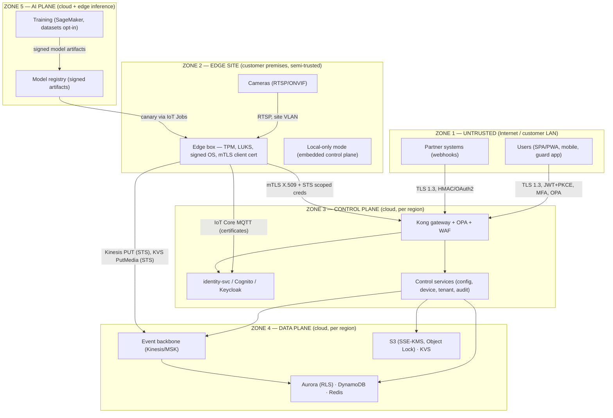
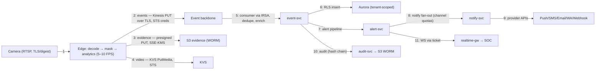
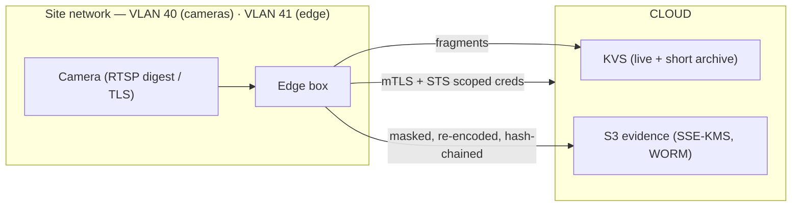
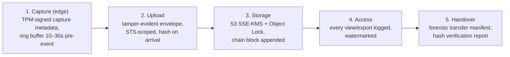
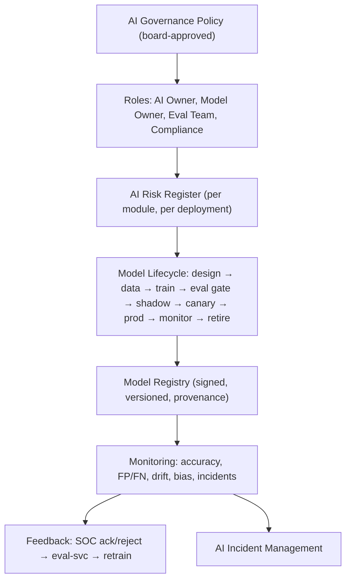

# SyncCam AI — Security, Privacy, Compliance & AI Governance Plan

**Document:** Security, Privacy, Compliance & AI Governance Plan v1.0 (Draft for Review)
**Date:** August 1, 2026
**Source:** `PRD-SyncCam-AI.md` (v1.0), `ARCHITECTURE.md` (v1.0), `AI-ARCHITECTURE.md` (v1.0), `BACKEND-ARCHITECTURE-SyncCam-AI.md` (v1.0), `UX-DESIGN-SyncCam-AI.md` (v1.0)
**Posture:** This document is the security, privacy, compliance, and AI governance companion to the architecture set. It **extends** (and does not restate) ARCHITECTURE.md §11–14 (AuthN/AuthZ/Security), §15–16 (Monitoring/Logging), §18–19 (Backup/DR); BACKEND-ARCHITECTURE.md §10 (Audit), §11 (Object Storage); and AI-ARCHITECTURE.md §7–9 (Training/Data/Risks). Where a control is already specified, this document references it and adds the *governance* layer: policy, ownership, cadence, evidence, and escalation.

**Disclaimer:** This document provides a compliance framework and preparation checklists. It is **not legal advice**. Application of PIPEDA, GDPR, the EU AI Act, state biometric statutes, or any other law depends on jurisdiction, deployment details, and evolving guidance; each deployment must be reviewed by qualified counsel (see §5.9).

---

## Table of Contents

1. [Security Architecture](#1-security-architecture)
2. [Video Security](#2-video-security)
3. [Biometric Privacy](#3-biometric-privacy)
4. [AI Governance](#4-ai-governance)
5. [Compliance Considerations](#5-compliance-considerations)
6. [Security Operations](#6-security-operations)
7. [Security Testing Plan](#7-security-testing-plan)
8. [Security Roadmap](#8-security-roadmap)
9. [Appendix](#9-appendix)

---

## 1. Security Architecture

### 1.1 Security Model

**Posture:** Zero Trust, defense-in-depth, privacy-by-design, security-as-evidence.

The platform treats **every identity, device, and network path as untrusted until verified** — including the customer's own site network, since CCTV sites are frequently on shared or poorly segmented LANs (factories, construction sites, malls). The three planes from ARCHITECTURE.md §2.3 each enforce the full verification stack independently; no plane trusts another plane's assertions without proof.

**Core invariants (non-negotiable, tested in CI):**

| # | Invariant | Enforced by |
|---|---|---|
| S1 | No tenant can read, write, or infer another tenant's data | RLS, per-tenant KMS, bucket prefixes, partition keys (ARCHITECTURE §13) |
| S2 | No raw video pixel exists for masked zones anywhere downstream of the edge | Pre-encode masking (ARCHITECTURE §6.2, P4) |
| S3 | No biometric template is stored in plaintext, ever | Field-level AES-256-GCM, separate KMS hierarchy (BACKEND §3.2.5) |
| S4 | Every sensitive action is attributable to an identity and immutable | audit-svc hash chain + WORM (BACKEND §10) |
| S5 | Life-safety detection never depends on the cloud, its network, or its security state | Edge-first architecture (ARCHITECTURE P1) |
| S6 | Default is deny; every grant is explicit, scoped, time-bound, and revocable | OPA policies, RBAC+ABAC, session TTLs |
| S7 | Secrets never appear in code, images, config, logs, or artifacts | Secrets Manager + external-secrets + CI secret scanning |
| S8 | Compromised edge devices can be isolated without impacting the platform or other tenants | Device cert revocation, shadow deactivation, per-device STS scoping |

### 1.2 Zero Trust Architecture

Zero Trust principles (NIST SP 800-207, CISA ZTMM) applied to all four planes:

1. **Verify explicitly** — every request is authenticated and authorized at the time of access, never trusted by network location. Applies to: users (JWT + OPA), edge devices (X.509 + registry check), services (IRSA + network policy), and partners (HMAC/OAuth2).
2. **Least privilege** — roles, scopes, IAM policies, and device credentials carry the minimum capability for the task; see §1.8.
3. **Assume breach** — segment everything, encrypt everything, monitor everything, and design so that a single compromise does not cascade across zones (§1.3), tenants (S1), or data classes (biometric ≠ video ≠ metadata).



**Zone traversal rules (every cross-zone path must satisfy all applicable rules):**

| Path | Rules |
|---|---|
| Z1→Z3 (user) | TLS 1.3, WAF, JWT validation (sig/issuer/aud/exp/tenant), OPA authZ, rate limiting, MFA where required (§1.7) |
| Z1→Z3 (partner) | TLS 1.3, HMAC signature + replay window, or OAuth2 client-credentials; schema validation; per-endpoint rate limits |
| Z2→Z3 (edge control) | mTLS (X.509 client cert, CN=device-id), cert registry validation, IoT Core shadows/jobs; revocation = instant disconnect |
| Z2→Z4 (edge data) | Short-lived STS credentials (15 min) scoped to own tenant/site prefixes; Kinesis/KVS/S3 least-privilege policies |
| Z3→Z4 (services) | IRSA roles, no long-lived keys; per-tenant KMS; RLS at the DB; network policies between namespaces |
| Z5→Z2 (models) | Signed model artifacts (Cosign), version-pinned, canary rollout with health-gated rollback (ARCHITECTURE §5.1) |
| Z3→Z5 (MLOps) | Datasets opt-in-only, checksummed, region-locked; training jobs with least-privilege IAM; no customer footage leaves its region |

### 1.3 Security Boundaries & Trust Zones

| Zone | Trust level | Assets | Primary risks | Key controls |
|---|---|---|---|---|
| **Z1 Internet/customer LAN** | Untrusted | Browsers, partner systems, cameras, site network | Credential theft, spoofing, interception, supply-chain apps | WAF, TLS 1.3, PKCE, HMAC, camera VLAN segmentation guidance |
| **Z2 Edge site** | Semi-trusted (physical exposure) | Edge boxes, ring buffer, local store, camera creds | Physical theft, tampering, malware, credential extraction, DoS | TPM/secure boot, LUKS full-disk encryption, signed images, watchdog, cert rotation, minimal OS, degraded-mode logic |
| **Z3 Control plane** | Trusted (after authZ) | Identity, config, device fleet, audit | Privilege abuse, insider threat, config tampering, IdP compromise | MFA tiers, OPA, dual-approval for destructive ops, immutable audit, break-glass protocol |
| **Z4 Data plane** | Trusted (isolated) | Events, alerts, video, evidence, biometrics | Data exfiltration, crypto key loss, retention failure, noisy neighbor | Per-tenant KMS, RLS, WORM, TTL/lifecycle, erasure jobs, per-tenant quotas |
| **Z5 AI plane** | Trusted (MLOps) | Models, datasets, registry, training runs | Model poisoning, artifact tampering, data leakage into training | Signed artifacts, provenance (SBOM + model card), opt-in datasets, shadow/eval gates |

### 1.4 Threat Model (STRIDE)

High-severity threats across the platform. The full threat model is maintained in the threat-model repository (see §7.1); this table is the executive summary.

| # | Threat | STRIDE | Target | Impact | Mitigation (ref) |
|---|---|---|---|---|---|
| T1 | Credential theft / phishing of SOC/admin users | S | Users | Full platform compromise | MFA (TOTP/WebAuthn), passkeys, SSO federation, session risk signals, anomaly alerts |
| T2 | Cross-tenant data access (IDOR / RLS bypass) | I | Data plane | Regulatory breach, competitive espionage | RLS + OPA + per-tenant keys; isolation test gates per release (ARCHITECTURE §13.3) |
| T3 | Edge device theft or tampering | T | Edge zone | Biometric DB extraction, footage theft | LUKS + TPM binding, secure boot, cert revocation, tamper alerts, remote wipe/re-enroll |
| T4 | RTSP/NVR credential compromise | S | Cameras, site network | Camera takeover, stream redirection | Credential vault, rotation, least-privilege camera accounts, segmented VLANs (§2.2) |
| T5 | Evidence tampering / chain-of-custody break | T | Evidence | Legal exposure, insurance denial | Hash chains, S3 Object Lock WORM, verification API (BACKEND §10–11) |
| T6 | Insider abuse (export/playback of raw video) | E | Data plane | Privacy violations, reputation | Role-scoped raw access + mandatory audit, quarterly privileged-access reviews, watermarks (§2.4) |
| T7 | Biometric template exfiltration | I | Biometric data | Identity theft, statutory penalties | Field-level encryption, separate KMS hierarchy, no plaintext cache, audit on access (§3) |
| T8 | JWT forgery / replay | S | Gateway | Session hijack | JWKS signature validation, audience/issuer pinning, short TTL, rotating refresh, jti revocation |
| T9 | API abuse / webhook spoofing | R/D | API surface | Data exfiltration, false alerts | HMAC + replay windows, rate limits, idempotency, schema validation (BACKEND §4, §7) |
| T10 | Model poisoning / artifact tampering | T | AI plane | Degraded detection, malicious behavior | Signed artifacts, checksums, eval gates, shadow mode, rollback (ARCHITECTURE §5) |
| T11 | Adversarial input (spoof, patch attacks) | T | Face/weapon models | Attendance fraud, evasion of weapon detection | Liveness gates, red-team retest, input sanitization, temporal confirmation (§4.12, §7.8) |
| T12 | Log injection / log data poisoning | T/E | Logging | Forensic contamination, SIEM bypass | Structured JSON, redaction filters, schema validation of log fields, WORM audit |
| T13 | KMS/key management failure | T | Data plane | Permanent data loss or key theft | KMS with rotation, multi-region replicas, HSM-backed, key access auditing, DR key continuity (§6.8) |
| T14 | Dependency / supply-chain compromise | T | All | Arbitrary code execution | Trivy gates, SBOM, Cosign signatures, base-image pinning, provenance (ARCHITECTURE §14.2) |
| T15 | Denial of service (API, streaming, notification flood) | D | Control/data plane | Operational outage, alert fatigue | WAF + rate limits, Kinesis shard scaling, notify flood control (ARCHITECTURE §4.4) |
| T16 | IdP federation misconfiguration | S/T | Identity | Account takeover via malformed SAML/OIDC | Federation conformance tests, audience restriction, certificate pinning, regular SSO audits |
| T17 | Camera-compromise pivot to edge/cloud | E | Edge zone | Lateral movement | Edge box firewall, minimal egress allowlist, device isolation, east-west segmentation |
| T18 | Retention/erasure failure (data kept past policy) | E | Data plane | Regulatory violation | Schema-level TTL/partitions, lifecycle rules, erasure manifest + audit (§5.10, BACKEND §11.3) |

### 1.5 Attack Surface Analysis

| Attack surface | Exposure | Risk | Hardening (ref) |
|---|---|---|---|
| **RTSP/ONVIF camera endpoints** | Internet? No — site VLAN only; edge pulls streams | High (credential theft, camera hijack) | Vault + rotation (§2.2), digest auth, ONVIF least-privilege accounts, VLAN guidance, no inbound exposure |
| **Edge device (Z2)** | Physically accessible at customer site | High | TPM, LUKS, signed OS/images, watchdog, minimal services, SSH disabled by default (break-glass via secure channel), egress allowlist |
| **Public API (Kong)** | Internet | High | WAF, OPA, rate limits, mTLS `/edge/*`, HMAC `/webhooks/in/*`, schema validation (ARCHITECTURE §10) |
| **WebSocket realtime-gw** | Internet (authenticated) | Medium | One-time tickets, per-connection rate caps, Redis-backed authorization on subscribe |
| **Webhooks out** | Partner endpoints (they are the risk) | Medium | HMAC + replay window, redacted payloads, delivery audit (BACKEND §7) |
| **GraphQL BFF** | Internet (authenticated) | Medium | Read-only, complexity budget, persisted queries, introspection off (BACKEND §5.3) |
| **SPA/PWA** | Internet | Medium | CSP, no secrets in client, PKCE, security headers, RUM monitoring |
| **MLOps pipeline** | Internal + partner model uploads (Phase 3 marketplace) | Medium→High | Signed artifacts, provenance, sandboxed eval, license checks (AI-ARCHITECTURE D6) |
| **Cloud console / CI/CD** | Internal (vendor account) | High | IAM least privilege, SSO + MFA for all console access, audit of deploys (GitOps), Terraform plan gates |
| **Third-party channels** (Twilio, SES, APNs/FCM, WhatsApp) | Provider APIs | Medium | Scoped credentials, provider-side abuse monitoring, per-channel quotas |
| **HRIS/access-control integrations** | Customer systems | Medium | Credential vault per integration, sync scoping, connection test without data movement (BACKEND §4.12) |

### 1.6 Data Flow Security (per plane)



**Per-hop security requirements:** every hop is TLS 1.3 (mTLS where mutual identity matters); every hop carries `trace_id` + `tenant_id` (correlation and RLS context); every hop that persists data applies tenant scoping; every hop that touches raw video or biometrics is logged (S4). No hop may place secrets in URIs, query strings, or logs.

### 1.7 Authentication

#### 1.7.1 User Authentication

Flow per ARCHITECTURE.md §11.1 (OIDC Authorization Code + PKCE against Cognito or embedded Keycloak). Governance rules:

- **Access token:** 15-min JWT with claims `sub, email, tenant_id, site_ids[], scopes[], roles[], data_class[], mfa_level, exp, iat, jti` (BACKEND §4.4).
- **Refresh token:** 30-day, rotating, single-use; rotation replay detection forces re-authentication (ARCHITECTURE §11.1).
- **Session inventory:** users can list and revoke sessions (`GET /auth/sessions`, `POST /auth/sessions/{id}/revoke`); role/scope changes invalidate active sessions (policy re-auth prompt per UX §5.17).

#### 1.7.2 MFA Tiers

| Tier | Roles / actions | Factors | Notes |
|---|---|---|---|
| **T0 — Break-glass** | Emergency super-admin override | WebAuthn hardware key + second operator approval | Dual-administrator protocol, fully audited, quarterly review |
| **T1 — Privileged** | Super Admin, Auditor, HR Manager; any export/delete/biometric action | WebAuthn/passkey **or** TOTP, **plus** step-up re-auth for sensitive operations (`MFA_REQUIRED`, BACKEND §4.2) | MFA enrollment mandatory at first login for these roles; biometric scope access always step-up |
| **T2 — Standard** | Operator, Site Admin, Manager | TOTP or WebAuthn (policy-configurable) | MFA encouraged by default; enforced via tenant policy |
| **T3 — Viewer** | Viewer, guard, reception | Password + optional MFA | Lowest privilege; no raw video, no exports |

**Password policy (NIST SP 800-63B aligned):** minimum 15 characters with no composition complexity requirements; password breach-list screening at enrollment and change; no forced periodic rotation unless risk event; rate-limited attempts with lockout (5 fails → 15-min lock, escalating); password reset via verified email with single-use token; support for passkeys (WebAuthn) as the phishing-resistant default where available.

#### 1.7.3 Single Sign-On & Federation

| IdP | Protocol | Provisioning | Notes |
|---|---|---|---|
| Microsoft Entra ID | SAML 2.0 / OIDC | SCIM 2.0 | Most common enterprise path |
| Okta | SAML 2.0 / OIDC | SCIM 2.0 | |
| Google Workspace | OIDC | SCIM | |
| Ping Identity / ForgeRock / OneLogin | SAML 2.0 | SCIM 2.0 | |
| Custom / ADFS | SAML 2.0 | SCIM (or JIT) | |
| Keycloak (local-only mode) | OIDC (embedded) | Manual + API | Offline token validation, same token contract (ARCHITECTURE §11.1) |

Rules: SP-initiated and IdP-initiated flows both supported; audience and ACS validation strict; certificate rotation for IdP metadata monitored; JIT provisioning supported but **SCIM deprovisioning is mandatory for enterprise** (leaver revocation ≤15 min); failed federation attempts feed security monitoring (§6.1).

#### 1.7.4 Device & Service Authentication

- **Edge devices:** X.509 client certificates issued at enrollment (serial + one-time token + QR, BACKEND §4.4), CN = device-id, signed by tenant CA; validation against device registry (active, not revoked, site matched) at every MQTT/HTTPS handshake; certificate rotation via IoT Jobs; revocation = disconnect + credential denial (ARCHITECTURE §11.2).
- **Services:** Kubernetes Service Accounts + IRSA (OIDC) with narrow IAM roles; no long-lived access keys anywhere; service mesh mTLS (Linkerd) in Phase 2 (BACKEND §13.2).
- **Partners:** HMAC-SHA256 shared secrets (rotatable, versioned 24h overlap) or OAuth2 client-credentials; per-integration credentials in Secrets Manager (BACKEND §7.2–7.3).

### 1.8 Authorization

#### 1.8.1 Model: RBAC + ABAC (extending ARCHITECTURE §12)

Enforcement in two layers — coarse at the gateway (Kong + OPA Rego), fine in services (query filters, payload redaction, RLS) — never gateway alone.

**ABAC attributes evaluated by OPA:** role, site scope (⊆ token.site_ids), zone, data class (`raw_video` / `metadata` / `biometric`), time window, MFA level, device posture (Phase 2), data residency region.

#### 1.8.2 Permission Hierarchy

```
Tenant  (company)
 └── Site  (facility)              ← site-scope containment
     └── Zone  (polygon/tripwire)  ← zone-level rule scope
         └── Resource (camera, rule, event, evidence, embedding)
```

Rules: scopes are strictly hierarchical — a site-scoped grant never implies tenant scope; a zone grant never implies site scope; every resource lookup is filtered by the caller's effective scope; `NOT_FOUND` and `FORBIDDEN` are indistinguishable (no existence oracle, BACKEND §4.2).

#### 1.8.3 Least Privilege & Delegation

- System roles (Super Admin, Site Admin, Operator, Auditor, Viewer, Guard, HR) ship least-privilege presets (UX §5.16); custom roles start from a preset and are reviewed on creation.
- **No user can grant, modify, or revoke a permission they do not hold**; role changes require Super Admin (site-scoped for Site Admin within their sites).
- Privileged grants are time-bound where supported (temporary escalation with auto-expiry and audit).
- Privileged access reviews: quarterly (PRD §15.6), covering active grants, dormant accounts, T0/T1 membership, and role-simulation spot checks (UX §5.17).

#### 1.8.4 Tenant Isolation (S1)

Mechanisms are specified in ARCHITECTURE §13 and BACKEND §3.7; the governance additions here: (a) isolation is a **release gate** — cross-tenant read attempts must 403/404 in every staging test cycle; (b) tenant onboarding creates the full isolation set atomically (RLS context, KMS alias, bucket prefixes, partition keys, quotas) before any data is accepted; (c) enterprise (silo) tier additionally offers dedicated Aurora/DynamoDB/keys (ARCHITECTURE §13.1); (d) erasure of tenant A is tested to never affect tenant B.

### 1.9 Security Controls

#### 1.9.1 Encryption at Rest

| Data | Mechanism | Key hierarchy |
|---|---|---|
| Video archive / evidence / reports | SSE-KMS (AES-256) | Per-tenant KMS alias (BACKEND §11.1) |
| Biometric embeddings | Application-level AES-256-GCM field encryption | **Separate per-tenant KMS key** (never shared with video keys) (BACKEND §3.2.5) |
| Relational data | Aurora encryption + RLS; column-level for sensitive fields where required | AWS managed + customer-managed keys (enterprise) |
| NoSQL/cache | DynamoDB/Redis encryption | AWS managed |
| Edge storage | LUKS full-disk encryption, key bound to TPM/secure element | Device-bound (ARCHITECTURE §7.1) |
| Secrets | Secrets Manager (KMS-encrypted) | Managed + rotation |

#### 1.9.2 Encryption in Transit

- TLS 1.2+ minimum everywhere; **TLS 1.3 on all user-facing and edge paths** (CloudFront/WAF/ALB termination, ARCHITECTURE §14.2).
- mTLS for edge↔cloud (IoT Core, `/edge/*`), internal service mesh (Phase 2).
- RTSP: prefer RTSP-over-TLS where cameras support it; otherwise RTSP digest auth on segmented VLAN with no internet exposure (§2.2).
- HLS segments and KVS playback are delivered over signed URLs/TLS only.

#### 1.9.3 Secret Management

- Single source: AWS Secrets Manager (+ external-secrets operator in EKS) (BACKEND §13.2).
- **Never** in Git, images, config maps, environment dumps, or logs; CI secret-scan gate fails the build (gitleaks-class).
- Rotation schedules: RTSP credentials 90d; webhook HMAC secrets 180d (versioned, 24h overlap); API keys for integrations on vendor change or exposure; database credentials via RDS rotation.
- Break-glass credential custody: sealed envelope + dual authorization + audit.

#### 1.9.4 API Security

- OpenAPI 3.1 contracts, request/response schema validation at the gateway; 10 MB REST / 1 MB webhook-in limits (BACKEND §4.1–4.2).
- Idempotency keys on POST mutations (24h window, replay-conflict 409) (BACKEND §4.1).
- Rate limiting: per-tier sliding windows (BACKEND §4.3), per-endpoint overrides, `RateLimit-*` headers, `Retry-After` on 429.
- GraphQL: read-only, depth ≤10, complexity ≤1,000, persisted-query allowlist in prod, introspection off (BACKEND §5.3).
- Webhook-in: HMAC verified, attributed, schema-validated (BACKEND §7.3).
- CORS: strict origin allowlist; no wildcard with credentials.

#### 1.9.5 Rate Limiting & Flood Control

Combined gateway quotas + alert-side aggregation (ARCHITECTURE §4.4): per-user + per-tenant limits (min of both), per-zone-source SMS cap 3/min (BACKEND §4.3), per-device edge limits 3,000 req/min, webhook-out 60/min/endpoint, face search 10/min/user with mandatory audit (Phase 2). Redis token buckets; noisy-neighbor protection for large tenants.

#### 1.9.6 Session & Token Management

| Control | Spec |
|---|---|
| Access token TTL | 15 min |
| Refresh token | 30d, rotating, single-use; replay → full re-auth |
| WS tickets | 30s TTL, single-use (BACKEND §6.1) |
| Signed media URLs | 15 min TTL, audited on use |
| Session revocation | Logout, role change, security event, admin revoke — all propagate ≤60s |
| Idle timeout | 30 min UI inactivity → re-auth for privileged roles (policy-configurable) |

#### 1.9.7 Key & Certificate Management

- KMS: automatic annual rotation for master keys; data keys short-lived; customer-managed keys (CMK) option for enterprise (bring-your-own-key with CloudHSM in Phase 2).
- Certificates: ACM for public endpoints (auto-renewal); edge device CA with hierarchical issuance (tenant CA → device certs), rotation via IoT Jobs, revocation list honored at handshake (ARCHITECTURE §11.2).
- Certificate trust for RTSP/ONVIF: documented guidance for camera cert validation; where cameras lack TLS, rely on network segmentation + digest auth (documented risk).

---

## 2. Video Security

### 2.1 Video Threat Model (specific)

| Threat | Vector | Mitigation |
|---|---|---|
| RTSP credential theft | Config export, plaintext storage, sniffing | Credential vault at edge + cloud, rotation, digest/TLS, no plaintext persistence, least-privilege camera accounts |
| Stream interception on site LAN | Unsegmented network | VLAN guidance (cameras + edge on isolated segment), RTSP-over-TLS where supported, no internet exposure of cameras |
| Camera compromise / fake stream | ONVIF default creds, firmware exploits | Onboarding credential hygiene checklist, device fingerprint, stream liveness (decode health, FR-116), anomaly on stream pattern change |
| Evidence tampering | Post-capture modification | Hash chain + WORM + verification API (BACKEND §10–11) |
| Clip/photo exfiltration by insider | Export/playback misuse | Role-scoped access + mandatory audit + watermarks (§2.4) |
| Replay of recorded footage as "live" | Stream substitution | WebRTC/HLS session tickets, per-session signatures, camera-health liveness checks |

### 2.2 Secure Streaming Architecture



**RTSP/ONVIF credential management:**
1. Credentials are stored encrypted (edge: TPM-bound keystore; cloud: Secrets Manager per camera) — never in plaintext config files, UI copy-paste is masked, and credentials never appear in logs or support bundles (redaction filter).
2. Per-camera accounts follow least privilege (ONVIF user with stream-only permission; no admin account used for ingestion); default camera passwords are force-changed at onboarding (hygiene checklist).
3. Rotation: 90-day automated rotation where cameras support dynamic credentials; manual rotation workflow (audited) otherwise; rotation breaks any cached credential.
4. Camera onboarding (FR-202) includes a credential test that never writes the credential into audit logs.

**Network guidance (customer responsibility, documented):** cameras and edge on isolated VLANs; no inbound NAT/port-forwarding to cameras; edge egress allowlist (only SyncCam endpoints + time/NTP); Wi-Fi cameras discouraged for security zones.

### 2.3 Access Control for Streams & Clips

| Surface | Control |
|---|---|
| Live view (WebRTC) | WS ticket auth; Operator+ role; every session logged (ARCHITECTURE §12.2, §15.6) |
| Playback (HLS) | Signed manifest + segment URLs (15 min), role-scoped, logged |
| Snapshots | Role-scoped (`GET /cameras/{id}/snapshot`), logged; masked zones never render (U9) |
| Clip export | Auditor+; every export audited; watermarked |
| Face/plate search (Phase 2) | `biometric:*` scope, step-up MFA, 10/min, every query audited (BACKEND §4.3) |
| Concurrent session limits | Configurable per role/tenant to prevent credential sharing (Phase 2) |

### 2.4 Watermarking

| Layer | Watermark | Purpose |
|---|---|---|
| Live view (any raw access) | Persistent overlay chip: "LIVE — accessed by \<user\> · logged" (UX §9.1) | Deterrence + attribution |
| Snapshots / exports | Visible: viewer user-id, timestamp, camera, hash short form; optional tenant branding | Attribution of leaks |
| Exported clips (Phase 2) | Forensic: imperceptible frame-level embedding (user+time) surviving re-encode/crop | Leak traceability |
| Reports/dossiers | Footer chain-of-custody line + hash chip (UX §9.2) | Integrity + provenance |

Forensic watermarking is applied server-side at export time (never alters the original evidence object, preserving chain of custody).

### 2.5 Evidence Integrity & Tamper Detection

- **Hash chaining:** every artifact is SHA-256 hashed at capture; `evidence_chain` blocks link `sha256(prev_hash ‖ sha256(artifact) ‖ block_index ‖ ts)` (BACKEND §3.2.11); last block sealed to S3 Object Lock (COMPLIANCE mode, ≥7y).
- **Manifest:** each incident writes `manifest.json` (artifact keys, hashes, chain links, capture metadata incl. edge device, model version, timestamps) — the manifest is itself chained.
- **Verification:** `POST /incidents/{id}/dossier/verify-hash` and `GET /reports/{id}/verify-hash` recompute chains (public trust — no auth on hash check; the hash is the proof).
- **Tamper detection signals:** camera-health tamper/occlusion/blur (FR-116) raises `tampered` status; clip hash mismatch on read triggers alert + status flag; audit-chain verification job runs nightly (mismatch → incident).
- **Integrity of the chain infrastructure:** audit tables are INSERT/SELECT-only (no UPDATE/DELETE for service roles, BACKEND §10.3); backup and archive copies are WORM-protected.

### 2.6 Chain of Custody



Custody record (audit-svc): each access to an evidence object creates a custody entry (actor, action, timestamp, hash state) — enabling an audit response of *who touched what, when, with what result* for any incident dossier.

### 2.7 Audit Trails for Video (extends ARCHITECTURE §16.1)

| Event class | Audit entries | Retention |
|---|---|---|
| Playback sessions | user, camera, start/end, stream type (live/playback), session id | 7y (audit chain) |
| Snapshots & exports | user, camera/incident, file, hash | 7y |
| PTZ operations | user, camera, preset/op (UX §5.5 "PTZ operated by") | 7y |
| Clip creation/deletion | user, clip id, hash, reason (if delete) | 7y |
| Mask/zone config changes | user, zone, before/after diff | 7y |
| Evidence access | actor, object, verdict, hash state | 7y |

---

## 3. Biometric Privacy

### 3.1 Privacy-First Design Principles

1. **Data minimization** — embeddings, not images, by default (`biometric_mode: embeddings_only` recommended for MVP; `photos` is opt-in and gated).
2. **Purpose limitation** — biometric processing is bound to the consent scope (attendance, or door access); no function creep into surveillance, watchlist, or search without fresh consent + tenant policy change.
3. **Storage limitation** — retention tied to employment/consent, enforced by deletion jobs (§3.8).
4. **Segregation** — biometric data lives in a separate schema, separate encryption hierarchy, separate scopes from video/metadata (BACKEND §3.2.5, ARCHITECTURE §12.3).
5. **Transparency** — employee notices, signage pack, consent UI, and a published biometric data-handling statement (PRD §15.5).
6. **Human rights by design** — opt-out with equivalent alternatives (§3.10); no coercion; no use for discipline without documented policy.

### 3.2 Face Enrollment

Workflow (UX §7.3) with security properties:

| Step | Security/privacy property |
|---|---|
| 1. Consent capture | Signed, versioned (`template_hash`), scope-bound, stored in `consent_records`; no enrollment without consent (tenant policy enforced at API + UI) |
| 2. Privacy mode selection | `photos` vs `embeddings_only` set at tenant level before any enrollment; UI hides photo storage in embeddings-only mode (silhouette placeholders, UX §5.6) |
| 3. Capture 3 quality-gated frames | Frames held in memory only during enrollment; quality gates (pose/lighting/occlusion); frames never persisted in embeddings-only mode; enrollment occurs at designated enrollment zones (AI-ARCHITECTURE §3.6 privacy P4) |
| 4. Liveness test | Anti-spoof check at enrollment and at every match (AI-ARCHITECTURE §3.9); spoof attempts → exception queue + alert |
| 5. Embedding creation | Cloud R100 (or edge MobileFaceNet) → 512-d embedding; raw frames discarded after successful extraction; embedding encrypted before persistence |
| 6. Verification test-punch | 1:1 match against the enrollment threshold before directory entry (self-test, no false acceptance) |
| 7. Consent re-verification | Re-consent on any policy/template change; suspension on consent withdrawal |

### 3.3 Consent Management

| Element | Design |
|---|---|
| Consent record | `consent_records`: employee, consent_version, signed_at, template_hash, scope jsonb, source (BACKEND §3.2.5) |
| Versioning | Consent templates are versioned; template change → re-consent workflow; consent record references the exact template hash |
| Scope | Explicit enumeration (e.g., "attendance punching at entry/exit gates") — never blanket consent |
| Withdrawal | Employee can withdraw at any time via self-service or HR; withdrawal → deletion job within SLA (§3.7) and automatic switch to alternative method |
| Proof | Consent records are auditable exports (compliance pack, §5.10); consent status visible in employee profile (UX §5.7) |
| Governance | Tenant onboarding pack includes works-council/union consultation kit (PRD §15.5); employer must confirm lawful basis — documented as customer obligation, supported by templates |

### 3.4 Why Embeddings Are Safer Than Raw Images

| Property | Raw face image | 512-d embedding (Mathematical, e.g., ArcFace cosine space) |
|---|---|---|
| Reversibility | Directly viewable; a copy of the person's face | Not directly viewable, but potentially invertible or linkable; treat embeddings as sensitive biometric data rather than as anonymous or irreversible |
| Identifiability | Face itself is the biometric identifier | Remains a biometric identifier; matching, linkage, or inversion risk depends on model, auxiliary data, and attacker capability |
| Blast radius if leaked | Identity theft, impersonation, reputational harm, bystander exposure | Matching/linkage and potential reconstruction risk; unlike a password, the underlying biometric cannot be reset, so containment requires revocation, model/version migration, and re-enrollment |
| Cross-system linkability | Same face works everywhere | Embeddings are not necessarily directly interchangeable across models, but model conversion and auxiliary-data linkage are possible; incompatibility is not a security control |
| Storage incentive | Tempting for "training on footage" | No training value from vectors alone |
| Regulatory weight | Clearly special-category data in most regimes | Biometric data, but defensible as "derived template" under minimization; still regulated — treat identically |

**Design rule:** raw enrollment photos are stored **only** in `photos` mode, encrypted, scoped, with separate retention and deletion on consent withdrawal; in `embeddings_only` mode, raw frames exist only in memory during enrollment and are destroyed after extraction. The platform's default is embeddings-only (PRD §15.3).

### 3.5 Biometric Template Security

| Layer | Control |
|---|---|
| Storage | `face_embeddings` table: embedding column AES-256-GCM field-encrypted, per-tenant KMS key (BACKEND §3.2.5) |
| Key isolation | Dedicated KMS key hierarchy — biometric keys never used for video/evidence; rotation independent |
| In transit | TLS 1.3 end-to-end (edge→cloud); embedding payloads never in logs or traces (redaction filter) |
| Memory | No plaintext persistence; embeddings loaded per-request and released; no plaintext caching in Redis (BACKEND §9.2) |
| Search index | OpenSearch k-NN index (Phase 2) holds derived vectors with mandatory `tenant_id` filter + field-level security; source of truth remains the encrypted Postgres table |
| Edge | On-box embedding DB (SQLite) encrypted, key bound to device TPM; per-tenant data only; wiped on device decommission/revocation |
| Access | `biometric:*` scope + step-up MFA + per-query audit; face search rate-limited 10/min (BACKEND §4.3) |
| Integrity | Embedding `checksum` column; model_version recorded per template for provenance and re-embedding |

### 3.6 Template Storage & Deployment Rules

- One encrypted template per employee (`employee_id UNIQUE`); re-enrollment replaces the template (old version retained only under legal hold, encrypted, flagged).
- Site-tuned thresholds (cosine 0.3–0.5) stored in config, not in the template record.
- Multi-site: employees may have per-site templates; cross-site dedupe (Phase 2) runs only with tenant consent and audit.
- No template ever leaves its tenant's pinned region (residency S-invariant, P6).

### 3.7 Deletion Workflow (Right-to-Erasure for Biometrics)

1. Request via `POST /employees/{id}/erasure-request` (Super Admin, dual-approval) or employee self-service withdrawal.
2. Deletion job walks every store **biometrics-first**: encrypted table row, OpenSearch vectors, Redis caches, edge device copies (OTA delete command), backups (restore-window carve-out documented; legal-hold exceptions listed in the manifest).
3. Produces `erasure_manifest_{tenant}_{subject}.json` (hashed, archived to audit-worm) — the proof artifact (BACKEND §11.3).
4. SLA: full deletion ≤24h; manifest confirmation returned to requester and to the compliance pack.
5. Legal hold: if retention is required by law, the template is isolated (encrypted, access-blocked, no matching), listed in the manifest as an exception, and released when the hold expires.
6. Tests: erasure completeness is a release gate (search for subject across all stores must return zero in staging).

### 3.8 Retention Policy

| Data | Default | Configurable | Deletion trigger |
|---|---|---|---|
| Biometric embeddings | Employment + 30d | Tenant policy | Termination, withdrawal, erasure request, consent expiry |
| Enrollment metadata (quality, model_version, timestamps) | Same as embeddings | — | Same |
| Raw photos (`photos` mode) | Same as embeddings | Tenant policy | Same; separate audit trail |
| Attendance records | 90d hot → archive | Per tenant (7–365d) | TTL + erasure jobs (BACKEND §3.2.6) |
| Consent records | As long as processing continues + audit period | Legal minimums | On withdrawal (except audit-required copies under legal advice) |

Retention is enforced at three layers (schema TTL, lifecycle rules, erasure jobs — BACKEND §3.4/§11.3); biometric retention is a **tenant-visible setting** in Privacy & Compliance settings (UX §5.15).

### 3.9 Employee Access Rights

| Right | Implementation |
|---|---|
| Notice | Enrollment consent UI + employee notice templates + signage pack (PRD §15.5) |
| Access | Self-service: employee can view own consent record, enrollment state, and attendance history (HR scope only for others) |
| Correction | Re-enrollment/re-embedding on request; manual attendance adjustments with approver (BACKEND §4.5) |
| Portability (Phase 2) | Embedding export is technically possible (encrypted container) — offered with legal guidance; most regimes do not require biometric portability, confirm per region |
| Erasure | §3.7 workflow; right-to-erasure API is productized (PRD §15.4) |
| Restriction/objection | Consent withdrawal + alternative authentication (§3.10); objection documented in consent records |
| Complaints | Tenant DPO/HR channel documented in consent UI; platform provides exportable evidence pack for the tenant's handling |

### 3.10 Opt-Out & Alternative Authentication

- **Alternative methods (always available, no coercion):** badge/swipe cards, PIN, manual punch (HR-verified), and mobile self-check-in (Phase 2). Attendance must not be denied to anyone who opts out.
- **Opt-out flow:** employee → HR (or self-service) → biometric suspension + alternative method assignment → deletion job (§3.7) → confirmation.
- **Bystander protection:** mask zones can cover areas where non-participating persons appear; enrollment is restricted to employees; visitor faces are matched only with visitor consent (visitor flows, UX §5.8).
- **Watchlist caution:** unknown-face alerting ("unauthorized entry") does **not** run facial identification of employees; it triggers on non-match — documented limitation, reviewed by legal (§5.9) where the tenant uses watchlists.

### 3.11 Biometric Database Risks & Recovery

**Risks of biometric databases (why they are a special asset class):**
1. **Irreversible compromise** — unlike passwords, a leaked template cannot be "reset" by the user; the person has only ~2 faces.
2. **Linkage/matching across incidents** — templates enable tracking of the same person across events/sites if consolidated (function creep).
3. **Identity fraud** — derived attacks (cosine-space inversion approximations, model-extraction) and spoofing of matched identity.
4. **Statutory exposure** — BIPA-style private rights of action, GDPR Art 82 damages, regulatory fines attach to biometric processing specifically.
5. **Insider misuse** — watchlist abuse, surveillance drift, employee monitoring escalation.
6. **Third-party/edge compromise** — customer-site physical theft targets the on-box database.

**Breach scenarios & recovery strategy:**

| Scenario | Detection | Recovery |
|---|---|---|
| A. Cloud DB dump (encrypted at rest) | GuardDuty/DB access anomalies, alert on export patterns | Keys remain in KMS (no key exfiltration assumed); rotation of affected keys; disclosure per §5; forensic review; **no re-enrollment needed** if ciphertext only |
| B. Decryption key compromise | KMS audit trail anomalies, dual control review | Emergency key rotation; **mandatory re-enrollment** (rotate embeddings); notify tenant; legal/regulatory notification where required |
| C. Edge device theft (plaintext-adjacent) | Device tamper/heartbeat loss | Remote wipe via IoT Jobs; cert revocation; device blacklist; re-provisioning; on-box data is TPM-bound (unreadable off-device) |
| D. Insider template export | `biometric:*` access audit, DLP signals | Revoke access, isolate session, forensic export of audit chain, disciplinary + legal process, regulatory notification if personal data breach |
| E. Template theft via API abuse | Rate-limit/query anomalies, unusual vector-batch downloads | Kill-switch on biometric endpoints, anomaly-based blocking, full audit replay, disclosure |
| F. Model-extraction (embedding space theft) | Red-team findings, unusual inference volume | Rate limits, quantization/obfuscation, re-embedding, model version rotation |

**Universal recovery playbook:** (1) contain (revoke keys/access/sessions), (2) preserve evidence (audit chain), (3) assess exposure (was it ciphertext or plaintext, who affected), (4) notify (tenant, affected individuals, regulators per breach-notification SLAs — 72h GDPR, 30d DPDP, immediate BIPA-affected states), (5) remediate (rotate embeddings by re-enrollment where exposure warrants, rotate keys, harden vector), (6) review (root cause, playbook update, training). Incident severity follows §6.2.

---

## 4. AI Governance

### 4.1 Governance Framework



**Roles & responsibilities:**

| Role | Responsibility |
|---|---|
| AI Governance Board | Policy approval, high-risk decisions (weapon/face/ADM), incident escalation review |
| AI Owner (per module family) | Model lifecycle, eval gates, calibration, retirement |
| Model Registry/MLOps | Versioning, signing, canary/rollback (ARCHITECTURE §5.1) |
| Eval Team | Benchmarks, bias/accuracy gates, drift monitoring, red-team |
| Compliance | Regulatory mapping (AI Act, GDPR, BIPA, DPDP), DPIA support, transparency docs |
| SOC / Safety Managers | Human-in-the-loop validation (ack/reject → training feedback) |
| Customer (tenant) | Site-level threshold/zone calibration decisions, notice to workforce |

### 4.2 AI Risk Assessment

**Method:** per-module risk tiering at design + per-deployment review. Risk score = (impact severity × likelihood of error) + (societal/regulatory weight).

| Tier | Modules | Primary risks | Governance weight |
|---|---|---|---|
| **High — life-safety** | Weapon, Fire, Smoke, Fall, Fight | False negatives (missed life-safety events), alarm fatigue, liability | Highest bar: temporal confirmation, human verification of ambiguous events, per-site precision gates, incident review |
| **High — biometric/ADM** | Face recognition, face verification, liveness, attendance | Identity errors, privacy/statutory exposure, automated decisions affecting employees | Consent gates, FAR/FRR calibration, human review of exceptions, Art 22 safeguards (§4.12) |
| **Medium — compliance/security** | PPE, intrusion, loitering, abandoned object, LPR, vehicle | Enforcement/compliance errors, profiling concerns | Per-zone thresholds, documented limitations, audit trails |
| **Medium — operational** | Crowd density, occupancy, anomaly (v2) | Decision-support error, capacity misjudgment | Calibration honesty in UI, labeled estimates, no life-safety reliance |
| **Low — analytics** | Aggregations, reports, heatmaps | Minor data-quality error | Standard accuracy monitoring |

**Risk register fields:** module, tier, harm scenarios, error types (FN/FP), affected populations, likelihood, mitigation, residual risk, review cadence (quarterly for High, semi-annual otherwise).

### 4.3 Human-in-the-Loop (HITL)

- **Default:** every alert is *presented* to a human (SOC/manager/guard) for ack/dispatch/dismiss; the platform **never autonomously takes consequential action** (no auto-lockdown, no auto-dismissal, no auto-payroll) in v1 — autonomous response is Phase 3 with separate governance approval (PRD §12.3).
- **Feedback loop (designed in):** dismissal requires a reason (false_positive/duplicate/handled) that feeds eval-svc retraining (ARCHITECTURE §5.1); acknowledgment confidence is tracked per model/site.
- **Ambiguity protocol:** cheap-detector → cloud-verifier cascade (D3) routes ambiguous crops to a stronger model; if still ambiguous, the event is flagged "verify" in the UI rather than suppressed.
- **Exception handling:** spoof-blocked, low-confidence punches, and blacklist matches always require human review (exception queues, UX §5.6, §5.9).
- **Escalation:** life-safety events auto-escalate to emergency contacts ≤5s (FR-111) — this is notification, not autonomous action; the human retains decision authority.

### 4.4 Model Transparency

- **Confidence everywhere:** every detection UI shows confidence + model version + site threshold (U8, UX §2.6); incident dossiers record model provenance per detection (BACKEND §3.2.8 `model_version`).
- **Explainability:** temporal-confirmation state machines are documented per module (AI-ARCHITECTURE §4); rule-based modules (intrusion/loitering) are logic engines with full traceability (D4); DNN modules document failure modes (AI-ARCHITECTURE §3 failure cases columns).
- **Public transparency docs:** model family overviews, accuracy claims vs measured benchmarks, limitations, and the "calibration honesty" UI conventions (UX §9.4).
- **No black-box claims:** marketing/accuracy claims are pinned to benchmark tables and re-validated per release (eval-svc).

### 4.5 Model Cards (summary — full cards in model registry)

| Module | Model | Primary data | Benchmark target | Known limitations | License |
|---|---|---|---|---|---|
| Person/vehicle detection | YOLOv8m/11m (shared backbone) | COCO + CrowdHuman + BDD100K FT | AP50 0.93–0.95 | Tiny/distant persons, occlusion, IR flare | AGPL→resolved per D6 |
| Weapon | YOLOv8m FT + P2 + SAHI | Public weapon sets + hard negatives | mAP50 0.82–0.88, prec ≥0.90 | Small knives @40m, tool confusion, silhouettes | AGPL→resolved per D6 |
| Face detection | SCRFD-500 | WIDER FACE | AP 0.90–0.93 | Masks, backlight, glasses glare, <20px | MIT (InsightFace) |
| Face recognition | ArcFace MobileFaceNet (edge) / R100 (cloud) | MS1MV3/Glint360K pretrained (no raw faces shipped) | TAR ≥0.96 @ FAR 1e-4 | Age/clothing drift, twins, yaw >45°, mask | MIT |
| Face liveness | miniFASNet-class | SiW/OULU/CelebA-Spoof/Replay | APCER ≤1.5% / BPCER ≤1% | Bright-screen replay, doll/mask attacks | MIT |
| LPR (detect+OCR) | YOLOv8s + LPRNet / PP-OCRv4 | Synthetic-first + regional sets | mAP 0.95+ day; char acc 0.96+ | Muddy plates, IN font variance, night | Apache-2.0 |
| Fire/Smoke | EfficientNet-B0 / D-Fire | DFire, FiSmo, hard negatives | prec 0.93/0.88 | Welding arcs, steam vents, IR profile | MIT |
| PPE | Shared backbone FT | SHWD/SODA/CVPPA + opt-in | helmet 0.92, vest 0.90, prec ≥0.95 | Hand-held helmets, open vests, dark backgrounds | AGPL→resolved per D6 |
| Fall | RTMPose-m + FSM | Le2i/UR/UP-Fall | prec 0.92 / rec 0.95 | Sitting/crouching FPs, oblique angles | MIT |
| Fight | Pose/track cluster scoring | RWF-2000/AIC + negatives | prec/rec 0.85–0.92 | Play-fighting, crowd jostling | MIT |
| Crowd density | Count + calibration map (CSRNet-lite opt) | ShanghaiTech B etc. | MAE 8–15% | Critical-density underestimation (documented) | MIT |
| Anomaly (v2) | YOLO-World-s / GroundingDINO | LVIS/COCO + tenant vocab | prec 0.8–0.9 object-level | Everything is anomalous on construction sites | Apache-2.0 |

### 4.6 Bias Evaluation

**Scope of bias testing (release gate):** face recognition and verification (highest priority), PPE, weapon, fall, LPR — per-skin-tone, gender, age-band, lighting, and mask/accessory subgroups where data permits.

| Module | Bias concerns | Evaluation approach | Mitigations |
|---|---|---|---|
| Face recognition | Differential FAR/FRR across skin tones, age, headwear (BIPA/EEOC concern: disparate impact in attendance/enforcement) | Stratified evaluation on benchmark subsets with demographic metadata; per-subgroup TAR@FAR reporting; site threshold chosen per population | Per-site FAR/FRR calibration (AI-ARCHITECTURE §3.8), subgroup thresholds where needed, documented residual bias, human review of exceptions, opt-out alternative (§3.10) |
| Liveness | Spoof-detection bias vs skin tone/material | Stratified APCER/BPCER | Threshold tuning, red-team |
| PPE | Class confusion varies by uniform color/lighting | Per-zone matrix eval, hard-negative mining | Per-zone models, calibration |
| Weapon | Tool-vs-weapon confusion rates (false accusations risk) | Per-site validation set with tool-class recall gate before registry entry (AI-ARCHITECTURE §3.3) | Precision-gated thresholds, human verification, no autonomous action |
| Fall/Fight | Scene/behavioral variance (hospital vs warehouse) | Per-vertical eval gates (PRD §9) | Per-site FSM tuning |

**Fairness metrics published per model version:** FAR/FRR per subgroup, equality-of-opportunity gap, and calibration curves. **Bias incidents** route to AI incident management (§4.11).

### 4.7 Accuracy Monitoring

| Signal | Instrument | Cadence | Action |
|---|---|---|---|
| Live precision/recall | eval-svc + SOC ack/reject feedback (ARCHITECTURE §5.1) | Continuous, reported daily | Site threshold adjustment, retrain trigger |
| Benchmark regression | Per-vertical benchmark suite | Every model release | Gate: fail → block promotion |
| Shadow mode | New versions run on live traffic without acting | Per deployment | Compare vs prod; promote or discard |
| FAR/FRR per site | Monthly calibration job (AI-ARCHITECTURE §9) | Monthly | Threshold re-tune, report to tenant |
| False-alert rate | alert-svc SLO ≤1/5 cams/day | Daily | Alert-fatigue review, per-zone masking |

### 4.8 False-Positive Management

- **Design levers (already in place):** temporal confirmation (AI-ARCHITECTURE §4), cheap→expensive cascade (D3), hard-negative mining programs, per-site confidence thresholds (0.5–0.9, FR-101), zone masking of known false sources (steam vents, welding arcs), alert aggregation + mute/snooze (ARCHITECTURE §4.4).
- **Operational levers:** dismissal reasons feed eval-svc; monthly alert-quality reviews per site (PRD §13); per-zone sensitivity profiles (school vs factory); SLO surfaced as visible KPI (UX §7.1).
- **Governance:** FP-rate per module is a tracked metric in the risk register; sustained above-target FP → precision gate re-evaluation + retrain; customer-facing transparency on what was suppressed and why (dismissal summaries).

### 4.9 False-Negative Management

- **Monitoring:** recall is the harder signal (ground truth needs sampling) — a stratified review sample of dismissed/quiet periods is re-inspected by humans (SOC spot-checks) to estimate missed events; missed-event reports (camera-health + detection gaps) feed eval-svc.
- **Design levers:** multi-frame confirmation with configurable leniency, class-gated zones, redundant modality (vision + optional sensor/fire-panel integration, FR-113), documented limitations surfaced honestly in UI (crowd underestimation, UX §9.4).
- **Escalation:** any confirmed missed life-safety event (fire/fall/weapon) triggers AI incident review (§4.11) and, where warranted, model update + site recalibration.
- **Life-safety policy:** analytics never *replaces* certified safety systems (fire panels, FR-113) — stated in product docs and customer agreements.

### 4.10 Model Drift Monitoring

| Drift type | Signal | Threshold → action |
|---|---|---|
| Confidence distribution shift | Per-model confidence histograms (Prometheus) | Sustained shift → eval-svc review |
| FP/FN rate shift | SOC feedback rates | Precision < site target → retrain trigger (ARCHITECTURE §5.1) |
| Scene drift | Scene statistics (lighting, class mix, calibration map residuals) | Scene-change learning (weekly background refresh, §3.21) + recalibration |
| Face threshold drift | FAR/FRR monthly report | Monthly calibration job (AI-ARCHITECTURE §9) |
| Embedding drift | Re-embedding distance tracking | Re-embed low-confidence enrollments |
| Concept drift (new object classes) | Anomaly-detection vocab coverage | Vocab updates via registry |

All drift events are logged to the model registry (versioned) and appear in the tenant's model-health view (UX §5.15 System group). Rollback is always available (shadow → canary → prod → rollback; auto-rollback on health-beacon failure).

### 4.11 AI Incident Management

**Incident classes:** (1) harmful/incorrect decision (missed weapon, wrong attendance identity, discriminatory pattern); (2) privacy/consent breach via model (unauthorized face search, template exposure); (3) security/adversarial (spoof success, poisoning, evasion); (4) unintended use/function creep (watchlist misuse); (5) external (regulator inquiry, media).

| Class | Triage | Response | Disclosure |
|---|---|---|---|
| Life-safety model failure | P1 (immediate) | Suspend model (rollback/disable), site recalibration, root-cause, retrain | Tenant within 24h; regulator per law |
| Identity error / ADM harm | P1–P2 | Human review of affected records, correction workflow (attendance adjustments), appeals path | Affected individual + tenant |
| Bias pattern | P2 | Subgroup eval, threshold/retrain, process change | Tenant report, transparency update |
| Adversarial attack | P1 | Block vectors, liveness/model update, red-team revalidation | Tenant + regulator as applicable |
| Function creep | P2 | Scope lockdown, consent re-verification, audit | Tenant + legal review |

**Governance:** AI incident log is part of the risk register; quarterly AI governance board review of all incidents; post-incident model cards updated; regulatory notification assessed per §5 (GDPR Art 33 72h, DPDP 30d, state biometric laws, AI Act high-risk obligations as they come into force).

### 4.12 Specialized Risk Analyses

#### 4.12.1 Weapon Detection Risks

| Risk | Nature | Mitigation |
|---|---|---|
| **False negative (missed weapon)** | Life-safety failure; liability | Temporal 3-frame confirm tuned conservatively (AI-ARCHITECTURE §3.3); cloud verification of ambiguous crops; precision-over-recall default documented; per-site recall gate; never presented as absolute ("not a guarantee" disclosures) |
| **False positive (tool misread as weapon)** | Alarm fatigue; **accusation risk** (guards responding to a worker's drill); profiling | Tool-class hard-negative programs; per-site validation with tool-recall gate before registry entry; human verification before any on-ground action; configurable thresholds; dismissal reasons tracked |
| **Misuse (surveillance creep)** | Profiling, legal exposure | Scope-limited to tenant-designated high-risk zones; consent/notice obligations; no autonomous action; audit of zone config changes |
| **Regulatory pressure on weapon detection in public spaces** | AI Act high-risk ambiguity, societal concern | Legal review per deployment (§5.9); transparency; proportionality assessment in DPIA |

**Standing rules:** weapon alerts require human confirmation before any physical response; the system never autonomously locks down, dispatches lethal-force-adjacent actions, or tags individuals as "armed" without verification; false-positive rate per site is a board-reviewed metric.

#### 4.12.2 Face Recognition Risks

| Risk | Nature | Mitigation |
|---|---|---|
| **Identity error** (wrong match) | Wrong attendance, false accusation | Site-tuned thresholds (FAR/FRR), liveness gate always, confidence floors, human review of exceptions, appeals workflow |
| **Consent/lawfulness** | BIPA-style private actions; GDPR Art 9; DPDP sensitive data | Consent-first enrollment, embeddings-only default, opt-out + alternatives (§3), notice packs, DPIA kit |
| **Function creep** (attendance → surveillance) | Privacy backlash, regulatory breach | Purpose-scoped consent, separate scopes for face search (Phase 2, audit-gated), watchlist use requires tenant policy + legal review |
| **Spoofing** | Attendance fraud | Passive liveness (APCER ≤1.5%), depth-IR upgrade for door mode, spoof-blocked exception queue |
| **Bias/disparate impact** | Discrimination claims | §4.6 bias evaluation, subgroup metrics, human review |
| **Bystander capture** | Non-consenting persons in frame | Enrollment zones only; mask zones; no gallery matching of non-enrolled persons; non-match events used only for zone alerts (documented) |
| **Mass-surveillance perception** | Media/reputation | Detection-over-surveillance philosophy, transparency docs, published retention, opt-out signage |

**Standing rules:** no facial recognition runs on footage of non-consenting/unenrolled persons in v1 (attendance-only mode matches only against the enrolled gallery at enrollment zones); face search over archive (Phase 2) is consent-gated, scope-gated, audit-gated, and rate-limited; never used for random mass identification.

#### 4.12.3 Automated Decision-Making Risks (ADM)

**Where ADM exists:** attendance punching and payroll feed (HRIS integration), access-control pass/fail (face verification → door), PPE compliance scoring, LPR blacklist gate actions.

| Aspect | Assessment & design |
|---|---|
| GDPR Art 22 | Attendance→payroll and door access are **automated decisions with legal/significant effects** on employees. Art 22(2)(b) employment-necessity basis may apply in some states, but the safe design is: **human review of all exceptions** (low-confidence, spoof-blocked, disputes), **right to obtain human intervention**, **right to contest** (appeals workflow via attendance adjustments), and transparency (notice of automated processing). |
| EU AI Act | High-risk classification for employment-related biometric systems and workplace safety; obligations include risk management, data governance, technical documentation, record-keeping, transparency, human oversight, accuracy/robustness/cybersecurity — our design (model cards, eval gates, HITL, audit) maps to these; formal AI Act compliance pack in Phase 3 (§5.3, §8). |
| DPDP 2023 (India) | Consent for sensitive data (biometrics) + purpose limitation; automated-decision safeguards are being operationalized by DPB rules — align via consent-first design and human review. |
| Employment law (IL BIPA, workplace surveillance statutes) | Consent/notice plus collective-bargaining implications; employer must have lawful basis — customer obligation, supported by our compliance kit (§5.9). |
| AI-assisted vs automated | Reports (FR-117) are **assisted** (human-generated, AI provides evidence and drafts); dossiers carry confidence/model metadata and are not automated decisions. The AI Assistant (Phase 3) is read-only and cannot change decisions (UX §5.19 guardrails). |

**Design safeguards:** (a) exceptions always human-reviewed; (b) every automated decision record carries the model version, threshold, confidence, and evidence link (auditable); (c) corrections are bidirectional (adjustment flows to HRIS); (d) no automated decision is final without a human-available appeal path; (e) privacy impact of ADM per deployment is assessed in the DPIA (§5.10).

---

## 5. Compliance Considerations

**Posture:** This section is a framework and preparation checklist — **not legal advice** (§5.9). The platform is compliance-configurable per tenant (retention, masking, consent, residency, audit verbosity — ARCHITECTURE §13.2) precisely so each deployment can be aligned to its jurisdiction.

### 5.1 Canada

| Framework | Key requirements for this product | Platform response |
|---|---|---|
| **PIPEDA** (private sector) | Consent, purpose limitation, accountability, safeguarding (10 fair information principles); **biometric information as sensitive**; access/correction rights; breach notification to OPC + affected individuals | Consent-first enrollment + embeddings-only default; access/correction/erasure APIs (§3.9); breach-notification runbooks (72h to OPC for serious harm); DPA with customers as joint controllers/processors structure |
| **Provincial privacy laws** | BC PIPA, AB PIPA (private-sector equivalents), **Quebec Law 25** — most prescriptive: biometric consent, **privacy impact assessment (PIA) required before biometric processing**, breach notification (72h), data portability, private right of action (2023+), governance duties (privacy officer, registers) | Law 25 compliance pack: PIA template, consent templates, privacy-officer registers per tenant, breach process with 72h clock, deletion/portability exports |
| **Workplace surveillance** (federal + provincial) | Video surveillance of employees must be reasonable, disclosed, minimally intrusive; **Quebec**: surveillance must be justified, unions must be informed; **Ontario** employment standards on monitoring transparency (disclosure); unionized workplaces → collective agreement/works-council consultation | Notice/signage pack (PRD §15.5), works-council onboarding kit, proportionality guidance in DPIA kit, zone-based masking to minimize employee capture |
| **Public bodies** | *Charter* s.8 (unreasonable search) applies where public bodies deploy; school boards, municipalities → heightened standard | Guidance + legal-review question for public-sector tenants (§5.9) |

### 5.2 Europe (GDPR + EU AI Act)

| Framework | Key requirements | Platform response |
|---|---|---|
| **GDPR Art 6/9** | Biometric data = special category; processing for employee attendance needs Art 9(2)(b) employment necessity (with safeguards) or explicit consent; **DPIA mandatory for large-scale biometric surveillance / CCTV at work**; Art 13/14 notices | Legal-basis selection UI (employment-necessity vs consent) with per-tenant basis documented; DPIA kit (template + evidence pack); employee notice templates; consent tooling |
| **GDPR Art 22** | Automated decision-making with legal/significant effects → safeguards (§4.12.3) | Human review of exceptions, appeals, transparency |
| **GDPR Art 25/32** | Data protection by design/default | Embeddings-only default, minimization, RBAC, audit, encryption — all by design |
| **Art 15–21** | Access, rectification, erasure, portability, restriction | Self-service + APIs (§3.9), erasure manifests |
| **Art 33/34** | Breach notification 72h to SA; individuals when high risk | Breach runbooks + SIEM detection (§6) |
| **Transfers** | EU→India/US transfers need adequacy/EU SCCs/derogations | Region-pinned residency; transfer-mechanism selection per tenant; DPA includes transfer clauses |
| **DPO** | DPO appointment (customer obligation for high-risk processing; platform supports with documentation) | Compliance pack includes DPO job-aid + register |
| **EU AI Act** | (Phasing in through 2026–2027+): **prohibition on real-time remote biometric identification in publicly accessible spaces** (law-enforcement context — verify applicability to private deployments); **high-risk classification** for employee management/biometric systems and safety components; transparency Art 50; obligations: risk management, data governance, technical documentation, record-keeping, human oversight, accuracy/robustness/cybersecurity | Phase 3 AI Act pack: classification assessment per deployment, documentation sets (model cards already produced), human-oversight evidence (HITL logs), accuracy monitoring records, EU representative/registration workflow support |

### 5.3 United States

| Framework | Key requirements | Platform response |
|---|---|---|
| **IL BIPA** (high-water mark) | Written consent before collecting biometric identifiers; retention schedule; **private right of action with liquidated damages**; no sale | Consent-first enrollment (signed, versioned), embeddings-only default, published retention schedule, employee rights workflow; BIPA state pack |
| **TX CUBI, WA** | Consent/notice; disclosure/retention schedules; no private action (TX) but AG enforcement | Same pack, state-specific templates |
| **Other state biometric laws** (CA, CO, DE, OR, UT, VA, MD, NY, NH + more pending) | Consent, retention, security safeguards, opt-outs | Configurable compliance packs; legal-review per state (§5.9) |
| **CCPA/CPRA** | Biometric data = personal info; notice at collection; **opt-out of sale/share** (biometric data not to be sold/shared); deletion requests; service-provider contracts | Notice UI, deletion APIs, DPA/CPPA service-provider terms, no-sale commitment (PRD §15.8) |
| **Workplace surveillance/monitoring laws** (CT, NY, DE, MA disclosure; more states) | Employee monitoring disclosure (email/phone/filing rules; camera-specific in some states); union/collective-bargaining notice | Employee notice templates per state, disclosure guidance in compliance kit |
| **HIPAA** (hospitals) | PHI if cameras capture identifiable individuals in covered entities | PHI guidance, masking controls, BAAs where the tenant is a covered entity (legal review) |
| **FERPA** (schools) | Student-record privacy for school deployments | Education pack (parent/guardian consent where required) — legal review |

### 5.4 India (DPDP Act 2023)

| Requirement | Platform response |
|---|---|
| Consent for personal data; **sensitive data (biometrics)** needs explicit consent + purpose limitation | Consent-first, scope-bound, versioned consent records; biometric scope UI |
| **Consent managers** framework | Consent records exportable in manager-compatible format (Phase 2) |
| Erasure / right to update | Erasure APIs + manifests (§3.7) |
| Breach notification to DPB + affected individuals | Breach runbook (30-day window as prescribed) |
| Cross-border transfer rules (DPB-approved countries/whitelist mechanisms) | Residency pinning (ap-south-1), transfer decision support |
| Children's data (guardian consent) | School-deployment pack flags guardian-consent obligations (legal review) |
| Data fiduciary duties (security safeguards, purpose limitation, storage limitation) | Full control set in this document |

### 5.5 Brief APAC & Middle East

| Jurisdiction | Notes | Platform response |
|---|---|---|
| Australia | Privacy Act 1988; **biometric information** = sensitive info; OAIC guidance on facial recognition (consent + high risk); APP entity obligations | Compliance pack: APP mapping, OAIC-aligned consent + DPIA guidance; legal review |
| Singapore | PDPA: consent, notification, purpose; biometrics not separately classified but DNC/breach rules apply | Standard pack |
| Japan | APPI: personal information incl. biometrics; sensitive categories; transfer consents | Standard pack |
| Saudi Arabia | PDPL (2023, phased): consent, purpose limitation; no dedicated biometric rules yet | Region pack when GTM expands (PRD §17.9) |
| UAE | Federal PDPL (2021): consent, data transfers, rights | Region pack |

### 5.6 Industry Frameworks

| Framework | Scope for this product | Evidence sources (existing) |
|---|---|---|
| **SOC 2 Type II** (Trust Services Criteria: Security, Availability, Confidentiality, Privacy) | Control environment, access, change management, monitoring, encryption, incident response | audit-svc chain + WORM; config versioning; OPA/RBAC; access logs; backup/restore logs; monitoring stack (ARCHITECTURE §15–16) |
| **ISO 27001:2022** (ISMS; Annex A: 5.33–5.35 AI-systems controls, 8.10 info deletion, 8.12 data leakage prevention, 5.34 protection of PII in AI) | ISMS scope includes platform + MLOps; AI controls align with our AI governance | AI governance framework (§4) mapped to Annex A AI controls; deletion/retention evidence (BACKEND §3.4/§11.3); DLP controls |
| **ISO 27701** (privacy extension) | PIMS for privacy management | Privacy program: DPA, consent, erasure, records |
| **NIST Cybersecurity Framework 2.0** (Govern/Identify/Protect/Detect/Respond/Recover) | Strategic alignment + control baseline | This document maps naturally: Govern (§5/§6), Identify (§1.4), Protect (§1–3), Detect (§6.1), Respond (§6.2), Recover (§6.8) |
| **NIST AI RMF 1.0** | Govern/Map/Measure/Manage AI risk | §4 framework, model cards, bias/accuracy monitoring |

### 5.7 Compliance Checklist (extends PRD §16)

| Standard | Requirement | Control ref | Evidence artifact | Status target |
|---|---|---|---|---|
| PIPEDA / provincial | Consent + breach + access | §3, §5.1 | Consent records, breach runbook | MVP+ |
| QC Law 25 | PIA before biometrics, 72h breach | §5.1 | PIA template pack | Phase 2 |
| GDPR | DPIA, Art 22, erasure, transfers | §4.12.3, §5.2 | DPIA kit, transfer mechanics | MVP (built-in) / Phase 2 pack |
| EU AI Act | High-risk obligations | §4, §5.2 | AI Act classification + docs | Phase 3 |
| IL BIPA / state packs | Consent, retention, no sale | §5.3 | State packs, retention schedule | Phase 2 |
| CCPA/CPRA | Notice, opt-out sale/share, deletion | §5.3 | Notice UI, deletion APIs | MVP |
| DPDP 2023 | Consent, erasure, breach, residency | §5.4 | DPDP pack | Phase 1 |
| SOC 2 Type II | TSC controls | §6 | Audit evidence pipeline | Phase 3 (12 mo post-GA) |
| ISO 27001/27701 | ISMS/PIMS | §4–§6 | ISMS documentation | Phase 3 (12–18 mo) |
| NIST CSF / AI RMF | Baseline + AI risk | §1, §4 | Control mapping | MVP |
| OSHA/insurance | Incident + PPE reporting, tamper-evident evidence | §2, UX §5.14 | Dossier exports + hash verification | MVP |
| HIPAA/FERPA (where applicable) | PHI/student data | §5.3 | Pack + masking | Per deployment |

### 5.8 Compliance Preparation Checklist

| # | Action | Owner | Timing |
|---|---|---|---|
| 1 | Appoint security/compliance officer and AI governance board | Executive | Now |
| 2 | Finalize DPA (controller/processor terms, SCCs, transfers) | Legal | MVP |
| 3 | Ship DPIA kit (template + platform evidence pack) | Compliance + Eng | MVP |
| 4 | Ship consent/notice/signage pack (per region) | Compliance | MVP |
| 5 | Publish biometric data-handling statement + no-sale commitment | Compliance | MVP |
| 6 | Implement region-pinned residency + transfer decision UI | Eng | MVP |
| 7 | Breach-notification runbooks (72h GDPR/QC, 30d DPDP, state rules) | SecOps | MVP |
| 8 | Retention/erasure completeness tests as release gates | Eng | MVP |
| 9 | SOC 2 Type II readiness audit | Compliance | Phase 2 start |
| 10 | ISO 27001 gap analysis + ISMS build | Compliance | Phase 2 |
| 11 | AI Act classification assessment per deployment | Legal + AI Gov | Phase 3 |
| 12 | Quarterly legal review of evolving state biometric laws | Legal | Ongoing |

### 5.9 Questions Requiring Legal Review (not legal advice — obtain counsel before deploying)

1. **Biometric consent validity:** Is employer "consent" freely given for employees in each target jurisdiction (GDPR Art 9 employment-necessity vs consent; BIPA; DPDP)? What is the correct legal basis per deployment?
2. **Workplace surveillance notice:** What notice, disclosure, and union/works-council consultation duties apply to video surveillance of employees (QC, ON, EU works councils, US state monitoring laws)?
3. **Public-space restrictions:** Does the EU AI Act prohibition on real-time remote biometric identification (or national analogues) apply to any planned deployments (e.g., retail entrances, gated communities)?
4. **Biometric template classification:** Are 512-d embeddings "biometric data" under each regime (yes under GDPR Art 4(14); check PIPEDA "meaningfully identifiable", state statutes)? Does embeddings-only mode change obligations?
5. **Retention schedules:** Are 30/90/365-day defaults defensible for biometric templates? What retention does each statute permit?
6. **Erasure vs legal hold:** Which records may lawfully be exempted from erasure (audit, insurance, litigation holds) and for how long?
7. **Watchlists:** Is employee/visitor watchlist facial matching permissible (no-gallery surveillance laws, employment screening restrictions)?
8. **Automated decisions:** Does attendance→payroll qualify as ADM requiring Art 22 safeguards or state employee-monitoring consent?
9. **Insurance/forensic use:** Do insurer requirements to retain evidence conflict with retention policies or erasure rights?
10. **Public-sector deployments:** What Charter/administrative-law standards apply to schools, hospitals, municipalities?
11. **Children's data:** What guardian-consent obligations apply to school deployments (COPPA, FERPA, DPDP children's provisions)?
12. **Cross-border transfers:** Which transfer mechanisms are required for each tenant's data path (EU SCCs, DPDP whitelist, US state requirements)?
13. **Liability allocation:** How do controller/processor roles allocate liability for misuse, surveillance disputes, or model errors (product liability for AI decisions)?
14. **Weapon-detection deployment:** Are weapon-detection features subject to weapons-related restrictions or heightened disclosure duties in any region?
15. **Voice/audio capture:** If audio features are added (Phase 3 gunshot), which wiretap/consent statutes apply?

### 5.10 Compliance Evidence Model

The platform's compliance story is: **controls are engineered, evidence is generated automatically.** Audit chain (BACKEND §10), config versioning, retention manifests, erasure manifests, model registry provenance, and monitoring telemetry collectively serve as the evidence pipeline for SOC 2/ISO 27001/GDPR responses. A compliance portal (Phase 2) packages this evidence per tenant (security questionnaire responses, SOC 2 report excerpts, DPIA artifacts, AI Act documentation set).

---

## 6. Security Operations

### 6.1 Security Monitoring

| Source | What it detects | Tooling | Response |
|---|---|---|---|
| CloudTrail + GuardDuty | API abuse, crypto-currency/credential exfiltration patterns, anomalous IAM | AWS-native → SIEM | Alert tiers → SecOps |
| WAF/ALB/Gateway logs | Attack patterns, credential stuffing, anomalous traffic | WAF managed rules + anomaly baselines | Rate/block + IR |
| EKS audit + k8s events | Privilege misuse, unauthorized access to namespaces | audit log → SIEM | IR |
| VPC Flow Logs | East-west movement, exfiltration | NetFlow analytics | IR |
| Edge telemetry (device-svc) | Heartbeat loss, store-and-forward anomalies, tamper signals, OTA rollback events | OTel → monitoring | Device quarantine |
| Identity events | Failed logins, MFA bypass attempts, refresh-token replay, SCIM deprovision failures | identity-svc audit | Account lockdown |
| Access logs (audit) | Biometric access patterns, export spikes, playback anomalies | audit-svc + anomaly rules | Privileged-access review trigger |
| Data-plane anomalies | Unusual S3 egress, KVS access, RLS query patterns | GuardDuty S3 protection + custom | IR |

**Detection SLAs:** critical detections → SecOps page ≤5 min; high → ≤30 min ticket; monitoring coverage is 24×7 (vendor SOC in Phase 3 or dedicated SecOps).

### 6.2 Incident Response

**Severity matrix:**

| Sev | Definition | Examples | Response SLA | Escalation |
|---|---|---|---|---|
| P1 | Active compromise / data exposure / life-safety model failure | Edge theft, KMS exposure, cross-tenant breach, missed weapon incident | ≤15 min | SecOps lead → CISO → exec |
| P2 | High-risk vulnerability or isolated account compromise | Credential stuffing hit, device cert compromise, drift incident | ≤4 h | SecOps lead |
| P3 | Medium findings | Vuln in non-critical service, policy violation | ≤48 h | Queue |
| P4 | Low / hygiene | Patching backlog, config drift | ≤30 d | Queue |

**IR lifecycle (NIST SP 800-61):** Preparation → Detection & Analysis → Containment → Eradication → Recovery → Post-incident (RCA + playbook update). Every incident produces an RCA with evidence chain references.

**Core runbooks (all versioned in Git, exercised in tabletop quarterly):**
- Edge device theft/compromise (revoke cert, remote wipe, re-provision, §3.11 C)
- Biometric data exposure (contain → assess ciphertext-vs-plaintext → notify (§3.11))
- Cross-tenant data access suspicion (isolate tenants, forensics, notify)
- Account takeover (revoke sessions/tokens, force re-auth, SCIM check)
- Evidence tampering detection (freeze chain, verify all artifacts, notify customer)
- Region/cloud incident (coordinate with ARCHITECTURE §19 DR runbooks)
- Regulatory breach notification (72h/30d clocks, regulator + individual templates)
- Model incident (rollback, shadow-disable, recalibrate, §4.11)

**Communication plan:** pre-approved templates (customer, regulator, media), spokespersons defined, 1-hour internal notification for P1, customer notification ≤24h for data incidents, regulatory per §5.

### 6.3 Vulnerability Management

| Program element | Spec |
|---|---|
| SAST | Every PR (Semgrep-class, fail on critical/high) |
| DAST | Staging per release (OWASP ZAP/Burp automation) |
| Container/image scanning | Trivy in CI (fail on critical/high); SBOM per image (syft) |
| Dependency scanning | Continuous (GitHub Dependabot + SBOM diffing) |
| IaC scanning | Terraform plan gates + drift detection (BACKEND §13.3) |
| Edge images | Same gates + firmware/OTA signature verification |
| Patching SLAs | Critical 72h, High 7d, Medium 30d, Low 90d (with compensating controls while pending) |
| Disclosure | Coordinated Vulnerability Disclosure policy + security.txt; bug bounty (Phase 2, private) |
| CVE intake | SBOM-based triage → risk-scored → patch queue |

### 6.4 Penetration Testing & Security Audits

| Activity | Cadence | Scope |
|---|---|---|
| External penetration test | Annual + pre-GA + post-major-change | API, gateway, WAF, authN/Z, webhooks, WS, GraphQL |
| Internal/cloud config review | Annual | AWS account, IAM, KMS, EKS, network |
| Edge hardware test | Per hardware tier certification | Physical tamper, firmware, credential extraction, boot chain |
| Adversarial ML testing | Per model release + annual red-team | Liveness spoof, evasion, poisoning, extraction (AI-ARCHITECTURE §3.9, §14) |
| Third-party pen test | Annual (independent firm) | Full external scope |
| SOC 2 Type II audit | Annual (after Phase 3 certification) | TSC controls |
| ISO 27001 surveillance audits | Annual | ISMS scope |
| Privileged-access reviews | Quarterly | T0/T1 memberships, grants, dormant accounts |

### 6.5 Logging Strategy (security view)

Per ARCHITECTURE §16, with security emphasis:

| Log class | Retention | Integrity | Security use |
|---|---|---|---|
| Auth events (login/MFA/token) | 180d (hot), 7y (archive) | audit chain | Account-takeover detection, forensics |
| Access logs (gateway/ALB) | 180d | — | Attack detection, compliance |
| Audit log (immutable) | ≥7y WORM | hash chain + Object Lock | Evidence for everything |
| Security events (GuardDuty/CloudTrail) | 1y | — | Detection + RCA |
| Edge logs | 7d local / 90d cloud | signed | Device forensics |
| Model/ML logs | 1y | — | AI governance evidence |

Rules: structured JSON with `trace_id`; PII redaction at the collector (plates, faces, names, video paths — BACKEND §14.4); no raw video or biometrics in logs; log anomalies alert (§6.1).

### 6.6 SIEM Integration

| Capability | Design |
|---|---|
| Native feeds | OTLP + S3/parquet export of audit/security events |
| Supported SIEMs | Splunk, Microsoft Sentinel, Sumo Logic, Datadog, Elastic (Phase 2 connectors) |
| Tenant access | Enterprise tenants may consume **their own** audit/security event feed (SIEM Connect, Phase 2) — never cross-tenant |
| Correlation | Platform-level correlation (GuardDuty + audit + edge anomalies) before SIEM shipping |
| Tuning | SIEM queries tuned quarterly with pen-test + incident learnings |

### 6.7 Disaster Recovery (security aspects)

Extends ARCHITECTURE §19 (RTO ≤60 min, RPO ≤5 min) with security-specific continuity:

- **Key continuity:** KMS multi-region replica keys; HSM (CloudHSM) failover; documented key-loss playbook (data encrypted with lost key = unrecoverable — key backups via KMS key policies + governance).
- **Certificate continuity:** ACM auto-renewal; edge CA cross-region mirror; emergency cert issuance path for DR region endpoints.
- **Identity continuity:** IdP pools per region with sync; federation unaffected by region failover; DR region MFA policies pre-deployed.
- **Security monitoring during DR:** DR stack provisions GuardDuty/CloudTrail/SIEM shipping from minute zero (IaC includes security module — BACKEND §13.3).
- **DR with security scenarios:** quarterly drills include (a) region failover under active attack, (b) edge fleet reconnect with cert rotation mid-incident, (c) KMS regional outage.
- **Forensics during failover:** audit chain continues in DR region; chain verification must remain valid across region switch (hash-chain design is region-independent).

---

## 7. Security Testing Plan

### 7.1 Threat Modeling

- **Method:** STRIDE per component (gateway, edge agent, vision/face engines, event pipeline, video path, biometric path, MLOps) + attack-tree analysis for high-risk flows (evidence, biometrics, ADM).
- **Cadence:** at design (each new component/feature), at every major release (full sweep), and on any architecture change; the §1.4 table is the living summary maintained in the threat-model repo (OWASP Threat Dragon / threatspec in CI).
- **Gate:** new threats must have an owner, a mitigation, and an evidence ref before release.

### 7.2 Penetration Testing

| Scope | Method | Cadence |
|---|---|---|
| External perimeter (API, WAF, authN/Z, webhooks, WS, GraphQL) | OWASP WSTG, Burp Suite, third-party firm | Pre-GA, annual, post-major-change |
| Internal/cloud | AWS account review, IAM/KMS/EKS misconfiguration, CIS benchmarks | Annual |
| Edge | Physical, boot chain, firmware, credential extraction, side-channel (Phase 2) | Per hardware tier |
| Webhooks/partner surface | HMAC bypass, replay, schema abuse | Per release |
| Mobile/guard apps (Phase 2) | AppSec: rooting, certificate pinning, storage | Per release |

### 7.3 API & GraphQL Testing

- OWASP API Security Top 10 (object-level authZ, broken function-level authZ, unauthenticated endpoints, excess data, rate-limit abuse, injection, SSRF, misconfig, improper inventory).
- Fuzzing (schema-validated payload fuzz at the gateway; edge-case timestamps, ids, cursors).
- Idempotency correctness (replay → same response; conflict → 409).
- GraphQL: depth/complexity bypass attempts, introspection (must be off), persisted-query bypass, alias abuse.
- Webhook-in: signature forgery, replay window violations, oversized bodies (1 MB limit), event-id dedupe.

### 7.4 Authentication Testing

- Credential stuffing (with tenant lockout), MFA bypass (backup codes, TOTP replay, WebAuthn downgrade), session fixation, refresh-token rotation replay, jti revocation, token expiry edge cases.
- Federation: SAML response manipulation (signature stripping, assertion replay), audience/ACS misrouting, IdP metadata/cert poisoning, SCIM deprovision propagation (≤15 min).
- Edge: certificate validation (expired/revoked/foreign-CA), one-time enrollment token reuse, cert rotation edge cases, STS scoping (device cannot upload outside own prefix).

### 7.5 Authorization Testing

- IDOR across every resource (alerts, incidents, cameras, employees, embeddings, reports, webhooks).
- Cross-tenant: tenant A token → tenant B data (must 403/404); RLS bypass via SQL injection, session-variable spoofing; bucket-prefix traversal; partition-key guessing.
- Privilege escalation: operator → admin via role/scope mutation; JWT claim tampering (signature validation); OPA policy bypass via parameter smuggling; site-scope containment (§1.8).
- Data-class boundaries: `metadata` access must never return `raw_video` or `biometric` fields; response redaction verified.
- Isolation test gates per release (ARCHITECTURE §13.3).

### 7.6 Data Leakage Testing

- Log redaction verification (grep-derived test corpus: plates, names, faces, URLs, credentials must not appear in logs/traces).
- Error-message leakage (stack traces, SQL, S3 paths, internal hostnames must not surface).
- Response-envelope leakage (404 vs 403 vs 200 revealing existence).
- Export minimization (CSV/PDF exports contain only authorized scope + redacted fields).
- Backup/archive leakage (restore test: erased tenant data must not reappear; WORM exclusions listed).
- Side channels: presigned URL TTLs, share-link scoping, HLS segment URL reuse.

### 7.7 AI Attack & Adversarial Testing

| Attack | Test | Gate |
|---|---|---|
| Liveness spoofing | Print, screen-replay, video replay, paper mask, 3D mask; red-team revalidation per release | APCER ≤1.5% / BPCER ≤1%; realistic spoof success ≤2% (AI-ARCHITECTURE §3.9) |
| Evasion (physical patches) | Adversarial patch testing on weapon/person/PPE detectors | Documented residual risk; temporal confirmation mitigates single-frame attacks |
| Evasion (digits/frames) | Confidence-manipulation inputs, frame-drop attacks on temporal FSM | FSM robustness tests |
| Model extraction | Embedding-space extraction attempts (API abuse) | Rate limits + anomaly detection |
| Data poisoning | Malicious dataset injection via opt-in pipelines / marketplace (Phase 3) | Dataset checksums, provenance, eval gates, license checks |
| Prompt injection (AI Assistant, Phase 3) | Guardrail bypass, data-class leakage, cross-tenant prompts | Read-only scope enforcement, refusal tests |
| Backdoor/artifact tampering | Signed-artifact validation bypass | Cosign verification + SBOM + registry provenance |

### 7.8 Privacy Testing

- Consent flow: enrollment without consent must be impossible (API + UI); consent version changes force re-consent.
- Erasure completeness: after erasure, the subject returns zero hits across Postgres, DynamoDB, Redis, OpenSearch, ClickHouse, S3 prefixes, edge stores (automated test).
- Retention enforcement: TTL/lifecycle deletion verified per tenant setting; retention override edge cases (legal hold flags).
- Masking: masked-zone pixels never reach cloud, storage, logs, or any role's UI (automated pixel-level check on staged stream).
- Biometric scope: non-`biometric:*` roles cannot read embeddings; face-search queries audit + rate-limited.
- Data-residency: cross-region copy APIs blocked by policy; region pin test.
- Bystander minimization: enrollment zones, no-gallery matching, opt-out alternatives tested end-to-end.

### 7.9 Release Gates (security sign-off)

| Gate | Requirement |
|---|---|
| PR level | SAST, secret scan, dependency scan, unit + integration tests, RLS/isolation tests |
| Staging | DAST, GraphQL checks, threat-model update, pen-test scoped checks, privacy tests (§7.8), load tests (1,000 ev/s) |
| Pre-prod | Full isolation suite, drift of threat model accepted, security review sign-off, SBOM + signatures present |
| Canary | 5% fleet with rollback on security signals; anomaly baselines established |
| Model release | Eval gates (benchmark, bias, FP/FN), adversarial revalidation, signed artifact, model card updated |
| Quarterly | Tabletop IR, pen-test scoping refresh, privileged-access review |
| Annual | External pen test, SOC 2/ISO readiness assessment, red-team AI testing |

---

## 8. Security Roadmap

### Phase 1 — MVP Security (Now → Private Beta)

| Area | Deliverables | Gate |
|---|---|---|
| Identity | MFA (TOTP/WebAuthn) with tiers, password policy, session/token management (§1.7), basic SSO (OIDC) | All privileged roles MFA-enrolled; pen-test of authN/Z clean |
| Authorization | RBAC presets + OPA ABAC, site-scope containment, biometric scope, isolation test suite | Isolation gates green |
| Data protection | TLS 1.3, SSE-KMS per tenant, field-level biometric encryption, LUKS+TPM edge, secret management, hash-chained evidence + WORM | Evidence verification demo passes |
| Video | RTSP credential vault + rotation, VLAN guidance, stream session tickets, watermarking (visible), playback/export audit | Playback/export fully logged |
| Biometrics | Consent-first enrollment, embeddings-only default, erasure workflow + manifest, opt-out + alternatives, retention defaults | Erasure completeness test green |
| AI governance | Model cards, eval gates, HITL feedback loop, FP/FN monitoring, bias baseline on face stack | Release gates per §7.9 |
| Compliance | DPA, DPIA kit, notice/signage pack, residency pinning, breach runbooks | Legal review of DPA |
| SecOps | Monitoring stack, IR runbooks + severity matrix, vuln management pipeline, pen test pre-GA | P1/P2 runbooks exercised in tabletop |
| **Exit criteria** | Pre-GA external pen test clean (no critical/high open); threat model signed; security sign-off on release gate | — |

### Phase 2 — Enterprise Security (Months 4–9)

| Area | Deliverables |
|---|---|
| Identity | Full SAML/SCIM/JIT for enterprise IdPs; step-up MFA policies; session risk signals; device posture (Phase 2) |
| Federation depth | SCIM deprovisioning SLAs, IdP conformance test suite, SSO audits |
| Data protection | Customer-managed keys (CMK) + CloudHSM option; forensic watermarking; SIEM Connect for enterprise tenants |
| Tenancy | Dedicated (silo) isolation tier for enterprise; per-tenant P95 + noisy-neighbor controls verified |
| Biometrics | Face search (Phase 2) with consent + audit + rate gates; monthly FAR/FRR calibration service; QC Law 25 PIA pack |
| Governance | AI incident management operationalized; drift monitoring dashboards; bias re-evaluation on model updates |
| SecOps | Bug bounty (private), SIEM integrations, 24×7 monitoring option, quarterly tabletop, edge hardware pen tests |
| **Exit criteria** | SOC 2 Type I report; ISO 27001 gap analysis complete; enterprise reference customer security review passed |

### Phase 3 — Compliance Certifications (Months 9–18+)

| Area | Deliverables |
|---|---|
| Certifications | SOC 2 Type II (Security, Availability, Confidentiality, Privacy); ISO 27001 certification; ISO 27701 (PIMS) |
| AI Act | Per-deployment classification assessments; AI Act documentation set (risk mgmt, data governance, technical docs, record keeping, human oversight, accuracy/robustness/cybersecurity); EU representative/registration support |
| Regional packs | GDPR DPIA library; state biometric packs (BIPA et al.) maintained; DPDP compliance (consent manager alignment); APAC region packs |
| Compliance portal | Per-tenant evidence packaging (questionnaire answers, audit extracts, SOC 2 excerpt, DPIA artifacts) |
| Continuous | Annual SOC 2 Type II, ISO surveillance audits, annual pen test + red-team, quarterly privileged-access reviews, privacy program maturity (privacy officer, registers) |
| **Exit criteria** | All certifications issued; enterprise sales security questionnaire pass rate ≥90% without legal escalations |

**Roadmap principles:** security debt is not deferred — Phase 1 gates are absolute; Phase 2/3 items are additive depth, not compensating controls for missing MVP controls. Every phase ships with monitoring, runbooks, and audit evidence.

---

## 9. Appendix

### 9.1 Decision Log Additions (extends ARCHITECTURE §23.2, BACKEND §16.1)

| # | Decision | Rationale |
|---|---|---|
| SD-01 | Zero Trust adopted platform-wide (all zones untrusted by default) | CCTV sites on shared LANs; camera/edge compromise must not cascade; S1–S8 invariants |
| SD-02 | Biometric embeddings stored field-encrypted with dedicated KMS hierarchy | BIPA/GDPR exposure; minimization (§3) |
| SD-03 | No autonomous consequential actions in v1; all actions human-verified | ADM/Art 22 + liability; Phase 3 agentic actions gated by governance review |
| SD-04 | Consent-first biometric enrollment with embeddings-only default | PIPEDA/QC Law 25/GDPR/BIPA/DPDP alignment; PRD §15.3 |
| SD-05 | Evidence integrity via hash chain + S3 Object Lock + public verification API | Forensic/insurance standard (P9, FR-117) |
| SD-06 | Compliance is configuration-driven per tenant, with per-region packs | Multi-region GTM (India/EU/US) without code forks (P6) |
| SD-07 | Annual external pen tests + adversarial ML red-team as standing commitments | PRD §6 security NFR; AI-ARCHITECTURE §14 model security |
| SD-08 | Breach runbooks with regulator clocks (72h/30d) built into SecOps | Notification obligations across regimes |

### 9.2 Cross-Reference Map (section → source docs)

| This document | Source |
|---|---|
| §1.7, §1.8 | ARCHITECTURE §11–12; BACKEND §4.4, §13.2 |
| §1.9 | ARCHITECTURE §14.2; BACKEND §13 |
| §2.2–2.6 | ARCHITECTURE §6, §14.2 (P9); BACKEND §3.2.11, §10–11 |
| §3.2–3.8 | PRD §15.3–15.4; BACKEND §3.2.5, §11.3; AI-ARCHITECTURE §3.6–3.9 |
| §4 | AI-ARCHITECTURE §7–9; ARCHITECTURE §5; PRD §13–14 |
| §5 | PRD §16; ARCHITECTURE §14.3 |
| §6 | ARCHITECTURE §15–19; BACKEND §10, §14 |
| §7 | PRD §6, §14; AI-ARCHITECTURE §3.9 |
| §8 | PRD §10–12 |

### 9.3 Glossary Additions (extends ARCHITECTURE §23.4, BACKEND §16.3)

| Term | Meaning |
|---|---|
| ABAC | Attribute-based access control (data class, site, zone, time, MFA level) |
| ADM | Automated decision-making (GDPR Art 22) |
| APCER/BPCER | Attack/benign presentation classification error rates (liveness metrics) |
| DPIA / PIA | Data Protection Impact Assessment / Privacy Impact Assessment |
| HITL | Human-in-the-loop review of AI outputs |
| KMS | Key Management Service (per-tenant key aliases, separate biometric hierarchy) |
| Model card | Standardized documentation of a model's intended use, data, performance, limitations |
| STS | AWS Security Token Service (short-lived scoped credentials) |
| TPM | Trusted Platform Module (edge key binding) |
| WORM | Write-once-read-many (S3 Object Lock) |

---

*Document ends. Companion docs: `PRD-SyncCam-AI.md`, `ARCHITECTURE.md`, `AI-ARCHITECTURE.md`, `BACKEND-ARCHITECTURE-SyncCam-AI.md`, `UX-DESIGN-SyncCam-AI.md`. Review, then adopt via the PRD §Appendix decision process.*
